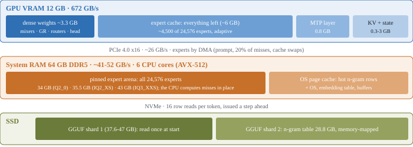

<h1 align="center">Strata</h1>

<b>Run a 125-billion-parameter AI model on a normal gaming PC</b> 
one NVIDIA card (12-24 GB) + 64 GB of RAM · Windows or Linux · one click to install

Strata runs **[Qwen3.8-Flash-Next](https://huggingface.co/Qwen/Qwen3.8-Flash-Next)** - a large, smart AI model that
normally needs a server - on your own PC. It writes its answers at **60-95 tokens per second** (a token is about ¾
of a word): faster than you can read.

- **Private:** everything runs on your PC. Nothing is sent anywhere.
- **Works with your apps:** chat apps, coding agents and scripts that speak the OpenAI or Anthropic API just work.
- **Sees pictures** too, if you want (screenshots, photos, scanned pages).
- **Free and open source.**

> **Jump to:** [Is my PC enough?](#is-my-pc-enough) · [Install](#install-3-steps) · [How fast?](#how-fast-is-it) ·
> [Which model?](#which-model-should-i-pick) · [Using it](#using-it) · [Problems?](#something-went-wrong) ·
> [How it works](#how-does-it-work) · [All the details](docs/DETAILS.md)

---

## Is my PC enough?

| You need | |
| --- | --- |
| **Graphics card** | NVIDIA RTX 30, 40 or 50 series with **12 GB of VRAM or more** |
| **Memory (RAM)** | **64 GB** |
| **Free disk space** | ~80 GB (an SSD makes the first start much faster) |
| **System** | Windows 10/11, or Linux |

That's it. The only thing you install yourself is a current **NVIDIA driver**
([nvidia.com/drivers](https://www.nvidia.com/drivers) or the NVIDIA App). Everything else - Python, the engine, the
model - is set up for you.

## Install (3 steps)

**Windows**

1. [Download this project](https://github.com/Niko1221/Strata/archive/refs/heads/main.zip) and unzip it (or `git clone` it).
2. Double-click **`START-HERE.bat`**.
3. Answer 4 questions - or just press Enter each time for the recommended choice:
   - **Which model?** The original, Swift 1.5 (a version that thinks shorter and answers sooner), or an
     [uncensored build](#which-model-should-i-pick) (this fork)
   - **Which size?** Q2_0, IQ2_XS or IQ3_XXS - see [which model](#which-model-should-i-pick)
   - **How much context?** How much text it can keep in mind at once (it suggests one for your card)
   - **Images?** Whether it should also read pictures

Then it downloads everything (the model is ~70 GB, so the first time takes a while - you can stop and it picks up
where it left off) and **starts the model**. Your browser opens a chat page at `http://127.0.0.1:8080`.

**Next time**, just double-click `START-HERE.bat` again: it starts right away, nothing is downloaded twice. Close its
window to stop the model.

**Linux:** run `./setup.sh` - same questions, same result.

## How fast is it?

Measured on an RTX 5070 (12 GB), a Ryzen 5 7600 and 64 GB of RAM:

| Size | Writes answers (short chat) | Writes answers (128K context) | Reads your prompt |
| --- | ---: | ---: | ---: |
| **Q2_0** | 95 tokens/s | 65 tokens/s | 539 tokens/s |
| **IQ2_XS** | 78 tokens/s | 52 tokens/s | 463 tokens/s |
| **IQ3_XXS** | 66 tokens/s | 45 tokens/s | 410 tokens/s |

- **Writes answers** = how fast the reply appears (tokens per second).
- **Reads your prompt** = how fast it takes in what you send (long documents, code, chat history).

A card with more VRAM is faster, because more of the model fits on the GPU: an RTX 3090 (24 GB) should do roughly
100-140 tokens per second. All measurements, long-context numbers and estimates for other cards are in the
[details](docs/DETAILS.md#speed-measured).

## Which model should I pick?

**The size** (the same model, compressed more or less):

| Size | Download | Speed | Quality | Pick it if... |
| --- | ---: | --- | --- | --- |
| **Q2_0** | 66 GB | fastest | good | you want speed |
| **IQ2_XS** | 68 GB | fast | better | you want a good all-rounder (**recommended**) |
| **IQ3_XXS** | 76 GB | slower | best | you want the best answers (uses 43 GB of your 64 GB RAM) |

**The version:**

- **Qwen3.8-Flash-Next** - the original.
- **[Swift 1.5](https://huggingface.co/ukisai/Swift-1.5-Qwen3.8-Flash-Next-GSQ-RCO-GGUF)** - a fine-tune by UkisAI
  that thinks much shorter before answering, so you get the answer sooner, with about the same quality. Same speed per
  token. Its own license applies (see its page).
- **Uncensored** (this fork only) - community builds of the original with its refusals removed ("abliterated"). They
  answer requests the original refuses, so you are responsible for how you use them. They are not GSQ-RCO quants,
  so each has its own sizes, and their experts are bigger (more RAM):

  | Choice | Size | Download | RAM it uses | Needs |
  | --- | --- | ---: | ---: | --- |
  | **[OrcaRouter](https://huggingface.co/orcarouter/Qwen3.8-Flash-Next-Uncensored-GGUF)** | IQ2_M | 80 GB | 48 GB | 64 GB RAM |
  | OrcaRouter | IQ3_XXS | 85 GB | 54 GB | ~68 GB RAM |
  | **[mradermacher](https://huggingface.co/mradermacher/Qwen3.8-Flash-Next-Uncensored-i1-GGUF)** (same weights as OrcaRouter) | IQ3_S | 89 GB | 57 GB | ~72 GB RAM |
  | **[RVN](https://huggingface.co/0bserverx/RVN-Qwen3.8-Flash-Next-Abliterated-Uncensored-GGUF)** (another method) | IQ3_XS | 86 GB | 54 GB | ~70 GB RAM |

  **OrcaRouter is gated:** sign in on its page and click *Agree and access repository*, make a *Read* token at
  [huggingface.co/settings/tokens](https://huggingface.co/settings/tokens), then either set `HF_TOKEN`, run
  `hf auth login`, or paste the token when the setup asks. The other two download without an account.
  Preparing one the first time takes 45-90 GB more disk (the setup stores its PLE key as BF16, which rewrites one
  of the files, and may copy its experts into one file) and a few minutes.
  Measured: OrcaRouter IQ2_M on an RTX 3060 (12 GB), a Core i5-10400 (AVX2) and 64 GB of RAM writes ~21 tokens/s.
  Without questions: `START-HERE.bat --family orca --model IQ2_M` (or `--family mrad` / `--family rvn`).

Not sure? Take **IQ2_XS**. You can add another one later with `START-HERE.bat --setup`.

## Using it

- **Chat in the browser:** `http://127.0.0.1:8080` - a simple chat page (it opens by itself when the model starts).
- **Chat in the terminal:** `.venv\Scripts\python chat.py`
- **Your apps and coding agents:** add it as an "OpenAI-compatible" provider with base URL
  **`http://127.0.0.1:8080/v1`**, any API key and any model name. Apps that use Anthropic's API: `http://127.0.0.1:8080/v1/messages`.
- **Thinking:** the model thinks before it answers. Choose **off, low, medium or high** - in the chat page menu, with
  `/think low` in `chat.py`, or with your app's "reasoning effort" setting. Off is fastest; high is best for hard questions.
- **Pictures:** in the chat page click **Picture**; in `chat.py` type `/image <path>`; in apps just attach them.
- **From your phone or another PC:** see the [details](docs/DETAILS.md#using-it) (set an API key first).

**Good to know:** it answers one request at a time, and it re-reads the whole conversation for every answer. So in
very long chats you wait longer before it starts writing: about 1 minute per 30,000 tokens of conversation.

## Something went wrong?

| What you see | What to do |
| --- | --- |
| `the NVIDIA driver is too old` | Update the driver (NVIDIA App or nvidia.com/drivers), restart the PC, run `START-HERE.bat` again. |
| It stopped during download or setup | Run `START-HERE.bat` again - it continues where it stopped. |
| `port 8080 is already in use` | Strata is already running - look for its window. |
| The first start takes minutes | Normal: it loads 35-43 GB into RAM. The next start is faster. |
| Slow, and the disk light is busy | Not enough free RAM: close other programs (browsers use a lot), or pick Q2_0 / IQ2_XS. |
| "prompt exceeds the context" | The conversation is longer than the context you chose: run `START-HERE.bat --setup` and pick more. |

More in the [full troubleshooting table](docs/DETAILS.md#troubleshooting). Still stuck? Open an issue and attach
`strata-<model>.log` from this folder.

## How does it work?

A model this big doesn't fit on a gaming graphics card. Strata splits the work between the parts of your PC:

- **The GPU** runs the part of the model that is used for every word, plus the "experts" it needs most often.
- **The RAM** holds all 24,576 experts, and **the CPU** computes the few the GPU doesn't have - at the same time as the GPU.
- **The SSD** holds a big lookup table; the model reads a few rows of it per word.
- **A small helper inside the model guesses the next words**, and Strata checks several guesses at once. That makes
  it 1.6-1.8x faster than going word by word - and the answer is exactly the same.

The full story is in the [paper](docs/paper/Strata-Paper.pdf) and the [details](docs/DETAILS.md).

## Credits

- Model: [Qwen3.8-Flash-Next](https://huggingface.co/Qwen/Qwen3.8-Flash-Next) by the Qwen team; compressed versions by
  [ISTA-DASLab](https://huggingface.co/ISTA-DASLab/Qwen3.8-Flash-Next-GSQ-RCO-GGUF);
  [Swift 1.5](https://huggingface.co/ukisai/Swift-1.5-Qwen3.8-Flash-Next-GSQ-RCO-GGUF) by UkisAI. Their licenses apply
  to the model files.
- Built with parts of [llama.cpp / ggml](https://github.com/ggml-org/llama.cpp) (MIT). Ideas from
  [Splash](https://github.com/incoai/splash), [ninfer](https://github.com/Neroued/ninfer) and
  [HyperQwen](https://github.com/syv-ai/HyperQwen). More in the [details](docs/DETAILS.md#credits-and-licenses).
