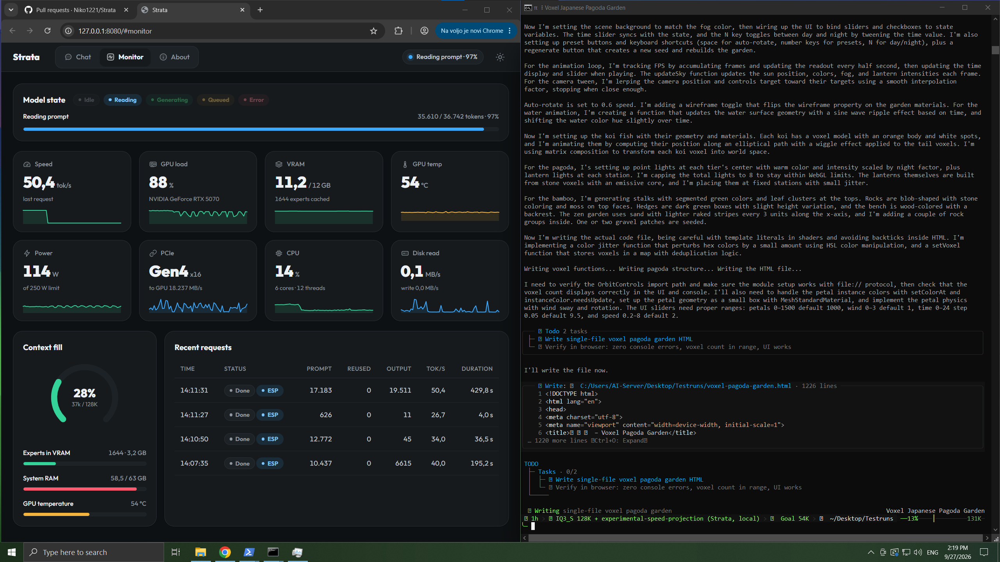
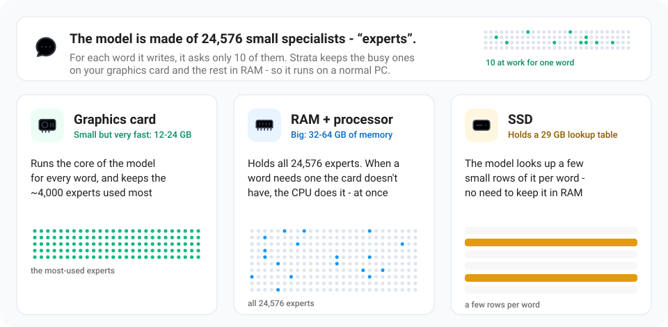

<h1 align="center">Strata-V100</h1>

> **Tesla V100 fork.** This fork keeps Strata compatible with NVIDIA Volta (`sm_70`) and is validated on a
> Tesla V100-PCIE-16GB, Ryzen 5 3600, 48 GB DDR4-3200, and CUDA 12.8. The installed Qwen3.8-Flash-Next Q2_0
> configuration provides the model's full **262,144-token context**, int8 KV cache, and MTP speculative decoding.
> The bundled web chat and live performance monitor run at `http://100.80.155.43:8088/` over this machine's
> Tailscale network. API access is protected by the key stored locally in `.strata-service.env`.
> Hardware calibration selected a 0.28 PCIe share and 0.70 MTP draft floor, measuring **45.5 output tokens/s**.

> | V100 benchmark | ~4K prompt | ~8K prompt | 32K prompt | 128K prompt | 256K prompt |
> | --- | ---: | ---: | ---: | ---: | ---: |
> | Prompt processing | **989.1 tok/s** | **966.5 tok/s** | **1136.8 tok/s** | **659.3 tok/s** | **414.1 tok/s** |
> | Output generation | 49.3 tok/s | 50.6 tok/s | 50.5 tok/s | 44.9 tok/s | 38.8 tok/s |
>
> All rows are uncached API requests (`reused=0`) on the prefill fast path: FP16 tensor-core
> GEMMs for the Volta BF16 projections (no scalar fallback), io_uring O_DIRECT reads for the PLE
> table, and model storage on the NVMe. Re-measured 2026-09-28 on the merged main build
> (engine 0.1.20 + the prefill-speed PR); the exact prompt sizes match the previous table row
> for row. The passively-cooled V100 throttles when hot (the same 8K prompt spans 616-967
> tok/s), so the table shows the cool-idle measurement. Raw rows and notes:
> [`bench/results/2026-09-28-v100-fastpath`](bench/results/2026-09-28-v100-fastpath).
> [Full methodology and timings](docs/DETAILS.md#tesla-v100-fork-benchmark).

<p align="center"><b>Run a 125-billion-parameter AI model on a normal gaming PC</b><br>
one NVIDIA card (12-24 GB) + 64 GB of RAM · Windows or Linux · one click to install</p>

<p align="center"><a href="https://github.com/Niko1221/Strata/releases/download/v0.1.10/Pagoda.mp4"></a><br>
<sub>A voxel pagoda garden, 1 shot prompt running on an RTX 5070 with Strata (IQ3_S, 128K context) ·
<a href="https://github.com/Niko1221/Strata/releases/download/v0.1.10/Pagoda.mp4">full video (49 s)</a></sub></p>

Strata runs **[Qwen3.8-Flash-Next](https://huggingface.co/Qwen/Qwen3.8-Flash-Next)** - a large, smart AI model that
normally needs a server - on your own PC. It writes its answers at **60-95 tokens per second** (a token is about ¾
of a word): faster than you can read.

- **Free and open source.**

> **Jump to:** [How fast?](#how-fast-is-it) · [Which model?](#which-model-should-i-pick) · [Install](#install) ·
> [Using it](#using-it) · [Problems?](#something-went-wrong) · [How it works](#how-does-it-work) ·
> [All the details](docs/DETAILS.md)

---

## How fast is it?

Measured on an RTX 5070 (12 GB), a Ryzen 5 7600 and 64 GB of RAM:

| Size | Writes answers (short chat) | Writes answers (128K context) | Reads your prompt |
| --- | ---: | ---: | ---: |
| **Q2_0** | 90 tokens/s | 67 tokens/s | 1,310 tokens/s |
| **IQ2_XS** | 74 tokens/s | 60 tokens/s | 1,240 tokens/s |
| **IQ3_XXS** | 62 tokens/s | 46 tokens/s | 1,110 tokens/s |
| **IQ3_S** | 52 tokens/s | 41 tokens/s | 1,070 tokens/s |
| **Coder** (IQ1_M) | 51 tokens/s | 44 tokens/s | 1,300 tokens/s |

- **Writes answers** = how fast the reply appears (tokens per second).
- **Reads your prompt** = how fast it takes in what you send (long documents, code, chat history), measured on a
  32K-token prompt; a 4K prompt reads at 740-1,000 tokens/s. A 32K prompt takes about 25 seconds with Q2_0.

A card with more VRAM is faster, because more of the model fits on the GPU: an RTX 3090 (24 GB) should do roughly
100-140 tokens per second. All measurements, long-context numbers and estimates for other cards are in the
[details](docs/DETAILS.md#speed-measured).

Every PC is different: `START-HERE.bat --calibrate` measures a few engine settings on yours and keeps the fastest
(about 5-10 minutes; on the PC above it made the Coder 7% faster).

**Two or three NVIDIA cards?** Just run `START-HERE.bat`: it lists your cards, says which ones Strata can use, and
asks whether to share the model across them (recommended when two can). An install made on one card asks once at
its next start. Or choose yourself: `START-HERE.bat --gpus 0,2` (both, remembered), `--gpus all`, or `--gpu 0` (one
card, this start only). Each card keeps the experts of its own layers, and prompts flow through the cards in a
pipeline: on an RTX 5080 + RTX 3090 prompts were read 18-20% faster than on the 5080 alone, decoding on par.
Every card must be an RTX 30 series or newer with 8 GB or more. See [docs/MULTI_GPU.md](docs/MULTI_GPU.md).

## Which model should I pick?

**The size** (the same model, compressed more or less):

| Model | RAM+VRAM Requirements | Speed | Quality |
| --- | ---: | --- | --- |
| **Q2_0** | 37.6 GB | fastest | good |
| **IQ2_XS** | 39.2 GB | fast | better (**recommended**) |
| **IQ3_XXS** | 47.0 GB | slower | great |
| **IQ3_S** | 54.8 GB | slowest | best: matches the full model on the published tests (original model only) |

**Will it fit?** Shard 1 is the part of the model that gets loaded when it starts: its experts go into your **RAM**,
the rest onto your graphics card (the second shard, a 29 GB lookup table, stays on the SSD). So it fits when your
**RAM is at least shard 1 + about 10 GB** for Windows and your other programs. With 64 GB of RAM every size fits
(IQ3_S with little else open); with 48 GB, Q2_0 and IQ2_XS. A bigger graphics card makes it faster, but it doesn't
lower the RAM needed.

**The version:**

- **Qwen3.8-Flash-Next** - the original.
- **[Coder](https://huggingface.co/ISTA-DASLab/Qwen3.8-Flash-Next-GSQ-RCO-Coder-GGUF)** - ISTA-DASLab's coding
  version: half of the experts removed, keeping the ones that code, tool use and images need (91% of the full model's
  SWE-bench Verified score, 99% of LiveCodeBench, by its authors). One size (IQ1_M: its experts stored like IQ3_S):
  shard 1 is **29.6 GB**, so it fits a PC with **32 GB of RAM**, runs 262K context on 64 GB, and reads long prompts
  the fastest of all. Weaker outside coding.
- **[Swift 1.5](https://huggingface.co/ukisai/Swift-1.5-Qwen3.8-Flash-Next-GSQ-RCO-GGUF)** - a fine-tune by UkisAI
  that thinks much shorter before answering, so you get the answer sooner, with about the same quality. Same speed per
  token, and about the same RAM as the same size of the original (no IQ3_S). Its own license applies (see its page).

Not sure? Take **IQ2_XS** - or the **Coder** if you mainly write code, or have 32-48 GB of RAM. You can add another
one later with `SETUP.bat` (the same as `START-HERE.bat --setup`; on Linux `./setup.sh --setup`).

For **OrcaRouter's Flash-Next Uncensored IQ3_XXS**, see the [manual compatibility setup](docs/ORCA.md).
It needs an explicit packing conversion and is not an installer menu option.

## Install

**You need:** an NVIDIA GPU with compute capability 7.0 or newer and 12 GB of VRAM or more, enough RAM for the size
you pick (above), ~80 GB of free disk space (an SSD makes the first start much faster), and Windows 10/11 or Linux.
RTX 30/40/50 cards use the ready-made engine; Volta cards such as the Tesla V100 are compiled locally with CUDA
12.x. The only thing you install yourself is a current **NVIDIA driver**
([nvidia.com/drivers](https://www.nvidia.com/drivers) or the NVIDIA App). Everything else is set up for you.

**Windows**

1. [Download this project](https://github.com/Niko1221/Strata/archive/refs/heads/main.zip) and unzip it (or `git clone` it).
2. Double-click **`START-HERE.bat`**.
3. Answer a few questions - or just press Enter each time for the recommended choice:
   - **Which model and size?** The original or Swift 1.5, and Q2_0, IQ2_XS, IQ3_XXS or IQ3_S - see [above](#which-model-should-i-pick)
   - **How much context?** How much text it can keep in mind at once (it suggests one for your card)
   - **Images?** Whether it should also read pictures
   - **Experimental speed projection?** Off unless you say yes - [read what it does](docs/DETAILS.md#experimental-speed-projection-experimental-off-by-default) first

Then it downloads everything (the model is ~70 GB, so the first time takes a while - you can stop and it picks up
where it left off) and **starts the model**. Your browser opens the Strata app at `http://127.0.0.1:8080`.

> **While the model starts, your PC can be slow or stop responding for 1-3 minutes** (longest the first time): Strata
> loads 35-55 GB into your RAM and locks part of it for the graphics card. That's normal - wait, and don't close the
> window. The window tells you what it is doing.

**Next time**, just double-click `START-HERE.bat` again: it starts right away, nothing is downloaded twice. Close its
window to stop the model.

**Updating:** download the new version and unzip it anywhere (or `git pull`), then run `START-HERE.bat` in it. The
model files are kept in a `Strata-data` folder next to your Strata folder, so a new copy finds them and sets itself up
the same way - nothing big is downloaded again.

**Linux:** run `./setup.sh` - same questions, same result.

## Using it

<p align="center"><br>
<sub>The Strata app's <b>Monitor</b> (left) while a coding agent writes the pagoda garden from the video (right)</sub></p>

- **In the browser:** `http://127.0.0.1:8080` - the Strata app (it opens by itself when the model starts): **Chat**, a
  live **Monitor** of the model and your GPU/CPU/RAM, and **About** with the settings and addresses.
- **Chat in the terminal:** `.venv\Scripts\python chat.py`
- **Your apps and coding agents:** add it as an "OpenAI-compatible" provider with base URL
  **`http://127.0.0.1:8080/v1`**, any API key and any model name. Apps that use Anthropic's API: `http://127.0.0.1:8080/v1/messages`.
- **Thinking:** the model thinks before it answers. Choose **off, low, medium or high** - in the chat page menu, with
  `/think low` in `chat.py`, or with your app's "reasoning effort" setting. Off is fastest; high is best for hard questions.
- **Pictures:** in the chat page click **Picture**; in `chat.py` type `/image <path>`; in apps just attach them.
- **From your phone or another PC:** `START-HERE.bat --setup --host 0.0.0.0 --api-key <secret>`, then open the
  address the server window prints; see the [details](docs/DETAILS.md#using-it).
- **Experimental speed projection (off by default):** an experimental control vector that setup can turn on; it
  changes how the model answers - read [what it does](docs/DETAILS.md#experimental-speed-projection-experimental-off-by-default) first.

**Good to know:** it answers one request at a time. The first message of a chat is read in full (about 1 minute per
30,000 tokens); after that it keeps the conversation and reads only what is new, so follow-ups start in seconds.

## Something went wrong?

**My PC froze, or got very slow, the first time Strata started.**
That's normal while it starts, most of all the first time. Strata loads 35-55 GB into your RAM, locks part of it for
the graphics card, and works out how much of the model fits on your GPU. The mouse can freeze for a few minutes. **Wait, and don't close the
window.** The next starts are much faster. Still frozen after 10 minutes? Restart the PC, close other programs
(browsers use a lot of RAM) and try again. If it keeps happening, pick a smaller size (Q2_0 or IQ2_XS).

**It stopped while downloading or installing.**
Run `START-HERE.bat` again. It continues where it stopped.

**It says the NVIDIA driver is too old.**
Update it (NVIDIA App or [nvidia.com/drivers](https://www.nvidia.com/drivers)), restart the PC, and run
`START-HERE.bat` again.

**It says port 8080 is already in use.**
Strata is already running. Look for its window.

**It's very slow and the disk light keeps blinking.**
Your PC is out of free RAM. Close other programs, or pick a smaller size (Q2_0 or IQ2_XS).

**An answer stopped with "the engine stopped unexpectedly".**
Usually not enough RAM (on Linux the system then stops the engine). Just send your message again: Strata starts the
engine by itself. If it keeps happening, close other programs or pick a smaller size.

**It says the prompt exceeds the context.**
The conversation is longer than the context you chose. Start a new chat, or run `SETUP.bat` and pick more
context.

**Still stuck?** Look in the [full troubleshooting table](docs/DETAILS.md#troubleshooting), or open an issue and
attach `strata-<model>.log` from the Strata folder.

## How does it work?

Models like this one normally run on servers with hundreds of gigabytes of graphics memory. Your graphics card has
12-24 GB. Strata makes it fit by **sharing the work across your whole PC** - the same idea as a kitchen, where the
things you use all the time stay on the counter and the rest waits in the pantry.

<p align="center"></p>

- **The model is a team of 24,576 small specialists ("experts"),** and each word it writes needs only 10 of them.
  So it doesn't have to have all of them on the graphics card at once.
- **Your graphics card** does the part of the work needed for every word, and keeps the few thousand experts that
  are asked most often. It keeps learning which ones those are while you use it.
- **Your RAM** holds every expert. When a word needs one the card doesn't have, **your processor** works on it -
  at the same time as the graphics card, so neither waits for the other.
- **Your SSD** holds a big lookup table; the model only reads a few small rows of it per word.

<p align="center"></p>

- **Guess, then check.** A small, fast helper built into the model guesses the next few words, and the big model
  checks all the guesses in one go. It keeps the ones it agrees with and writes the next word itself - so one step
  often produces several words. The helper only guesses - the big model decides every word - so you get the same
  quality answer, 1.6-1.8x sooner.
- **Long texts are read in big pieces** (up to 8,192 tokens - pieces of words - at a time), which is why a long
  document or code base is read at over 1,000 tokens per second.

Want the full picture? The [details](docs/DETAILS.md#how-it-works) explain every part and its numbers, and the
[paper](docs/paper/Strata-Paper.pdf) tells the whole story, with the measurements behind it.

## Benchmarks and regression tests

The V100 table above is reproduced end to end by [`bench/run_v100_bench.py`](bench/run_v100_bench.py):
it builds every row at the exact published prompt size (unique-prefix repeated text, uncached,
64 generated tokens), targets the running server, and reads the engine's own timings from
`/metrics`. The API key is read from `.strata-service.env` / `$STRATA_API_KEY`, so the script
contains no credentials and can be committed. Use it for all future benchmark runs:

```sh
.venv/bin/python bench/run_v100_bench.py --model-gguf models/Q2_0/Qwen3.8-Flash-Next-GSQ-RCO-Q2_0-00001-of-00002.gguf
.venv/bin/python bench/run_v100_bench.py --model-gguf <shard-1.gguf> --only '~8K,128K'   # a subset of rows
```

Raw rows and methodology notes for each measuring session live in `bench/results/`.

Before shipping any engine change, run the live OpenAI-compatible tool-call regression checks
against the running server (they exercise function calling and a Hermes-style agent loop, and
write full request/response transcripts under the ignored `build/diagnostics/`):

```sh
.venv/bin/python tests/diagnose_openai.py
.venv/bin/python tests/diagnose_hermes_flow.py
```

Both accept `--base-url` / `--api-key` / `--output`; without arguments they use
`http://127.0.0.1:8088/v1` and the key from `.strata-service.env`.


## Credits

- Model: [Qwen3.8-Flash-Next](https://huggingface.co/Qwen/Qwen3.8-Flash-Next) by the Qwen team; compressed versions by
  [ISTA-DASLab](https://huggingface.co/ISTA-DASLab/Qwen3.8-Flash-Next-GSQ-RCO-GGUF);
  [Swift 1.5](https://huggingface.co/ukisai/Swift-1.5-Qwen3.8-Flash-Next-GSQ-RCO-GGUF) by UkisAI. Their licenses apply
  to the model files.
- Built with parts of [llama.cpp / ggml](https://github.com/ggml-org/llama.cpp) (MIT). Ideas from
  [Splash](https://github.com/incoai/splash), [ninfer](https://github.com/Neroued/ninfer) and
  [HyperQwen](https://github.com/syv-ai/HyperQwen). More in the [details](docs/DETAILS.md#credits-and-licenses).

## License

Strata is open source under the [MIT License](LICENSE). A few parts carry their own licenses: `third_party/ggml`
(MIT, llama.cpp / ggml), the web app's font (SIL Open Font License 1.1) and the experimental speed projection's
vector in `data/experimental-speed-projection` (Qwen Community License 1.0, from the model's activations). The
models are not part of this repository; each model's own license applies to its files.
