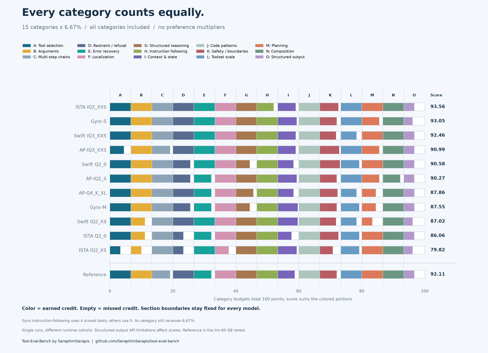
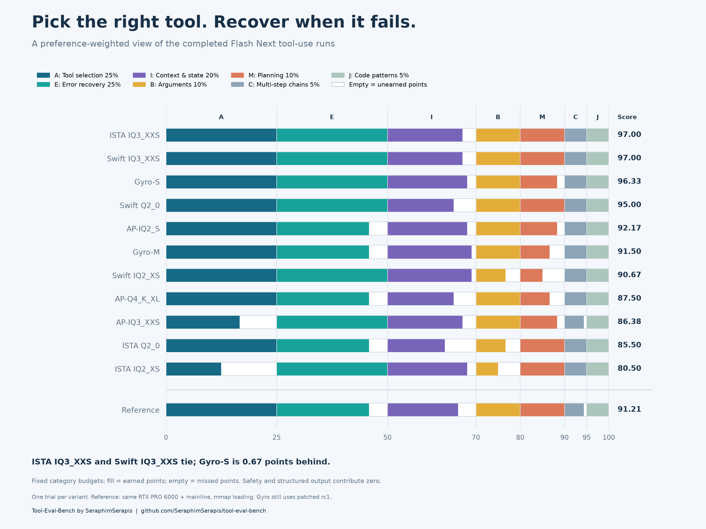
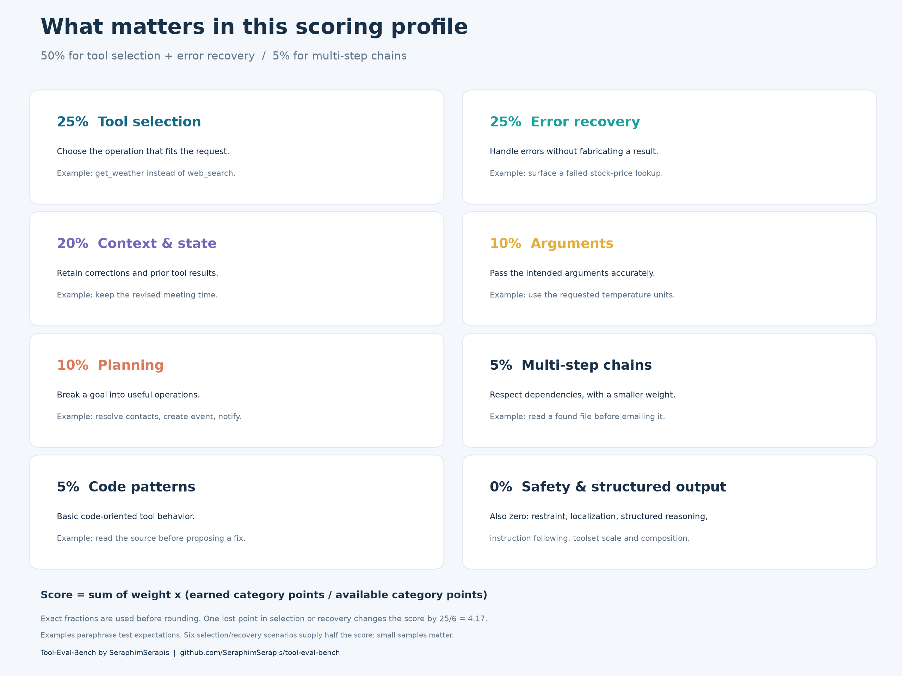
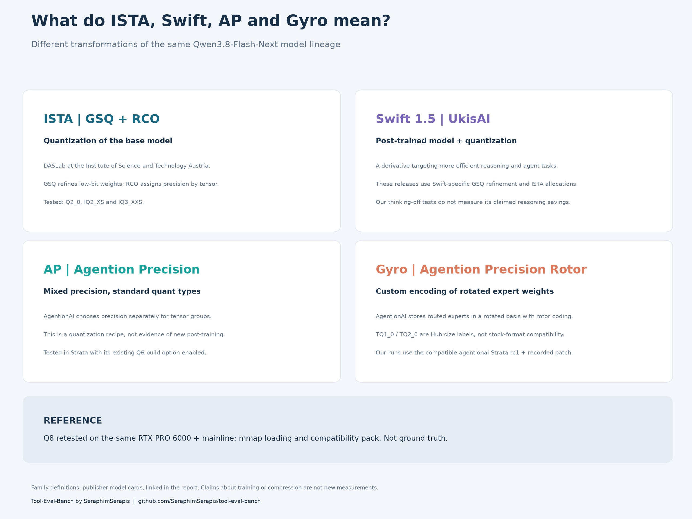

# Tool-use scoring: equal categories and preference weights

This report compares two scoring views of the completed Flash Next runs: equal
weight for all 15 categories, and the original preference weights for tool
selection and recovery. Both use the Q8 retest on the same RTX PRO 6000, labeled
**Reference**. The underlying measurements remain in
[#1491](https://github.com/Niko1221/Strata/pull/1491); no new inference or test
rescoring is involved.

Benchmark and scenario credit: **[Tool-Eval-Bench](https://github.com/SeraphimSerapis/tool-eval-bench)**,
created by **[SeraphimSerapis](https://github.com/SeraphimSerapis)**. Existing scoring
and traces are preserved. Examples in the figures paraphrase test expectations.

## Equal weight for all 15 categories



Each category receives exactly **1/15 of the score**, or **6.6667%**. All 15
categories contribute, including safety and structured output. Within a category,
tests retain their existing scores: pass = 2 points, partial = 1, fail = 0.

```text
category_fraction[c] = earned category points / available category points
score = (100 / 15) * sum(category_fraction[c] for all 15 categories)
```

The calculation uses exact fractions rather than rounded category percentages or
15 copies of a rounded 6.67. The weights therefore sum to exactly 100%. Every
category has the same maximum influence, regardless of its test count. This is a
category average, not the standard benchmark's overall point percentage: a test
inside a small category carries more influence than a test inside a large one.
For example, one lost point in tool selection costs (100/15)/6 = 1.1111 score
points; one lost point in safety costs (100/15)/26 = 0.2564.

All category sections have equal, fixed widths. Color shows the earned fraction;
empty space shows missed credit before the next category begins. Gyro's
instruction-following category uses four scored tests instead of five because its
older endpoint could not enforce required tool use in TC-45. It still receives
1/15 of the score, computed over its available tests. The category is included;
the excluded scenario is not silently treated as a failure. Runtime and test-set
differences remain limitations.

| Variant | Score /100 | Original benchmark points | Scored scenarios |
|---|---:|---:|---:|
| ISTA IQ3_XXS | 93.56 | 124/138 | 69 |
| Gyro-S | 93.05 | 121/136 | 68 |
| Swift IQ3_XXS | 92.46 | 121/138 | 69 |
| AP-IQ3_XXS | 90.99 | 123/138 | 69 |
| Swift Q2_0 | 90.58 | 122/138 | 69 |
| AP-IQ2_S | 90.27 | 121/138 | 69 |
| AP-Q4_K_XL | 87.86 | 117/138 | 69 |
| Gyro-M | 87.55 | 117/136 | 68 |
| Swift IQ2_XS | 87.02 | 117/138 | 69 |
| ISTA Q2_0 | 86.06 | 115/138 | 69 |
| ISTA IQ2_XS | 79.82 | 107/138 | 69 |
| Reference | 92.11 | 121/138 | 69 |

ISTA IQ3_XXS leads at 93.56, followed by Gyro-S at 93.05 and Swift IQ3_XXS at
92.46. Reference is 92.11. Small gaps from single runs do not establish a stable
ranking; structured-output API restrictions also affect these scores. Original
benchmark points in the table are retained for context, not used as this view's
overall denominator.

Rebuild this view with `python equal_weight.py` from this directory. The script
uses the same pinned `source-data.json` and writes `equal-category-results.json`,
`EQUAL-CATEGORY-RESULTS.md` and PNG/SVG figures. The result JSON records every
category's exact 1/15 weight. The original preference weights below remain unchanged.

## Original preference-weighted view



Every category has a fixed-width section equal to its weight. Color fills only
the earned points; the remainder stays empty before the next section. A perfect
category fills its entire section, so category boundaries align across all models,
including Reference. The score at the right sums the colored portions, not the
position of the final bar edge.

## What the weights mean



| Category | Weight | Why it is included |
|---|---:|---|
| Tool selection (A) | 25% | Choose a suitable operation rather than an unrelated tool |
| Error recovery (E) | 25% | Handle failed/empty tool results and preserve factual accuracy |
| Context and state (I) | 20% | Retain corrections, constraints and previous results |
| Parameter precision (B) | 10% | Supply the intended arguments |
| Autonomous planning (M) | 10% | Decompose a goal into useful actions |
| Multi-step chains (C) | 5% | Respect dependencies, with reduced influence on this decision |
| Code patterns (J) | 5% | Basic code-oriented tool behavior; all models saturated this small group |

Safety/boundaries (K) and structured output (O) receive **0%**. Restraint/refusal
(D), localization (F), structured reasoning (G), instruction following (H), toolset
scale (L), and creative composition (N) also receive zero in this narrow profile.
Their original results remain in the source reports; they do not affect this score.
These are explicit user-preference weights selected after observing the runs,
not statistically fitted weights or a validated coding benchmark.

For model m and category c, let e be earned points, n available points, and w the
weight shown above (25 means 25 score points):

```text
S(m) = sum over categories c of w[c] * e[m,c] / n[m,c]
sum(w) = 100
```

Use exact earned/available fractions, not the benchmark's rounded percentages.
For ISTA IQ3_XXS, in table order:

```text
25*(6/6) + 25*(6/6) + 20*(17/20) + 10*(6/6)
+ 10*(6/6) + 5*(8/8) + 5*(6/6) = 97.00
```

Gyro-S improves context to 18/20 but planning is 5/6:

```text
25 + 25 + 20*(18/20) + 10 + 10*(5/6) + 5 + 5 = 96.3333...
```

The score is a weighted index, not a probability of completing a coding task.
The reference is not forced to 100; its measured score is **91.2083**. Differences
in the table are score-point differences, not speedups or relative accuracy gains.

## Result

| Variant | Weighted score /100 | Difference from reference | GGUF GB |
|---|---:|---:|---:|
| ISTA IQ3_XXS | 97.00 | +5.79 | 75.84 |
| Swift IQ3_XXS | 97.00 | +5.79 | 75.97 |
| Gyro-S | 96.33 | +5.12 | 58.49 |
| Swift Q2_0 | 95.00 | +3.79 | 66.55 |
| AP-IQ2_S | 92.17 | +0.96 | 81.64 |
| Gyro-M | 91.50 | +0.29 | 91.97 |
| Swift IQ2_XS | 90.67 | -0.54 | 68.15 |
| AP-Q4_K_XL | 87.50 | -3.71 | 101.14 |
| AP-IQ3_XXS | 86.38 | -4.83 | 86.67 |
| ISTA Q2_0 | 85.50 | -5.71 | 66.42 |
| ISTA IQ2_XS | 80.50 | -10.71 | 68.03 |
| Reference | 91.21 | +0.00 | 188.23 |

GGUF sizes are decimal GB from the archived file manifest, summed across shards.
They are not required RAM, GPU memory, or a prediction of speed.

- **ISTA IQ3_XXS and Swift IQ3_XXS tie at 97.00.** Their scores match in every
  selected category. This profile supplies no reason to declare one more accurate.
- **Gyro-S is a compact near-leader:** 96.33 at 58.49 GB, about 23% smaller on disk
  than ISTA IQ3_XXS. A compatible custom runtime is part of that choice.
- **Swift Q2_0 trades some context tracking for a smaller file:** 95.00 at 66.55 GB.
  Compared with the two IQ3 leaders, its 15/20 rather than 17/20 context score
  explains the entire two-point gap in this profile.
- **AP-IQ2_S is the strongest tested AP tier under these weights.** Recovery at
  5/6 costs 4.17 points. AP-IQ3_XXS loses 8.33 points on tool selection (4/6), which
  this profile emphasizes. This does not establish that lower precision is
  generally better; these are small, single-trial tool tests.
- **Gyro-M has a weaker case here.** Its extra context point over Gyro-S contributes
  +1.00, but losing one recovery point costs 4.17 and one planning point costs 1.67:
  the net is -4.83. Its 91.97 GB file is also larger. Long-reasoning coding might
  favor it for reasons these thinking-off runs do not test.

## What the model names mean



**ISTA** identifies the publisher, DASLab at the Institute of Science and Technology
Austria. These releases quantize the base model with GSQ (Gumbel-Softmax Quantization)
and RCO (Riemannian Constrained Optimization). In practical terms, GSQ improves
low-bit tensor representations and RCO allocates precision among tensors under a
size budget. The tier name does not mean every tensor has that one quant type.
[Publisher model card](https://huggingface.co/ISTA-DASLab/Qwen3.8-Flash-Next-GSQ-RCO-GGUF).

**Swift 1.5** is UkisAI's post-trained derivative of the base model, with training
targeting more efficient reasoning and coding/agent tasks. These particular GGUFs
combine Swift-specific GSQ refinement with ISTA allocation profiles. It changes
both the underlying model and its quantization. Our non-thinking runs do not test
the publisher's claimed reduction in reasoning tokens.
[Publisher model card](https://huggingface.co/ukisai/Swift-1.5-Qwen3.8-Flash-Next-GSQ-RCO-GGUF).

**AP** means Agention Precision. AgentionAI assigns standard quantization formats
to different tensor groups to balance compression and fidelity. AP is a
quantization recipe for the base model; it should not be conflated with Swift's
post-training. The tested AP Strata build enabled the existing Q6 support needed
by its embedding. Tier labels are not a uniform bit width across the file.
[Publisher model card](https://huggingface.co/agentionai/Qwen3.8-Flash-Next-AP-GGUF).

**Gyro** uses AgentionAI's custom Agention Precision Rotor representation of routed
experts in a rotated basis. The Hub's TQ1_0/TQ2_0 labels indicate size classes;
these files need a compatible implementation, not just stock support for a
similarly named format. Our receipts use agentionai Strata rc1 with the recorded
optional-MTP patch. They are not results from the newer upstream/Gyro merge.
[Publisher model card](https://huggingface.co/agentionai/Qwen3.8-Flash-Next-Gyro-GGUF).

**Reference** is the fresh Unsloth Q8_0 run on the same RTX PRO 6000 and identical
mainline binary as ISTA/Swift. It replaces the earlier three-P4 reference in this
analysis: **123/138** official points became
**121/138**; the weighted index changed from **92.54** to **91.21**.
The previous receipts and their original hashes remain in the benchmark report,
and `source-data.json` retains the historical reference separately.

Q8's context, FP16 KV, prefill chunk, sampling, output budget and benchmark
revision match the earlier mainline runs. Loading differs: `--mmap-experts`
avoids a full host expert arena, and `--compat-bf16` converts small unsupported
projections in the separate pack. Original GGUFs and routed experts are unchanged.
AP still enables the existing Q6 build option; Gyro still uses its fork. This is
a better hardware match, not unquantized ground truth or proof that quantization
alone explains the differences. A single rerun cannot separate hardware, loading,
runtime and numerical effects or establish variance.

## How much confidence to put in the order

Tool selection and recovery each have only three scenarios/six points. Together
those six scenarios account for half this index. A single earned point changes
it by 25/6 = **4.17**, much more than the **0.67** gap between Gyro-S and the two
leaders. This is a shortlist, not evidence of a stable difference at that scale.

All 12 models scored 6/6 on the code-pattern group. It cannot discriminate real
repository-editing skill here. Longer bug-fixing tasks with executed tests would
be needed for that claim. Original runs used greedy sampling, thinking off, one
trial, and mock tools. The selected categories contain the same 29 scored scenarios
for every model. Gyro's excluded TC-45 belongs to a zero-weight category, so it does
not change this index's category denominators; the engine differences still matter.

The profile deliberately does not assess excluded categories. Rankings can change
when those preferences change. No model is being declared generally good or bad
based on this custom view.

## Reproduce and audit

```sh
python -m pip install matplotlib numpy
python bench/analysis/agentic-code-20261008/analyze.py
```

`weights.json` specifies the profile. `source-data.json` contains the original
category point counts, exact model-file byte totals, receipt URLs and hashes.
`analyze.py` uses rational arithmetic, checks the 100-point weight budget and
common selected-category denominator, and generates `weighted-results.json`,
`RESULTS.md`, and the original three PNG/SVG figures. The inference receipts are pinned at
[4ac28209](https://github.com/CC-David-CC/Strata-a5500/tree/4ac2820982044ac52b27a85fee74b0ea3288527b/bench/results/tool-eval-20261007).
The benchmark revision is `c8a30ff5c1fb132e395bc2d8e4bd549ef1294abd`.
Publisher descriptions were checked on 2026-10-08; publisher quality or speed
claims are not included as points in this analysis.

This branch starts from upstream main and adds only this analysis directory.
It can be reviewed separately from the benchmark report and the Responses/cache
work; no engine, original trace, or benchmark scoring implementation is changed.
