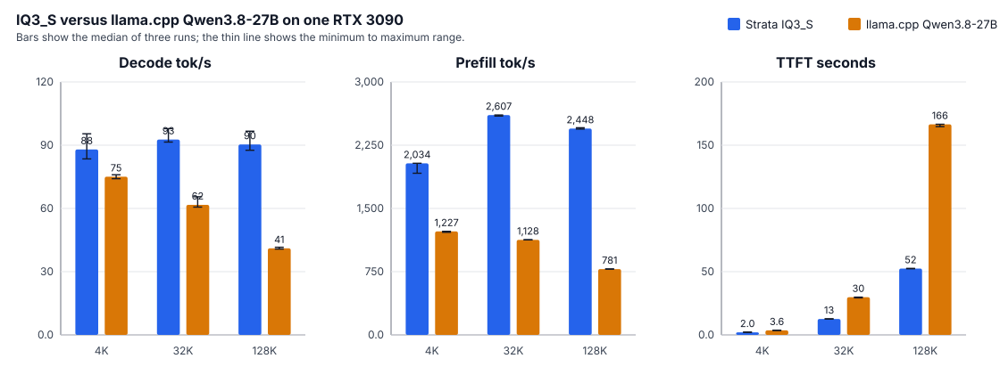

# Community benchmark: RTX 3090 (24 GB) + 128 GB RAM, Ryzen 9 5900X

Measured on 2026-10-07 by `@butonic`, on a Linux desktop. One machine,
three Strata models plus a separate llama.cpp Qwen3.8-27B check and an IQ3_S
elastic-VRAM run, Strata 0.1.40.3, one RTX 3090, **262,144-token** context. The
main model runs were GPU-dedicated (ComfyUI and the openclaw-gateway stopped; the
Wayland desktop compositor kept running), server bound to loopback:

- **IQ3_S** — the original Flash-Next IQ3_S (the daily model on this PC).
- **UD-IQ4_XS** — Unsloth Dynamic 4-bit (regular since 0.1.39; not previously
  measured on NVIDIA — see [docs/UNSLOTH_Q4.md](../../../docs/UNSLOTH_Q4.md)).
- **UD-Q4_K_XL** — Unsloth Dynamic 4-bit, the largest file this machine can
  hold fully in RAM (experimental — see [docs/UNSLOTH_Q4.md](../../../docs/UNSLOTH_Q4.md)).
- **IQ3_S with 10 GiB reserved** — the daily IQ3_S model after `POST /v1/vram`
  leaves 10,240 MiB free for Flux/image generation.

Median decode was **88.0 / 92.7 / 90.4 tok/s for IQ3_S**, **53.1 / 54.3 / 56.9 for
UD-IQ4_XS** and **38.4 / 36.5 / 37.5 for UD-Q4_K_XL** at 4,096 / 32,768 / 128,000
prompt tokens. Decode falls **88 → 54 → 37 tok/s** and engine PSS rises **53 → 95 →
118 GiB** across the three, all at the same 24 GB VRAM; the files are ordered by size,
and no quality gain was measured. These are synthetic code-explanation
requests with greedy decoding and a 256-token output cap; they do not establish
general answer quality or performance on other workloads. The compact tables are
in [matrix.md](matrix.md).

## Hardware and software

- **GPU:** NVIDIA GeForce RTX 3090, 24,576 MiB, power limit 370 W. PCIe Gen4 x16
  (capable; `nvidia-smi` reports the idle link downclocked to Gen1, Gen4 under
  load). Clocks were not locked.
- **CPU and RAM:** AMD Ryzen 9 5900X (12 cores / 24 threads); the engine used 11
  expert-pool workers plus its host thread. 125.7 GiB installed RAM (Linux).
  976 MiB swap, effectively unused during both runs.
- **Storage:** models on NVMe (`nvme1n1`, 2 TB, XFS, mounted at `/mnt/nvme1`);
  a second NVMe (`nvme0n1`, Samsung 980 PRO) holds the OS.
- **OS / driver / CUDA:** Debian GNU/Linux 13 (trixie), kernel 7.0.14-15-pve,
  NVIDIA driver 595.58.03, CUDA 13.2. Bare metal (MSI MAG B550M Mortar Max WiFi).
- **Strata:** source build at commit `d5ea713` (v0.1.40.3), engine 0.1.40.3,
  CUDA architecture 86, GPU vision helper. See [BUILD.json](BUILD.json) and
  [state-before.json](state-before.json) (the service and server state before the run).
- **Background workloads:** ComfyUI and the openclaw-gateway were stopped for each
  measurement (the Wayland desktop compositor kept running, so the GPU was not fully
  idle); the server was bound to `127.0.0.1` so no other client could reach it. A guard
  confirmed the engine handled exactly the harness's 16 requests
  (zero foreign) for all three runs — see
  [iq3_s/contamination.json](iq3_s/contamination.json) and
  [ud-iq4_xs/contamination.json](ud-iq4_xs/contamination.json).
- **Shared GPU use:** Strata can shrink its VRAM reservation dynamically with
  `--vram-elastic` and `/v1/vram`, letting ComfyUI run alongside inference on the same
  3090. That makes the machine a good host for tools such as OpenClaw or Open WebUI,
  where chat inference and image generation need to share one GPU. A separate IQ3_S
  elastic run with 10,240 MiB reserved for Flux/image generation is in
  [iq3_s-10gb-elastic/](iq3_s-10gb-elastic/); ComfyUI stayed idle and the
  openclaw-gateway was stopped.

## Models and configuration

Both runs used the same context, KV, MTP draft and vision settings; the model
files and the expert-residency mode differ.

### IQ3_S

Model: `ISTA-DASLab/Qwen3.8-Flash-Next-GSQ-RCO-GGUF`, IQ3_S. The repository
revision was not recorded; the three local files were SHA-256 hashed and are in
[model-provenance.json](model-provenance.json):

- `Qwen3.8-Flash-Next-GSQ-RCO-IQ3_S-00001-of-00002.gguf` (54,817,524,224 B)
- `Qwen3.8-Flash-Next-GSQ-RCO-IQ3_S-00002-of-00002.gguf` (28,800,138,432 B)
- `mmproj-Qwen3.8-Flash-Next-BF16.gguf` (907,543,008 B)

Configuration ([strata-iq3_s.json](strata-iq3_s.json), host shown as loopback):

- Context 262,144; INT8 KV; 32,768 KV cells per attention layer resident on GPU,
  the rest streamed from 3.09 GiB of pinned RAM.
- Expert cache `auto`: **7,935 slots, 15.04 GiB of VRAM**, prefilled from the
  bundled `data/expert-profile.bin`, no eviction. 457 MiB of VRAM free with
  everything loaded.
- Prefill `auto`: chunks of 8,192 tokens, borrowing 2,324 expert-cache slots
  (4.38 GiB) during prompt processing.
- MTP `--spec 4 --spec-min-p 0.70`; built-in suffix drafting on. `--pcie-frac 0.20`.
- Vision GPU enabled (mmproj BF16, 1,024 image tokens, 700 MiB reserve); the
  benchmark requests contained no images.
- `--vram-elastic --vram-segment-mib 512` was set in the config but **not exercised**
  in this run (no VRAM resize occurred).
- Low-RAM mode off; no calibration; experimental speed projection off; no custom
  control vectors. Reasoning off, temperature 0, 256 generated tokens per run.

```text
engine/strata --serve --pack .../packs/iq3_s \
  --native /mnt/nvme1/models/IQ3_S/Qwen3.8-Flash-Next-GSQ-RCO-IQ3_S-00001-of-00002.gguf \
  --ple-gguf /mnt/nvme1/models/IQ3_S/Qwen3.8-Flash-Next-GSQ-RCO-IQ3_S-00002-of-00002.gguf \
  --expert-profile data/expert-profile.bin --expert-cache auto --prefill auto \
  --spec 4 --mtp .../mtp/rt --max-context 262144 --kv int8 --kv-resident 32768 \
  --pcie-frac 0.20 --spec-min-p 0.70 --vision --vram-reserve-mib 700 \
  --vram-elastic --vram-segment-mib 512
```

### UD-IQ4_XS

Model: `unsloth/Qwen3.8-Flash-Next-GGUF`, UD-IQ4_XS, three shards at revision
`38bb39ee97821de2c9009abb7e93950eec396e66`. The shards were SHA-256 verified by
setup against the published table; the hashes and the mmproj hash are in
[model-provenance-ud-iq4_xs.json](model-provenance-ud-iq4_xs.json):

- `Qwen3.8-Flash-Next-UD-IQ4_XS-00001-of-00003.gguf` (10,946,624 B)
- `Qwen3.8-Flash-Next-UD-IQ4_XS-00002-of-00003.gguf` (49,835,229,856 B)
- `Qwen3.8-Flash-Next-UD-IQ4_XS-00003-of-00003.gguf` (43,836,407,744 B)
- `mmproj-Qwen3.8-Flash-Next-BF16.gguf` (907,543,008 B) — the original image encoder

Configuration ([strata-unsloth-ud-iq4_xs.json](strata-unsloth-ud-iq4_xs.json),
host shown as loopback):

- Context 262,144; INT8 KV; 32,768 KV cells resident, the rest streamed from
  3.6 GiB of RAM.
- **`--resident-budget-gib 55`** = the whole expert set. setup computes the budget as
  `min(RAM − 24 − KV, experts)`; the expert total is 59.5 GB = 55.4 GiB, so on 128 GB
  the cap is the experts themselves and **all of them are resident**. The experts stay
  in the GGUF files (the pack holds only the dense side, `--compat-bf16`, no
  `experts.bin`); the engine maps them file-backed and keeps a shared arena, so the
  engine's PSS is ~95 GiB (46 GiB file-backed + 46 GiB shared + 3 GiB anonymous).
  During the runs **no experts were read from the SSD** (`file_blobs` 0, `file_mb` 0
  across all nine speed runs); all expert traffic was RAM and PCIe.
- Expert cache `auto`: **6,362 experts, 14.34 GiB of VRAM**, prefilled from
  `data/expert-profile.bin`.
- MTP `--spec 4 --spec-min-p 0.5`; same `mtp/rt` draft as IQ3_S.
- Vision GPU enabled (same mmproj BF16, 700 MiB reserve); no images in the requests.
- Reasoning off, temperature 0, 256 generated tokens per run.

```text
engine/strata --serve --pack .../packs/unsloth-ud-iq4_xs \
  --native /mnt/nvme1/models/unsloth-UD-IQ4_XS/Qwen3.8-Flash-Next-UD-IQ4_XS-00001-of-00003.gguf \
  --expert-profile data/expert-profile.bin --expert-cache auto --prefill auto \
  --spec 4 --spec-min-p 0.5 --mtp .../mtp/rt --max-context 262144 --kv int8 --kv-resident 32768 \
  --resident-budget-gib 55 --vision --vram-reserve-mib 700
```

Config deltas from IQ3_S: no `--ple-gguf` (the PLE rows are in the pack), no
`--pcie-frac` (experts come from RAM, not the SSD), `--spec-min-p 0.5` vs 0.70,
and no `--vram-elastic`. These are the values setup chose for this model; they are
not tuned.

### UD-Q4_K_XL

Model: `unsloth/Qwen3.8-Flash-Next-GGUF`, UD-Q4_K_XL, four shards at revision
`38bb39ee97821de2c9009abb7e93950eec396e66`. **Experimental** (docs/UNSLOTH_Q4.md):
the routed experts are Q4_K gate/up (Q5_K in layer 2) and Q5_1 down (Q8_0 in five
layers), the PLE table is IQ4_NL. The shards were SHA-256 verified by setup against
the published table; hashes and the mmproj hash are in
[model-provenance-ud-q4_k_xl.json](model-provenance-ud-q4_k_xl.json):

- `Qwen3.8-Flash-Next-UD-Q4_K_XL-00001-of-00004.gguf` (10,946,624 B)
- `Qwen3.8-Flash-Next-UD-Q4_K_XL-00002-of-00004.gguf` (49,859,583,136 B)
- `Qwen3.8-Flash-Next-UD-Q4_K_XL-00003-of-00004.gguf` (49,376,141,504 B)
- `Qwen3.8-Flash-Next-UD-Q4_K_XL-00004-of-00004.gguf` (12,087,983,520 B)
- `mmproj-Qwen3.8-Flash-Next-BF16.gguf` (907,543,008 B) — the original image encoder

Configuration ([strata-unsloth-ud-q4_k_xl.json](strata-unsloth-ud-q4_k_xl.json),
host shown as loopback):

- Context 262,144; INT8 KV; 32,768 KV cells resident, the rest streamed from RAM.
- **`--resident-budget-gib 71`** = the whole expert set (71.7 GiB). On 128 GB the
  budget cap is the experts themselves, so **all of them are resident** and none are
  read from the SSD (`file_blobs` 0 across all nine speed runs).
- Expert cache `auto`: **4,844 experts, 14.13 GiB of VRAM**, prefilled from
  `data/expert-profile.bin`.
- MTP `--spec 4 --spec-min-p 0.5`; same `mtp/rt` draft. Vision GPU enabled (same
  mmproj BF16, 700 MiB reserve); no images in the requests.
- Reasoning off, temperature 0, 256 generated tokens per run.

```text
engine/strata --serve --pack .../packs/unsloth-ud-q4_k_xl \
  --native /mnt/nvme1/models/unsloth-UD-Q4_K_XL/Qwen3.8-Flash-Next-UD-Q4_K_XL-00001-of-00004.gguf \
  --expert-profile data/expert-profile.bin --expert-cache auto --prefill auto \
  --spec 4 --spec-min-p 0.5 --mtp .../mtp/rt --max-context 262144 --kv int8 --kv-resident 32768 \
  --resident-budget-gib 71 --vision --vram-reserve-mib 700
```

This ran on the **same engine binary** as the other two columns, built with
`STRATA_MMQ_KQUANTS=OFF` (the released default). That means the Q4_K/Q5_K prompt
products go through the FP16 dequant path, not llama.cpp's MMQ kernels; a
`-DSTRATA_MMQ_KQUANTS=ON` build would speed prompts but costs every model a few
expert slots, so it is off here and in the released engine.

## Method and reproduction

The drivers below are fully automatic with a restore trap and a zero-foreign guard:

- [run_bench.sh](run_bench.sh) — IQ3_S. Rebuilds the pulled source, binds the
  server to loopback, stops ComfyUI + openclaw-gateway, restarts `strata.service`,
  runs the sweep and recall checks, then restores the host binding and neighbours.
- [run_bench_iq3_s_10gb.sh](run_bench_iq3_s_10gb.sh) — IQ3_S with elastic VRAM.
  Rebuilds, binds loopback, stops only openclaw-gateway, keeps ComfyUI idle, restarts
  `strata.service`, calls `POST /v1/vram` with `{"reserve_mib":10240}`, then runs the
  same sweep and recall checks. It uses [monitor-elastic.py](monitor-elastic.py),
  which also samples `/v1/status` VRAM fields.
- [run_bench_ud.sh](run_bench_ud.sh) — UD-IQ4_XS. Stops `strata.service` (IQ3_S)
  and the neighbours, starts the UD server manually on loopback:8080 (its config
  has no host key, so `server.py` binds `127.0.0.1`), runs the same sweep and
  recall checks, then kills the UD server and restarts `strata.service` (IQ3_S)
  and the neighbours. The IQ3_S model is the daily model on this PC, so it is
  restored at the end.
- [run_bench_q4k.sh](run_bench_q4k.sh) — UD-Q4_K_XL. Same shape as `run_bench_ud.sh`
  (manual loopback server, `monitor2.py`, restore of `strata.service`), pointed at
  the Q4 config and pack.
- [run_bench_club3090.sh](run_bench_club3090.sh) — Qwen3.8-27B under llama.cpp, not
  Strata. Stops `strata.service` and the neighbours, launches the club-3090 container
  on loopback:8090, runs [benchmark-club-3090.py](benchmark-club-3090.py) and
  [needle_bench-club3090.py](needle_bench-club3090.py) with
  [monitor-club3090.py](monitor-club3090.py), then brings the container down and
  restores Strata and the neighbours.

[benchmark.py](benchmark.py) is the unchanged harness from the
[RTX 5090 report](../2026-09-30-community-rtx-5090/README.md): deterministic
synthetic Python filler with a unique nonce per request, token-counted with
Strata's tokenizer and verified against the server. [monitor.py](monitor.py)
samples `/proc/meminfo` and `nvidia-smi` once per second; [monitor2.py](monitor2.py)
adds `MemFree`/`Cached`/`Shmem` and the engine process's `smaps_rollup` (PSS), and is
what produced the memory figures above (the UD run used it directly; IQ3_S was sampled
loaded-idle plus one 128K prompt into [iq3_s/memory-live.jsonl](iq3_s/memory-live.jsonl)).
[make_compare_charts.py](make_compare_charts.py) reads the IQ3_S and llama.cpp
summary files and writes the GitHub-renderable SVG chart used in the llama.cpp
comparison.

```bash
python benchmark.py --root <repo> --pack <pack> \
  --url http://127.0.0.1:8080 --out <iq3_s|ud-iq4_xs> --targets 4096,32768,128000 --runs 3
python tools/needle_bench.py --url http://127.0.0.1:8080 \
  --lengths 32k,128k --depths 10,50,90 --out <iq3_s|ud-iq4_xs>/needles.json
```

The elastic run is driven by `bash run_bench_iq3_s_10gb.sh`; it calls the same
benchmark and needle commands after `POST /v1/vram`.

One short warm-up request is excluded. Three runs at each length ran serially, in
increasing-length order, on the same loaded engine. All nine speed requests read
their whole prompt: **zero reused tokens**. The expert cache was filled at start
and kept between requests; loading time is excluded. TTFT is streaming, from just
before the HTTP request to the first nonempty text delta, over loopback. Prompt
throughput is freshly read tokens / `prompt_ms`; decode throughput is
`engine_generated / decode_ms`. Per-run records are in
[iq3_s/results.json](iq3_s/results.json) and [ud-iq4_xs/results.json](ud-iq4_xs/results.json);
aggregates in the matching `summary.json`; the session logs (startup decisions +
all 16 requests) in [iq3_s/engine.log](iq3_s/engine.log) and
[ud-iq4_xs/engine.log](ud-iq4_xs/engine.log).

## Results

Each cell is the median **[minimum–maximum]** of three runs. Every speed request
generated 256 tokens and stopped at the output limit; none failed or was
cancelled.

### IQ3_S

| Prompt tokens | Reused | Prompt tok/s | Decode tok/s | TTFT seconds | Total seconds |
| ---: | ---: | ---: | ---: | ---: | ---: |
| 4,096   | 0 | 2,034 [1,918–2,036]   | 88.0 [83.5–95.4] | 2.04 [2.04–2.16]     | 4.93 [4.71–5.21]     |
| 32,768  | 0 | 2,607 [2,595–2,608]   | 92.7 [91.5–97.9] | 12.63 [12.63–12.70]  | 15.38 [15.30–15.41]  |
| 128,000 | 0 | 2,448 [2,442–2,457]   | 90.4 [87.6–96.6] | 52.48 [52.30–52.61]  | 55.25 [55.21–55.30]  |

Decode expert-cache hit rate was 82.8–90.3% across the speed runs, with 0.5–1.1%
of routed experts read over PCIe.

### IQ3_S with 10 GiB reserved for Flux/image generation

Same IQ3_S model and harness, but after loading the engine called
`POST /v1/vram` with `{"reserve_mib":10240}`. The expert cache shrank from
7,795 full slots / 15,136 MiB to 2,870 slots / 5,632 MiB; the call reported
9,967 MiB free, and the minimum free VRAM sample during the run was 10,285 MiB.
ComfyUI stayed running idle, the openclaw-gateway was stopped, and the guard
reported zero foreign requests.

| Prompt tokens | Reused | Prompt tok/s | Decode tok/s | TTFT seconds | Total seconds |
| ---: | ---: | ---: | ---: | ---: | ---: |
| 4,096   | 0 | 1,735 [1,650–1,735]   | 50.5 [46.0–52.0] | 2.41 [2.40–2.52]     | 7.44 [7.30–8.06]     |
| 32,768  | 0 | 2,516 [2,515–2,525]   | 48.7 [48.5–51.3] | 13.11 [13.11–13.12]  | 18.34 [18.08–18.35]  |
| 128,000 | 0 | 2,355 [2,346–2,360]   | 51.9 [49.0–52.2] | 54.56 [54.46–54.76]  | 59.43 [59.35–59.95]  |

Decode fell from **88.0 / 92.7 / 90.4 tok/s** dedicated to **50.5 / 48.7 / 51.9**
with 10 GiB reserved. Prefill fell only **3.5–15%**, but decode fell **43–47%**
because the GPU expert cache held 2,870 slots instead of 7,935; decode hit rate
was 56.4–62.2%, with 4.4–5.3% of routed experts read over PCIe. Needle recall was
again **6/6** at 32k and 128k. GPU peak was 14,291 MiB and engine PSS peaked at
53.11 GiB.

### UD-IQ4_XS

| Prompt tokens | Reused | Prompt tok/s | Decode tok/s | TTFT seconds | Total seconds |
| ---: | ---: | ---: | ---: | ---: | ---: |
| 4,096   | 0 | 1,268 [970–1,278]    | 53.1 [39.8–53.9] | 3.27 [3.24–4.25]     | 8.06 [7.97–10.66]    |
| 32,768  | 0 | 1,991 [1,987–2,049]  | 54.3 [53.7–55.0] | 16.55 [16.08–16.57]  | 21.20 [20.81–21.23]  |
| 128,000 | 0 | 1,962 [1,959–1,975]  | 56.9 [56.2–57.0] | 65.45 [65.01–65.54]  | 69.93 [69.47–70.08]  |

The 4,096 minimums are the first run after load (cold expert cache); the medians are
the steady value. Decode expert-cache hit rate was 83.3–89.6%, but with **6.6–10.4%
of routed experts read over PCIe** — about 7–10x the PCIe share of IQ3_S. The 4-bit
experts are larger than IQ3_S's 3-bit ones, so each cache miss moves more bytes and
the GPU cache holds fewer experts (6,362 vs 7,935). That, plus a lower draft
acceptance (mean 0.70 vs ~0.87), is where the ~1.6x decode gap comes from.

### UD-Q4_K_XL

| Prompt tokens | Reused | Prompt tok/s | Decode tok/s | TTFT seconds | Total seconds |
| ---: | ---: | ---: | ---: | ---: | ---: |
| 4,096   | 0 | 979 [755–1,028]     | 38.4 [30.9–39.3] | 4.22 [4.03–5.47]     | 10.70 [10.67–13.73]  |
| 32,768  | 0 | 1,768 [1,718–1,776] | 36.5 [36.3–38.2] | 18.62 [18.54–19.97]  | 25.64 [25.52–26.64]  |
| 128,000 | 0 | 1,712 [1,703–1,725] | 37.5 [37.3–39.3] | 74.98 [74.42–75.37]  | 81.45 [81.24–82.18]  |

Decode expert-cache hit rate was 77.2–84.8%, with **10.2–15.0% of routed experts
read over PCIe** — the highest of the three, because the Q4_K experts are the largest
and the GPU cache holds the fewest (4,844 vs 6,362 vs 7,935). Draft acceptance was
mean 0.68. The ~37 tok/s matches the one-card figure in docs/UNSLOTH_Q4.md (31 tok/s
on a 3090 with the budget); this run is a little faster because all 71.7 GiB of
experts are resident (no SSD reads) and the prompt path is not SSD-bound.

**Memory.** The model's own footprint is the engine process's **PSS** (proportional
set size), read from `/proc/<engine>/smaps_rollup` by [monitor2.py](monitor2.py);
the IQ3_S figure is from a loaded-idle + one-128K-prompt sample
([iq3_s/memory-live.json](iq3_s/memory-live.json)), the UD figure from the full run
([ud-iq4_xs/memory-summary.json](ud-iq4_xs/memory-summary.json)). The first run used
`monitor.py`, which only took `MemTotal − MemAvailable`; that metric **discounts
reclaimable file-backed pages** and understated UD badly, so it is reported here only
for continuity.

| Model | Engine PSS peak GiB | Pss_Anon | Pss_File | Shmem | `MemTotal−MemAvailable` | Cached | GPU peak MiB |
|---|---:|---:|---:|---:|---:|---:|---:|
| IQ3_S | 53.2 | 49.1 | 0.2 | 4.0 | 60.2 | 66.8 | 23,803 |
| IQ3_S 10 GiB reserved | 53.11 | not sampled | not sampled | not sampled | not sampled | not sampled | 14,291 |
| UD-IQ4_XS | 95.4 | 3.1 | 46.3 | 46.1 | 55.2 | 115.3 | 23,900 |
| UD-Q4_K_XL | 118.4 | 3.2 | 53.4 | 62.7 | 72.1 | 116.9 | 23,927 |

IQ3_S holds its experts as **anonymous** RAM (49 GiB, non-reclaimable), so
`MemTotal − MemAvailable` (60 GiB) tracks it. The two Unsloth models hold them as
**file-backed `mmap`** of the GGUF plus a shared arena, so the same metric hides the
file-backed part and PSS is the real figure: 95 GiB for UD-IQ4_XS and 118 GiB for
UD-Q4_K_XL, which is what the bigger quants cost. All three fit 128 GB; UD-Q4_K_XL
is the tightest (PSS 118 GiB, swap peaked 620 MiB during the model swap), and there
was no out-of-memory event. These are sampled peaks; brief allocation spikes between
samples can be missed.

## Recall and limitations

The repository's unchanged `tools/needle_bench.py` found **all six needles** at
depths 10%, 50% and 90% at both lengths, for all three models and the IQ3_S
10 GiB elastic run
([iq3_s/needles.json](iq3_s/needles.json),
[iq3_s-10gb-elastic/needles.json](iq3_s-10gb-elastic/needles.json),
[ud-iq4_xs/needles.json](ud-iq4_xs/needles.json),
[ud-q4_k_xl/needles.json](ud-q4_k_xl/needles.json)). Actual prompt lengths were
32,343–32,525 tokens for `32k` and 125,918–125,983 for `128k`; every answer matched
the expected code word. The llama.cpp Qwen3.8-27B check used
[needle_bench-club3090.py](needle_bench-club3090.py), the same haystack with the
llama.cpp alias, and also found **6/6** ([club3090/needles.json](club3090/needles.json)).

**Limits of this report:**

- One machine, three quantizations, one dedicated configuration each, one IQ3_S
  elastic configuration, and a small synthetic workload. Long output, sampled
  decoding, thinking, coding-task correctness,
  vision, tool use, multi-request concurrency, and a sustained thermal run were
  not evaluated.
- The 128,000-token speed prompt does not fill the 262,144-token context window.
- The PCIe link idles at Gen1 and only reaches Gen4 under load; IQ3_S read under
  ~1% of routed experts over PCIe during decode, UD-IQ4_XS 6.6–10.4%, UD-Q4_K_XL
  10.2–15.0%.
- **Unsloth fidelity (UD-IQ4_XS and UD-Q4_K_XL):** both packs are built with
  `--compat-bf16`, which rounds the Q8_0 hyper-connection projections to BF16. On
  AMD this was measured to raise perplexity 6–9% above llama.cpp; it has not been
  measured on NVIDIA. The packs are not bit-exact to the checkpoint. Images are
  enabled in the configs but the docs note these packs have not been run with
  images; the benchmark sent none.
- **UD-Q4_K_XL is experimental** (docs/UNSLOTH_Q4.md): validated by the project on
  one other PC, and its Q4_K/Q5_K prompt path here uses the FP16 dequant (the engine
  was built with `STRATA_MMQ_KQUANTS=OFF`, the released default). A KQUANTS-on build
  would speed its prompts.
- The three models were measured in separate dedicated runs (the IQ3_S model was
  stopped while each Unsloth model ran, then restored). They share hardware, driver,
  engine build and harness, so the speed comparison is fair; the configs differ as
  noted.
- The Qwen3.8-27B llama.cpp check is a different model, engine, KV quant and context
  policy. It is included as a single-3090 context point, not as a controlled comparison
  against the Flash-Next MoE.
- The 10 GiB elastic run measures Strata inference with VRAM left free for Flux;
  ComfyUI was idle and no image generation ran concurrently.

## A different model that fits one 3090 (not Strata)

Strata runs only the Flash-Next MoE. The dense **Qwen3.8-27B** is a different
architecture and not a Strata model, but it is the common single-3090 alternative.
On one 3090 it runs under **llama.cpp**, not Strata: the community
[club-3090](https://github.com/noonghunna/club-3090/blob/master/docs/SINGLE_CARD.md)
slug `llamacpp/qwen38-27b-single-iq4xs` serves Unsloth **UD-IQ4_XS (14.3 GB)** at the
full 262,144-token context with vision and q4_0 KV (experimental, #993) — it fits
24 GB with room to spare, which the Flash-Next MoE cannot do on one card without
streaming its experts from RAM.

I ran that slug on this PC as a separate dedicated llama.cpp check, with Strata and
the desktop's GPU neighbours stopped and the container bound to `127.0.0.1:8090`.
It is not a controlled comparison: different model, engine, KV quant, and context
policy. Config: UD-IQ4_XS 14.3 GB + F16 mmproj, 262,144 ctx, q4_0 KV, built-in MTP
n=2, vision, one slot, `INSTRUCT=1`, temp 0, presence penalty 0. The club-3090 compose
does not enable `/metrics`, so prefill and decode tok/s come from llama.cpp's
non-stream `timings`; TTFT comes from a separate streaming request with a different
nonce so the timing request stays cold.

| Prompt target | Actual prompt tokens | Prefill tok/s | Decode tok/s | TTFT s |
|---:|---:|---:|---:|---:|
| 4,096 | 4,046 | 1,227 [1,216–1,228] | 75.0 [74.1–76.0] | 3.58 [3.52–3.59] |
| 32,768 | 32,718 | 1,128 [1,127–1,128] | 61.7 [60.6–65.5] | 29.77 [29.31–29.84] |
| 128,000 | 127,950 | 781 [780–781] | 41.1 [40.7–41.6] | 166.47 [164.65–166.57] |



The bars show the median of three runs; the thin vertical line shows the minimum to
maximum range. The chart is generated from the JSON summaries by
[make_compare_charts.py](make_compare_charts.py).

Needle recall: 6/6 at 32k and 128k (depths 10/50/90), with 32,492–32,493 and
125,968–125,970 prompt tokens. GPU peak was 22,333 MiB; the container's memory peak
was 10.21 GiB; MTP draft acceptance was 1,366/1,847 = 0.740. The q4_0 KV is the
club-3090 caveat: it buys the full 262K context on one card, but it is below the
stack's serving-grade q8_0 KV floor.

Against the daily **IQ3_S** run on the same card, the 27B llama.cpp file is slower:

| Prompt | Prefill tok/s IQ3_S / 27B llama.cpp | Decode tok/s IQ3_S / 27B llama.cpp | TTFT s IQ3_S / 27B llama.cpp |
|---:|---:|---:|---:|
| 4,096 | 2,034 / 1,227 | 88.0 / 75.0 | 2.04 / 3.58 |
| 32,768 | 2,607 / 1,128 | 92.7 / 61.7 | 12.63 / 29.77 |
| 128,000 | 2,448 / 781 | 90.4 / 41.1 | 52.48 / 166.47 |

The speed gap is not surprising: Flash-Next has 6B active parameters and runs as a
Strata MoE with experts resident in RAM, while Qwen3.8-27B is a dense 27B model kept
fully in VRAM. Quality was not measured on this PC, but the published numbers point
the same way: the full Flash-Next model is at or above the full 27B model on every
shared row below, and the published IQ3_S quant tracks its BF16 base (task average
93.26 vs 93.12). The practical reading is that Flash-Next IQ3_S is both faster and,
on published evidence, no worse — and likely better — than the single-3090 llama.cpp
27B file.

The unsloth GGUF card publishes **no per-quant numbers** for UD-IQ4_XS (only a
qualitative "Dynamic 3.0" accuracy claim). The fair published comparison is the two
full models, from the Qwen cards (BF16, not the quant):

| Published test | Qwen3.8-27B | Qwen3.8-Flash-Next |
|---|---:|---:|
| SWE-bench Pro | 61.7 | **62.5** |
| NL2Repo-Bench | 42.3 | **48.1** |
| DeepSWE 1.1 | 42.2 | **58.7** |
| CoWorkBench | 70.7 | **73.9** |
| JobBench | 33.4 | **55.7** |
| IFBench | 79.5 | **81.3** |
| GPQA Diamond | 89.2 | **91.7** |
| HLE | 30.8 | **35.9** |
| LiveCodeBench v6 | 90.3 | **91.9** |

The Flash-Next MoE Strata runs is at or above the dense 27B on every shared row, at
6B active parameters. These are the vendors' full-model numbers, not a measurement on
this PC and not the quantized files; context, not a controlled comparison.
