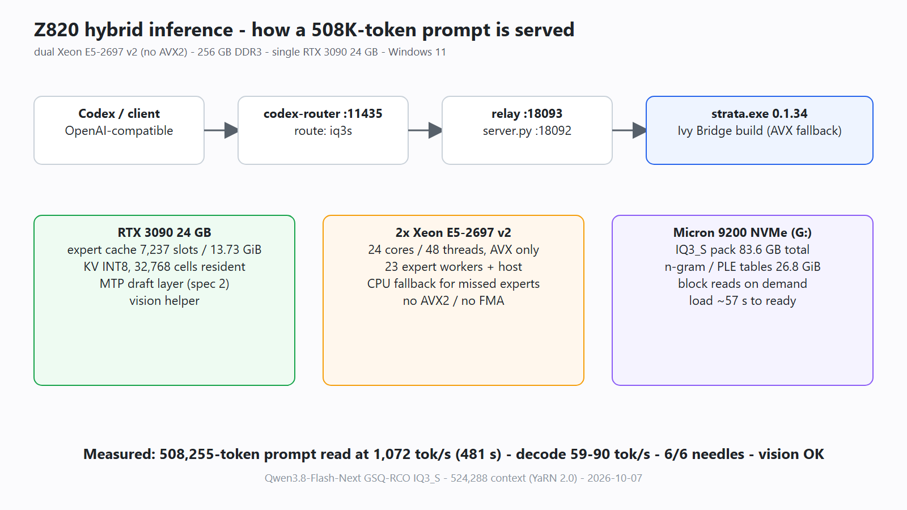
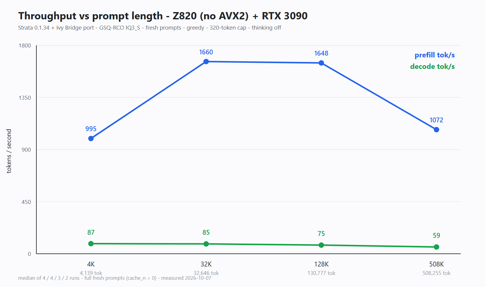
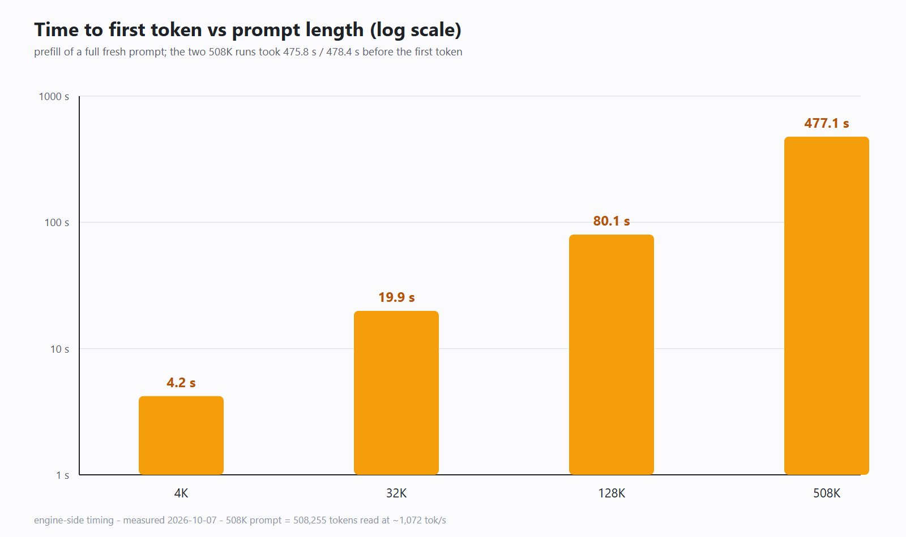

# Community benchmark: HP Z820 - dual Xeon E5-2697 v2 (AVX only) + RTX 3090 - Qwen3.8-Flash-Next IQ3_S at 512K context

Measured on 2026-10-07 by `NRK-SH`, on an HP Z820 workstation.

**Keywords:** Qwen3.8-Flash-Next, GSQ-RCO, IQ3_S, Strata, MoE, 125B total
parameters, 6B active per token, 512K context, AVX-only, no AVX2, Xeon E5-2697
v2, dual-socket Ivy Bridge-EP, HP Z820, RTX 3090 24 GB, hybrid inference,
expert cache, CPU fallback, MTP speculative decoding, n-gram / PLE tables,
GGUF quantization, local LLM, long-context inference, vision, tool calling,
Windows 11, single-GPU inference benchmark.

This report measures Strata 0.1.34 (source build with a local Ivy Bridge
compatibility port) serving the GSQ-RCO IQ3_S quantization of
Qwen3.8-Flash-Next - a 125B-parameter MoE model with 6B parameters activated
per token - on a machine with two Ivy Bridge-EP CPUs that support AVX but not
AVX2, and a single 24 GB RTX 3090. The context window is 524,288 tokens (native
262,144 with YaRN 2.0) and vision is enabled. The stack uses hybrid inference:
a GPU-resident expert cache for hot experts, CPU fallback for the rest, INT8
KV streaming, mmap-based n-gram / PLE tables, and MTP speculative decoding.

Headline results:

- **508,255-token prompts processed twice** (481 s / 484 s to first token,
  ~1,072 prompt tokens/s), with 59.0 decode tokens/s afterwards.
- **59-90 decode tokens/s** across prompt sizes from 4K to 508K.
- **6/6 long-context needles found** at 32K and 128K (`tools/needle_bench.py`,
  depths 10/50/90).
- Additional correctness checks: image question with a known code word, a
  tool-call round trip, and a small objective task set (8/9).

These are single-machine, single-quantization, synthetic-workload measurements.
They are not a general quality claim, and they should not be compared with
other hardware as a controlled result.

## Hardware and software

| Component | Detail |
| --- | --- |
| CPU | 2x Intel Xeon E5-2697 v2 (Ivy Bridge-EP, 12 cores each, 24 cores / 48 threads); AVX only, no AVX2, no FMA |
| System | HP Z820 workstation; 256 GB DDR3 (255.9 GB usable) |
| GPU | NVIDIA RTX 3090, 24,576 MiB; driver 616.56; PCIe 3.0 x16; 280 W power limit; also drives the desktop |
| OS | Windows 11 Pro for Workstations |
| Storage | Micron 9200 NVMe SSD (7.68 TB, model and data); Samsung 1 TB NVMe |
| Engine | Strata 0.1.34, source build for Ivy Bridge with a local AVX-only compatibility port (the upstream 0.1.34 release binary refuses this CPU; upstream added an AVX-only build path in 0.1.39) |
| Toolchain | CUDA 13.0.88, sm_86 |
| Measurement path | direct HTTP to `serve/server.py` on `127.0.0.1:18092` (the same backend Codex uses through a relay on port 18093) |

## Model and configuration

Model: `ISTA-DASLab/Qwen3.8-Flash-Next-GSQ-RCO-GGUF`, revision
`ed59f92082b1e93c0e96d60a8b11aab089b52f09` (current main at the time of
download; last modified 2026-09-29):

| File | Size (bytes) | SHA-256 |
| --- | ---: | --- |
| `IQ3_S/Qwen3.8-Flash-Next-GSQ-RCO-IQ3_S-00001-of-00002.gguf` | 54,817,524,224 | `4c1eb2ceb4915e1192f4f386021897bde56a97f40a0bb78bb86465e0f7d2aca3` |
| `IQ3_S/Qwen3.8-Flash-Next-GSQ-RCO-IQ3_S-00002-of-00002.gguf` | 28,800,138,432 | `316b46f3a2dbd68c900f43136ab9449f9dcc3725dfd8c794847c204bc161e113` |
| `vision/mmproj-Qwen3.8-Flash-Next-BF16.gguf` | 907,543,008 | see `provenance-local.json` |

The two IQ3_S hashes match the LFS hashes published by the model repository
(verified after download). Model scale: **125B total parameters, 6B activated
per token**, 48 layers with 512 routed experts per layer and top-10 routing,
plus 26.8 GiB of n-gram / PLE tables inside the GGUF shards.

Local pack and draft layers:

- The pack was prepared with `tools/iq_pack.py` and `compat_bf16: false` (no
  BF16 rounding of the Q8_0 projections). See `pack-conversions.json`.
- MTP draft pack: 707,788,800 B experts + 116,099,072 B dense, fetched from
  `Qwen/Qwen3.8-Flash-Next` by the installer.
- All local artifact hashes (engine binaries, pack files, draft pack, vision
  projector) are in `provenance-local.json` and `hashes.sha256`.

Effective runtime configuration (full file:
[strata-iq3s-512k-vision.json](strata-iq3s-512k-vision.json)):

- Context 524,288 tokens (262,144 native x YaRN 2.0); INT8 KV cache; 32,768 KV
  cells per layer resident on the GPU.
- Expert cache `auto`: 7,237 slots / 13.73 GiB VRAM, pre-filled from the
  routing profile at startup with no eviction.
- Prefill `auto`: 8,192-token chunks, borrowing 2,632 expert-cache slots during
  prompt processing.
- PLE / n-gram tables (26.8 GiB) accessed through `mmap`; MTP `--spec 2`; GPU
  vision enabled.
- Engine startup log: "pre-filled 7237 of 7237 slots", "23 expert-pool workers
  + the host thread", "session is up (engine 0.1.34)".

## Method and reproduction

[benchmark.py](benchmark.py) is the script used for the speed runs. It builds a
deterministic synthetic code filler with a unique nonce per request so the
server cannot reuse a conversation prefix (every run reports `cache_n = 0`),
appends an instruction that forces a long output, and streams the response
while recording time to first token and the engine's own timing values. Engine
timing lines for every run are in [engine-timings.log](engine-timings.log).

Run order and repetitions:

1. one warm-up request, excluded from the results;
2. four runs at ~4K fresh prompt tokens, four at ~32K, three at ~128K, and two
   at ~508K - increasing lengths, serially on the same loaded engine;
3. thinking disabled (`chat_template_kwargs: {"enable_thinking": false}`),
   greedy decoding, 320-token output cap, temperature 0.

The 4K and 32K stages include two additional runs from a second pass after
calibrating the characters-per-token ratio. Every number in the results table
comes from a fresh prompt. Model loading and the excluded warm-up are not part
of any timing.

## Results

Each cell is the median [minimum-maximum] over the listed runs. Every request
generated 320 tokens (the output cap); no speed run failed.

| Size | Runs | Actual prompt tokens | Prompt tok/s | Decode tok/s | TTFT (s) | Total (s) |
| --- | ---: | ---: | ---: | ---: | ---: | ---: |
| ~4K | 4 | 4,139 [4,109-4,169] | 995.4 | 87.4 [63.1-89.9] | 4.22 | 7.83 |
| ~32K | 4 | 32,646 [32,196-32,847] | 1,659.8 | 85.3 [83.5-86.4] | 19.85 | 23.60 |
| ~128K | 3 | 130,777 [130,745-131,148] | 1,648.0 | 74.9 [57.4-77.4] | 80.08 | 85.02 |
| ~508K | 2 | 508,255 [508,254-508,256] | 1,071.9 | 59.0 [58.6-59.4] | 477.1 | 482.5 |

Additional data points from the size-calibration pass (larger than intended;
retained for completeness):

| Prompt tokens | Prompt tok/s | Decode tok/s | TTFT (s) |
| ---: | ---: | ---: | ---: |
| 5,966 | 1,368.5 | 89.3 | 4.43 |
| 48,904 | 1,749.3 | 83.9 | 28.26 |
| 198,819 | 1,517.8 | 73.5 | 132.11 |

Per-run records: [results.json](results.json), [results.csv](results.csv);
aggregates: [summary.json](summary.json).

## Correctness checks

- `tools/needle_bench.py`, unmodified, at 32k and 128k with depths 10/50/90:
  **6/6 found**. Actual prompt lengths were 31,453-31,454 and
  121,792-121,794 tokens; individual runs took 19.7-77.0 s. See
  [needles.json](needles.json).
- Vision: an image containing a known code word ("MANGO-7391") was read
  correctly in 3.1 s total (2.8 s TTFT).
- Tool use: the model emitted a call to a `calc` tool, then used the returned
  value to answer `1234*5678 = 7,006,652`.
- Small objective task set (8/9): logic ordering, code evaluation,
  exact-format output, 32K multi-fact recall, and the tool call all passed; a
  two-leg travel-time question was answered incorrectly with thinking disabled
  and correctly with medium thinking. This is a spot check, not a general
  quality benchmark.

## Memory and startup

Resource peaks sampled at 1 sample / 5 s from the server's own telemetry during
the measured runs (195 samples): GPU memory **24,061 MiB** of 24,576, GPU
utilization up to 100%, GPU temperature up to **81 C**, package power up to
**280 W**, host RAM in use up to **81.3 GiB**. See
[memory-summary.json](memory-summary.json).

Cold start (engine restart): stop-to-exit 12 s; start-to-ready 56 s (from the
control log). The first request after the restart had a 3.96 s TTFT and
39.7 decode tokens/s; the second had 3.14 s and 68.7 tokens/s.

Thinking modes (additional observations, not part of the speed table): with
`reasoning_effort: xhigh` the model hit the 16,384-token cap twice without
reaching a final answer (~63 decode tokens/s during reasoning); with `medium`
it generated 13,241 tokens (11.9 k characters of reasoning) and then a
38.3 k-character answer. Simple tasks with medium thinking use only a few
hundred reasoning characters.

## Limitations

One machine, one quantization (GSQ-RCO IQ3_S), one custom pack, one engine
build. This is not an upstream release binary: Strata 0.1.34 was compiled for
Ivy Bridge with a local AVX-only compatibility port, and that AVX fallback path
is exactly what is being measured on the CPU side. The pack was converted
without `--compat-bf16`, so its numbers are not directly comparable with runs
that use that conversion. The 508K cases processed 508,255 tokens, slightly
below the full 524,288-token window. Requests were single-sequence; concurrency
and long-running stability were not tested. The workload is synthetic and the
throughput numbers should not be read as a quality claim; the needle check
measures recall on those inputs only. Timings were taken over loopback on the
same host, so network latency is not represented.

## Files

| File | Contents |
| --- | --- |
| `benchmark.py` | the benchmark script (configurable base URL / model) |
| `results.json`, `results.csv`, `summary.json` | per-run and aggregated results |
| `engine-timings.log` | engine timing lines for every speed run |
| `needles.json` | unmodified needle_bench.py output (6/6) |
| `memory-summary.json` | sampled GPU / RAM peaks |
| `strata-iq3s-512k-vision.json` | effective engine configuration |
| `pack-conversions.json` | local pack conversion metadata (`compat_bf16: false`) |
| `provenance-local.json`, `hashes.sha256` | local artifact hashes (engine, pack, draft, vision) |
| `assets/` | SVG / PNG charts and the system overview |
