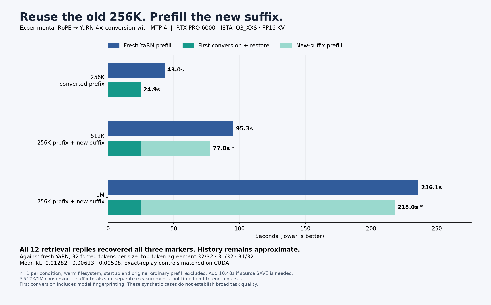

# MTP cache-migration validation



The implementation and probe in this branch match the tested source.
llm-79, Radeon RX 7900 XTX, HIP, ISTA IQ3_XXS, FP16 KV, MTP width 4,
table RoPE coefficients and greedy decoding. No deployment defaults changed.

The converter includes computed MTP draft keys at their absolute sliding-window
positions. It leaves the uncomputed final draft cell for boundary replay and
leaves main/draft values unchanged. Save/reload preserves approximate migration
provenance. Quantized KV remains unsupported.

The default-window 4K probe, a 4K probe with a 1,024-token draft window and 4,096
resident KV cells, and actual migration followed by extension from 4K to 8K
completed. Every scored retrieval reply returned the three expected markers.
The extension test verifies reuse of the original migrated prefix; it does not
silently replace it with full prefill. This narrow probe does not establish
broad long-context quality.

## Quality measurements

A is fresh YaRN, B is migrated ordinary-RoPE history, C is fresh YaRN replay.
Each row compares the same 32 forced continuation tokens. These are single
cases, not acceptance thresholds. The JSON files retain every token-level
measurement, all comparison arms, and exact generated text. Their one-token
setup/reset/forced-logit calls are not scored retrieval tasks; the generic
`correct: false` on those rows means their incidental single token does not
contain all three markers.

| Case | Comparison | Mean KL | Top-token agreement | Perplexity ratio |
|---|---|---:|---:|---:|
| 4K, default draft window | A / B | 0.004069 | 31/32 | 0.968224 |
| 4K, default draft window | A / C | 0.001792 | 32/32 | 0.981280 |
| 4K, 1K draft window | A / B | 0.003055 | 31/32 | 0.970200 |
| 4K, 1K draft window | A / C | 0.002499 | 32/32 | 0.999859 |
| Extended from 4K to 8K | A / B | 0.003370 | 31/32 | 1.022564 |
| Extended from 4K to 8K | A / C | 0.001404 | 32/32 | 0.997990 |

Nonzero A/C differences demonstrate backend numerical variation even for the
replay control. A ratio below one only means lower loss on these particular
forced tokens; it does not establish a better model.

At 4K, migration plus restore took **28.883 s**, including first-use model
identity verification, versus **9.692 s** for fresh YaRN prefill. This was not
a short-context speed win. Subsequent restore of the saved migrated session
took 1.190 s. Startup is separate; filesystem caches were not flushed.

The standalone SYCL engine built with Intel oneAPI 2026.1.1, and its host
mathematical checks passed. This proves compile compatibility, not Intel GPU
execution or a migration endpoint on the separate SYCL engine.
## CUDA 4K smoke test

llm-60, RTX PRO 6000 Blackwell, same ISTA IQ3_XXS model family, FP16 KV and
MTP width 4. The CUDA build and four native tests passed. Source save, migration, generation,
v2 save/reload and generation after reload completed; all six retrieval replies
returned the three markers. Migrated and reloaded replies each accepted 18 of
18 offered draft tokens, demonstrating MTP execution rather than just loading
draft weights.

| Comparison | Mean KL | Top-token agreement | Perplexity ratio |
|---|---:|---:|---:|
| A / B | 0.004182 | 30/32 | 0.979545 |
| A / C | 0 | 32/32 | 1 |

The deterministic CUDA replay control matched exactly in this case. Migration
plus restore took 9.192 s, including first-use model identity verification,
versus 0.959 s for fresh 4K YaRN prefill. It is not a short-context speed win.
`cuda-4k-results.json` retains all individual comparisons and MTP counters.
## CUDA: migrated 256K history continued to 512K and 1M

The full campaign completed with the same model/backend/KV/MTP settings. It
saved 262,143 ordinary-RoPE tokens, leaving the boundary token for recomputation,
converted that history, and verified save/reload provenance. Each extension
restored that original converted prefix and added new tokens until the actual
input contained 524,288 or 1,048,576 tokens. The saved 262,143-token prefix was
reused in both cases; no silent full-prefill fallback occurred. Target allocation
was 1,048,832 cells, including output headroom.

All 12 scored retrieval replies recovered the three original document markers.
These synthetic retrieval/forced-token cases measure preservation of this
history; they do not establish broad code, reasoning or long-context quality.

| Actual input | A/B mean KL | A/B max KL | A/B top-token agreement | B/A perplexity ratio | A/C control |
|---|---:|---:|---:|---:|---|
| 262,144 | 0.012821 | 0.080309 | 32/32 | 1.004367 | Exact |
| 524,288 | 0.006129 | 0.054138 | 31/32 | 1.017411 | Exact |
| 1,048,576 | 0.005081 | 0.041853 | 31/32 | 0.987061 | Exact |

Each comparison contains 32 forced-token distributions. All per-token values,
other comparisons and exact output text are in `cuda-256k-to-1m-results.json`.
A/B is approximate history versus fresh YaRN; A/C is the exact-replay control.
No quality gate or automatic switching policy was introduced.

### Timing and storage

Saving the ordinary source took 10.480 s and wrote 7,620,200,104 bytes (7.097 GiB).
Migration plus target restore took 24.867 s, including target first-use model
identity verification. It wrote a 7,620,200,136-byte converted file while retaining
the source. Fresh YaRN prefill of that prefix took 43.017 s. Startup/model loading
and the already-completed ordinary prefill are excluded from these comparisons.

| Target input | Fresh YaRN prefix prefill | New-suffix prefill after migrated prefix | Restore already-converted source | Restore + suffix (sum) | First conversion + suffix (sum) |
|---|---:|---:|---:|---:|---:|
| 524,288 | 95.321 s | 52.936 s | 4.485 s | 57.421 s | 77.803 s |
| 1,048,576 | 236.129 s | 193.165 s | 4.479 s | 197.644 s | 218.032 s |

The sum columns are calculated from separately measured operations, not new
end-to-end samples. Add another 10.480 s if the ordinary source must first be
saved from RAM. Do not double-count restore inside the conversion measurement.
Migration skips prefill of the old 256K prefix; it does not eliminate processing
the new suffix. Its first-use advantage is consequently modest at 1M. All timings
are single warm-filesystem samples, with the diagnostic mode applied equally
to all arms. This is a different experiment from restoring an already-saved 1M
session, which saves substantially more prefill work.

The five-second resource monitor measured 54.37 GiB peak combined process RSS,
54.11 GiB peak single-native-process high-water RSS, 73.79 GiB peak device usage,
and at least 66.17 GiB available system RAM. These are total working-set/device
measurements, including weights where resident; temporary-only allocations were
not isolated. `cuda-resources-summary.json` records the monitor hash and scope.
The converter stages changed keys in host memory and does not allocate a second
complete GPU KV pool. Retaining source and converted files costs about 14.194 GiB
for this 256K source, apart from diagnostics and any later snapshots.

| Retrieval input | Fresh YaRN decode | Migrated-history decode | Drafts accepted/offered, fresh → migrated |
|---|---:|---:|---|
| 262,144 | 232.3 tok/s | 236.0 tok/s | 15/21 → 15/21 |
| 524,288 | 207.1 tok/s | 181.5 tok/s | 15/21 → 15/24 |
| 1,048,576 | 109.2 tok/s | 134.0 tok/s | 13/33 → 15/27 |

These are single 22-token marker replies, measured after the first token and
without disk checkpoint writeback. Their short duration and changing MTP
acceptance preclude a general decode-speed claim. They are not comparable to
whole-request serving times that include checkpoint writeback.

```sh
python tools/bench_rope_migration.py --config /path/config.json \
  --output /new/long-probe --tokens 262144 --source-context 262400 \
  --target-context 1048832 --compare --mtp /path/mtp/rt \
  --extend-tokens 524288 1048576
```

## Reproduce

```sh
python tools/bench_rope_migration.py --config /path/config.json \
  --output /new/probe --tokens 4096 --source-context 8192 \
  --target-context 16384 --compare --mtp /path/mtp/rt
# Sliding draft window: add --mtp-window 1024 --kv-resident 4096
# Actual longer continuation: add --extend-tokens 8192
```

## Published evidence and build checks

Machine-local paths in the JSON were replaced with `/data/...` paths for
publication. Numerical measurements, token IDs, generated text, all comparison
arms, and failed incidental setup-token matches are preserved. No persona
instructions were included in these native-engine prompts.

CUDA and HIP each built the engine and passed four native targets:
`rope_cache_migration_test`, `conversation_cache_test`,
`conversation_file_test`, and `rope_parity`. The mathematical/snapshot target
passed 3,827 checks. SYCL built all 123 targets with Intel oneAPI 2026.1.1 and
passed the 3,827 host checks; it has no migration endpoint or Intel GPU runtime
validation. The API retains the existing `/slots/0?action=migrate_yarn4` contract.

The initial HIP launch inherited an unsupported option from a deployment
configuration and exited before inference. The corrected standalone native
probe produced `hip-4k-results.json`; the separate windowed and extension probes
also completed. That failed launch is not a model-quality failure or a timed
migration sample. The four native tests had passed before the launch correction.

The published runtime sources were compared against the CUDA/HIP builds and
the relevant SYCL build sources. They match. The HIP probe predates the
additional MTP-counter fields and explicit setup-token scoring labels; its
generation, migration and comparison operations are unchanged. The public
probe includes those recording improvements, as exercised in the CUDA run.
The 34 slot API tests also passed on the updated source.

Regenerate the chart with `python plot.py` from this directory. The original
MTP-off measurements remain in the adjacent `2026-10-09-rope-cache-migration`
report; they are not overwritten or combined with the new samples.
