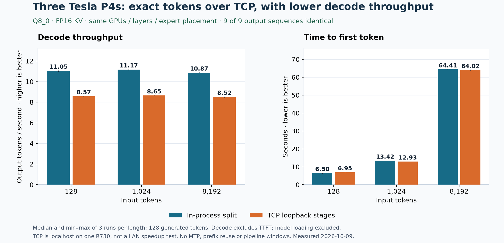

# R730 Q8: exact-token parity over TCP loopback

On the same three Tesla P4s, PR #1748's TCP stages produced exactly the same
128 output tokens as the in-process layer split for all nine matched requests.
TCP decode throughput was 21.6–22.6% lower. This is a controlled same-host
transport comparison, not a claim about the benefit of adding GPUs over a LAN.



## Results

Three repeats per prompt length, greedy, 128 generated tokens each. Medians:

| Input tokens | Local decode tok/s | TCP decode tok/s | Local TTFT s | TCP TTFT s | Local total s | TCP total s | Exact matches |
|---:|---:|---:|---:|---:|---:|---:|---:|
| 128 | 11.051 | 8.575 | 6.497 | 6.953 | 17.989 | 21.765 | 3/3 |
| 1,024 | 11.175 | 8.650 | 13.424 | 12.929 | 24.790 | 27.643 | 3/3 |
| 8,192 | 10.866 | 8.518 | 64.405 | 64.022 | 76.080 | 78.977 | 3/3 |

Decode min–max: local 11.006–11.061 / 11.128–11.182 / 10.849–10.878 tok/s;
TCP 8.570–8.581 / 8.615–8.659 / 8.492–8.525 tok/s, respectively.
All six repeated-versus-first comparisons within each mode also pass (12 total).
No output is dropped. Full output token IDs, generated text, input SHA-256 and
per-request timing are in `matched-local.json` and `matched-loopback.json`.
`report.py` independently rechecks the IDs and regenerates the chart and summary.

Decode rate is `(output_tokens - 1) / (total_s - ttft_s)`: the measured interval
from the first token to completion, excluding prompt processing and the first
token. TTFT includes prompt processing and first-token delivery. These are
Python engine-client wall times, not HTTP-server timings. The `prefill_progress_ms`
field in the raw rows is engine progress telemetry and is not substituted for TTFT.
Model loading is excluded. There is no queue of concurrent requests and no prompt
reuse; every row reports zero reused tokens. No separate warm-up was discarded.

## What changed to obtain this control

No additional TCP runtime patch was needed. Both modes use the same build:

- PR [#1748](https://github.com/Niko1221/Strata/pull/1748) at
  `809ff93ad9c36533c4811219e488b42f592bc809`.
- Plus PR [#1674](https://github.com/Niko1221/Strata/pull/1674)'s two
  `!always_publish_` guards, upstream patch head
  `9e67094a981225d4dc581a0229caf8525878e97a`.
- The measured cherry-pick build was `0f0406534ac6011ba4129b0d6688b3ee3f5da894`.
  This report branch contains no engine changes; its base is
  `fb58e0dbc8399662c0e47c76578c6e878b14f6cf`.

We fixed `--pcie-frac 0 --adapt-every 0`, used `STRATA_IQ_MT_MIN=1`, and matched
the **identities** of GPU-resident experts, not just slot counts. The profile keeps
the first 32 experts per layer from the original ranked profile. Each 16-layer
stage has exactly 512 filled slots; no spare slots admit different experts during
the run. The layer partition and physical cards stay identical in both modes.
`profile.json` records every selected pair and source/output profile hashes.

An earlier uncontrolled Q8 run varied even when the same prompt was repeated on
the local split. It therefore could not establish a TCP regression. These runs
establish parity under the combined controls; they do not isolate which individual
setting caused the earlier mismatches. #1674 is retained, but these requests do
not enable pipeline windows, so this does not demonstrate that its pipeline guard
caused the serial parity result.

## Machine and workload

- Dell PowerEdge R730xd, two Xeon E5-2697 v3 CPUs, 28 physical cores / 56 threads,
  AVX2, about 252 GiB usable RAM.
- Three Tesla P4s, 7,680 MiB VRAM and 75 W power limit each. Physical devices
  0/1/2 run layers 0–15 / 16–31 / 32–47. Previous link measurements identify the
  middle card as x8 and the outer cards as x16; link width under this run's load
  was not separately sampled.
- Ubuntu 24.04.5, NVIDIA 580.178.04, CUDA 12.0, GCC 12, experimental sm61 build
  (`STRATA_EXPERIMENTAL_SM60=ON`). Engine reports 0.1.41. CPU pool: 27 workers plus
  host thread per process; TCP therefore has separate pools sharing the same CPU.
- Unsloth `Qwen3.8-Flash-Next-GGUF`, Q8_0, six shards named
  `Qwen3.8-Flash-Next-Q8_0-00001-of-00006.gguf` through `00006-of-00006.gguf`.
  Total 188,225,033,248 bytes (175.298 GiB); experts 119.53 GiB.
  Artifact repository revision/full-file hash set was not captured for this run.
- Native pack, FP16 KV, context allocation 16,384, prefill chunk 1,024,
  `--spec 2` verifier capacity with **no MTP model**, `--suffix-draft 0`.
  No vision, control vectors, speed projection or pipeline-window overlap.
- VRAM reserve 1,536 MiB on each stage; `STRATA_PREFILL_CPU_SHARE=0`.
- TCP goes through `127.0.0.1`: main → middle relay → last worker. The TCP main
  process runs the head; the in-process split runs the head on the last card.
  Thus this compares the two actual execution modes, including their head
  placement and CPU-pool differences, not socket overhead in isolation.
- During measurement, GGUF files were accessed through a read-only SSHFS LAN
  mount. Experts are loaded into RAM, but mapped embedding/PLE reads can still
  access the source. This is not a disk-I/O-free claim. Local-disk staging happened
  afterward and did not affect these measurements. A full local-reference startup
  took 1,248 s and is excluded. Configuration order was local, then TCP.

Synthetic prompt: record three project codes near the beginning, middle and end,
with repeated `apple` / `orange` padding, then return the codes and write a Python
validator with a docstring and example calls. For example: “Return CEDAR-731,
MARBLE-482 and QUARTZ-956 in order, then write a function that validates them.”
`bench.py` constructs exactly 128/1,024/8,192 input tokens using the model's chat
template, with thinking disabled. This is three synthetic prompts, not a general
quality benchmark. Marker recovery is not used as a substitute for exact IDs.

## Reproduce

Use a separate checkout of #1748 at the tested head and cherry-pick #1674's patch:

```sh
git fetch https://github.com/Niko1221/Strata.git refs/pull/1748/head
git checkout --detach 809ff93ad9c36533c4811219e488b42f592bc809
git fetch https://github.com/Niko1221/Strata.git refs/pull/1674/head
git cherry-pick 9e67094a981225d4dc581a0229caf8525878e97a
```

Build CUDA for sm61 with the experimental Pascal option. Keep this report's files
outside that checkout or in another worktree. The harness needs the engine's
Python server/tokenizer dependencies. Set `STRATA_SRC` to that checkout, `BIN` to
its executable, and `PACK`, `NATIVE`, `PLE` to the same native pack, first shard and
third shard. Set `REPORT` to this report directory. Then:

```sh
mkdir -p probe-output
cd probe-output
export BENCH_OUTPUT="$PWD"
python "$REPORT/make_profile.py"
export PROFILE="$PWD/matched-expert-profile.bin"
export STRATA_IQ_MT_MIN=1 STRATA_PREFILL_CPU_SHARE=0
export STRATA_REMOTE_TIMING=1 STRATA_REMOTE_TIMEOUT_S=300
export STRATA_STAGE_TOKEN="$(python -c 'import secrets; print(secrets.token_hex(24))')"
```

Create `local.json` (replace paths, including tokenizer directory):

```json
{
  "tokenizer": "/path/to/pack/tokenizer",
  "args": ["--pack", "/path/to/pack", "--native", "/path/to/shard-1.gguf",
           "--ple-gguf", "/path/to/shard-3.gguf", "--expert-profile", "/path/to/matched-expert-profile.bin"],
  "benchmark_extra_args": ["--expert-cache", "512", "--pcie-frac", "0", "--adapt-every", "0",
    "--layer-split", "16,32", "--split-device", "1,2", "--trim-stage-weights"]
}
```

The measured local run additionally used `--shared-expert-arena` with a temporary
full-model file in `/dev/shm`. It was unmapped and removed before TCP workers
loaded their disjoint ranges; no full expert copy remained alongside them. This
backing option does not skip source reads on subsequent starts. To match it, add
that flag/path to local extras and remove the temporary file only after the local
engine exits. Ensure tmpfs and physical RAM capacity first.

Run the local reference:

```sh
python "$REPORT/bench.py" --config local.json --label local --exe "$BIN" \
  --sizes 128,1024,8192 --repeats 3 --output-tokens 128 \
  --spec 2 --no-mtp --max-context 16384 --prefill 1024
```

Start the last worker, then the relay, waiting for each listener before continuing
(commands use Bash arrays; run in separate terminals with the same environment):

```sh
COMMON=(--pack "$PACK" --native "$NATIVE" --ple-gguf "$PLE" --expert-profile "$PROFILE"
  --serve --expert-cache 512 --pcie-frac 0 --adapt-every 0 --prefill 1024
  --max-context 16384 --kv fp16 --stats --vram-reserve-mib 1536 --spec 2
  --suffix-draft 0 --prompt-cache 0 --conversation-cache-mib 0)
CUDA_VISIBLE_DEVICES=2 "$BIN" "${COMMON[@]}" \
  --stage-worker 18850 --stage-begin 32 --stage-bind 127.0.0.1
# In a second terminal, after the last worker is listening:
CUDA_VISIBLE_DEVICES=1 "$BIN" "${COMMON[@]}" \
  --stage-worker 18849 --stage-begin 16 --stage-end 32 \
  --stage-next 127.0.0.1:18850 --stage-bind 127.0.0.1
```

Make `tcp.json` from `local.json`, leaving only `--expert-cache 512 --pcie-frac 0
--adapt-every 0` in `benchmark_extra_args`. Then:

```sh
CUDA_VISIBLE_DEVICES=0 python "$REPORT/bench.py" --config tcp.json --label tcp --exe "$BIN" \
  --remote 127.0.0.1:18849 --split 16 --sizes 128,1024,8192 --repeats 3 \
  --output-tokens 128 --spec 2 --no-mtp --max-context 16384 --prefill 1024
```

Compare full `output_ids` for every matching `(tokens, repeat)` and verify equal
`input_sha256` values. Stop both workers when done. To audit the published data:
`python report.py` (requires matplotlib). No credentials, model weights or private
server features are included in this report.

## Scope and remaining checks

This report establishes exact greedy output parity for this small controlled
same-host Q8 sample. It does not establish identical logits, cross-architecture
parity, MTP parity, LAN performance, or a performance default. The P4-plus-RTX-3070
comparison with matched placement remains outstanding. Earlier unpaired results
are not pooled into this table. With only three runs per cell, no p95/p99 or
statistical-significance claim is made.

The measured source also built on RTX CUDA sm86, HIP gfx1100 and SYCL; selected
conversation-cache/session-file/RoPE native tests passed on CUDA/HIP, and stage-node
Python tests passed. These are supplementary build checks, not HIP/SYCL inference
parity results. The separately maintained SYCL verifier does not contain #1674's
guards; this report's inference uses the patched CUDA verifier.
