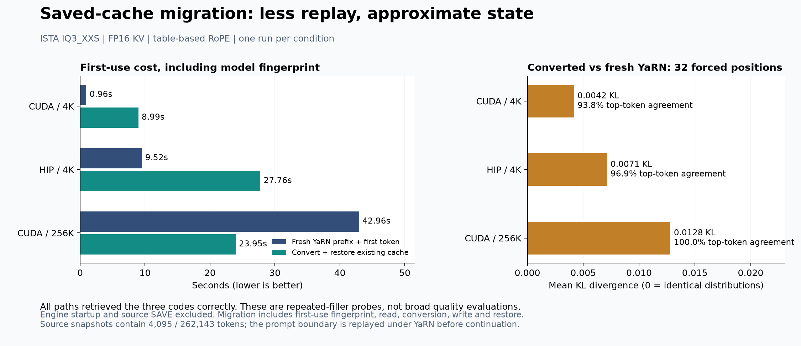

# Experimental saved-cache migration measurements



This measures the converter in this branch, using **STRATA_ROPE_TABLE=1** on
every source, target, and control. It is separate from measurements of stock
Strata's existing YaRN with its default numerical path. The converter refuses
analytic fast-math caches because their actual angles can differ from the table.

> These are the original MTP-off measurements. The [MTP follow-up](../2026-10-09-mtp-migration/README.md) adds CUDA/HIP draft-state conversion, actual continuation through 512K and 1M, and completed SYCL build checks.

## Results

ISTA-DASLab IQ3_XXS, FP16 KV, single GPU, MTP and parked-conversation caching off,
prefill chunk 8192, CPU prefill share zero, greedy sampling. NVIDIA: RTX PRO 6000
Blackwell 96 GB. AMD: Radeon RX 7900 XTX 24 GB. One run per condition.

| Condition | Fresh YaRN prefix | Convert + restore | Key conversion alone | Mean KL vs fresh | Top-token agreement |
|---|---:|---:|---:|---:|---:|
| CUDA, 4K | 0.96 s | 8.99 s | 0.078 s | 0.00418 | 93.75% |
| HIP, 4K | 9.52 s | 27.76 s | 0.163 s | 0.00714 | 96.875% |
| CUDA, 256K | 42.96 s | 23.95 s | 5.795 s | 0.01282 | 100% |

At 256K, migration plus restore took about **1.79x less time** than fresh
prefix processing in this example. At 4K it was slower. This does not locate a
general break-even point. The first full-model fingerprint costs 8.47 s / 24.39 s
in the two 4K cases and 8.43 s in the 256K case; it is cached for that engine
process. No warm-identity migration timing is claimed.

Timing starts with the target engine loaded and the source snapshot already
available. Engine startup and source SAVE are excluded. Fresh time is the
`A-prefix` request: prefill plus one token. Migration time includes identity,
read, conversion, write, and restore; the following boundary-token evaluation
is separate. Source snapshots contain 4,095 / 262,143 tokens; the last input
token is processed under YaRN before sampling. File caches were not deliberately
flushed, so these are not cold-disk measurements.

All task paths returned the same three associations:

```text
CEDAR-731|MARBLE-482|QUARTZ-956
```

The prompt places these codes near the start, middle, and end, with repeated
filler between them. The final request asks for all three in order. Task replies
were 22 tokens, capped at 64. The distribution comparison uses **32 identical
forced continuation positions**, including positions beyond 262143 in the
256K case. It is not a broad coding, agent, or long-conversation quality test.
100% top-token agreement does not mean equal probability distributions.

The fixed-continuation perplexity ratio (converted / fresh) was 0.97954, 0.96269,
and 1.00437 respectively. This applies only to that short fixed text, not general
model perplexity. All per-position KL, NLL and top-token comparisons are in
[measurements.json](measurements.json); no quality threshold filters the cases.

Exact replay versus fresh YaRN had zero KL on CUDA in both sizes. HIP's replay
control itself differed: mean KL 0.00171 and 96.875% top-token agreement. That
baseline variability should be considered when interpreting its migration result.

## Correctness and limitations

- CUDA and HIP: all six native test targets passed, including the independent
  FP64 oracle, session files, snapshot restoration, validation and RoPE parity.
  The converter fixture has 2,747 checks, including unchanged values,
  unsupported formats, failure after staging, provenance and duplicate rejection.
- Both backends: all 34 slot API tests passed. Real 4K probes completed save,
  migration, continuation, save again, and restore with provenance retained.
- CUDA: the 256K probe completed migration, continuation across the old boundary,
  and reload. The unflagged 4K control matched untouched main's 22 output token
  IDs exactly. This is a scoped regression check, not proof for every workload.
- The engine explicitly refuses experimental mode without the table setting.
  A low-disk attempt refused before writing; the completed run followed cleanup
  of disposable benchmark artifacts.
- These initial samples did not cover SYCL or migrated continuation through 1M.
  The linked follow-up now includes the SYCL build/host checks and actual CUDA
  continuation from a migrated 256K prefix through 512K and 1M. Intel GPU runtime
  execution remains unverified; the separate SYCL entry point has no migration endpoint.
- Full-model per-layer K/V comparisons, broad task suites, streaming-KV
  configurations, BF16 and quantized-KV conversion are not validated here.
  BF16, quantized KV, multi-GPU and multimodal conversion are rejected.
  MTP is supported by the separately measured follow-up in this branch.

The 256K source and converted files each occupy about 7.08 GB (decimal); keeping
both needs about 14.17 GB plus the configured free-space reserve. During that
whole probe, peak sampled GPU usage was 70.78 GiB and engine RSS high-water mark
was 53.33 GiB. Device-wide VRAM was sampled about once per second; RSS includes
mapped pages. These are whole-process observations, not isolated temporary
conversion allocations.

## Reproduce

See [configuration and API usage](../../../docs/ROPE_CACHE_MIGRATION.md).
Using this branch's build and an existing model configuration:

```sh
python tools/bench_rope_migration.py --config strata.json \
  --tokens 4096 --source-context 8192 --target-context 16384 \
  --compare --output /tmp/migration-4k

python tools/bench_rope_migration.py --config strata.json \
  --tokens 262144 --source-context 262400 --target-context 1048832 \
  --compare --output /tmp/migration-256k

python tools/compare_rope_results.py --output /tmp/comparison.html \
  /tmp/migration-4k/results.json /tmp/migration-256k/results.json
```

The probe sets the required table mode. Each output directory must be new.
Model/pack paths come from the configuration, while the executable is this
checkout's `build/strata`. Input and executable hashes, launch options and all
per-case measurements are retained in the JSON. Weights and saved sessions
are not included. Regenerate the PNG/SVG with `python plot.py` in this directory.
