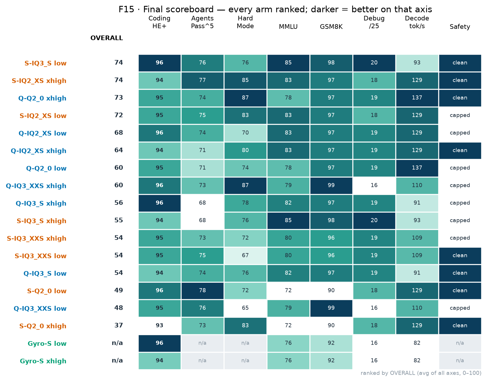
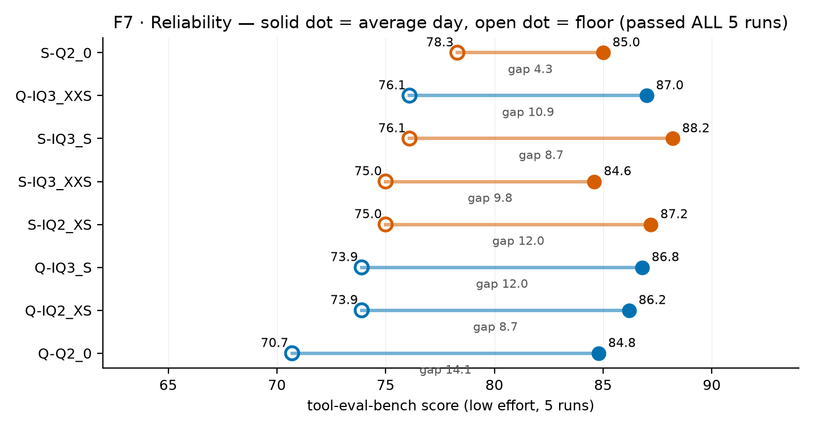
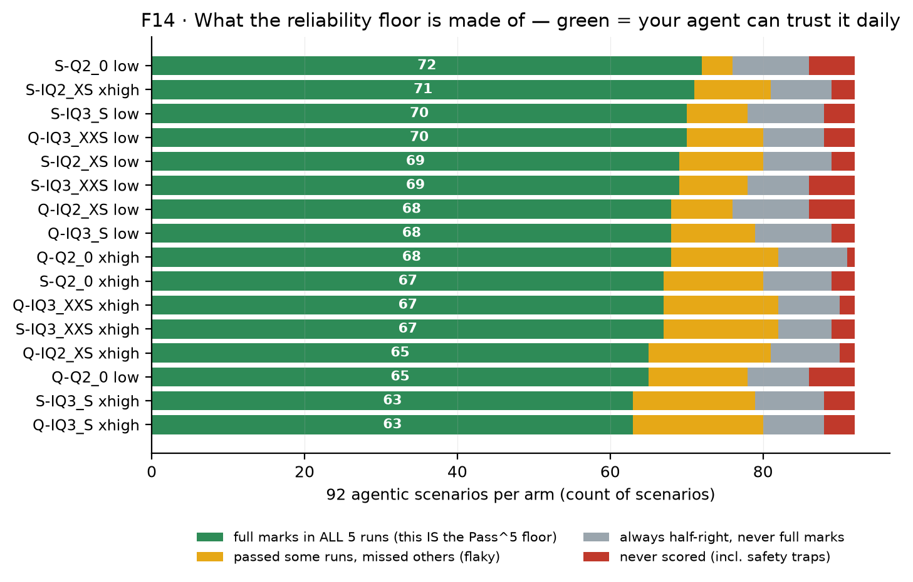
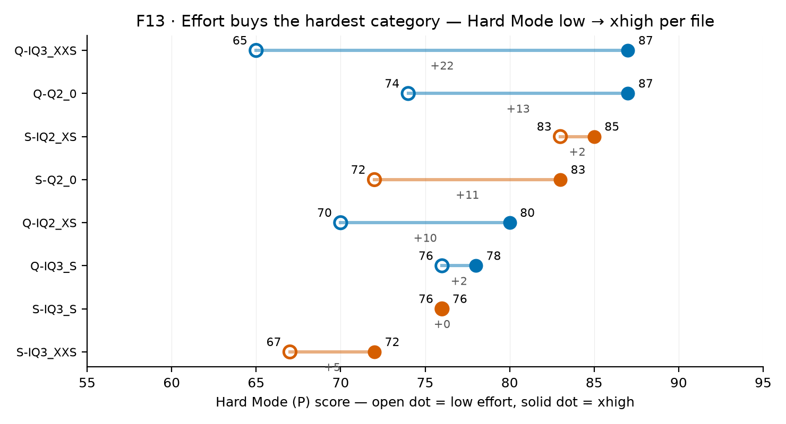
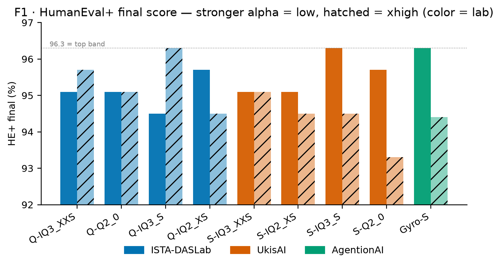
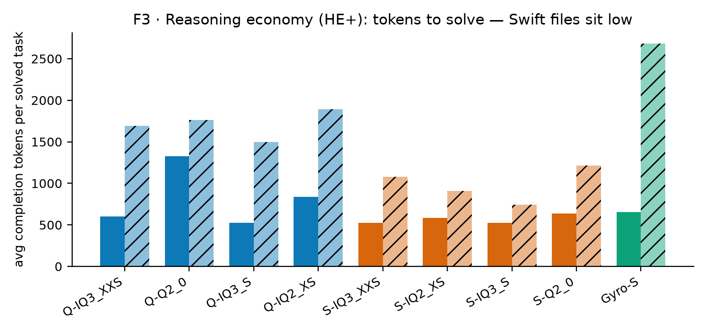
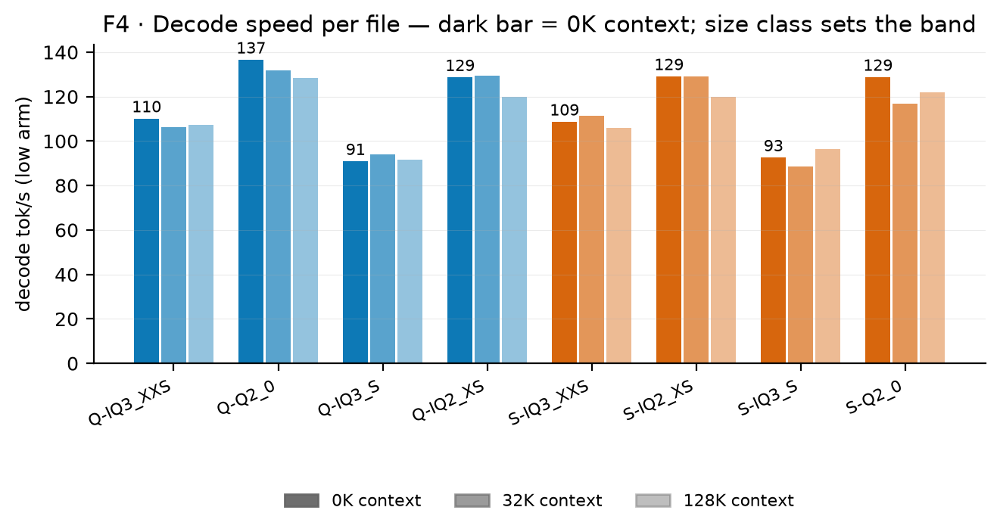
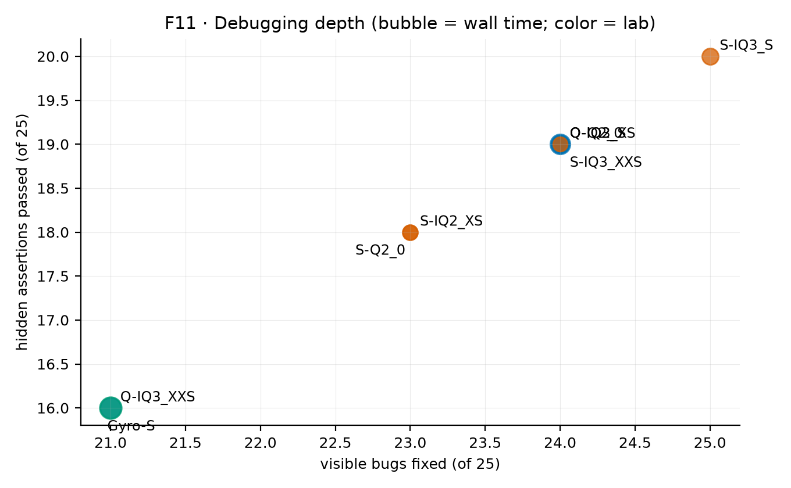

# Community report — 9-file quant battery on RTX 5070 Ti 16 GB

**ISTA-DASLab GSQ-RCO · UkisAI Swift-1.5 · AgentionAI Gyro-S — one rig, one engine, every axis.**

- **Rig:** RTX 5070 Ti (16 GB), Ryzen, 64 GB RAM, Windows + WSL · **Engine pinned `0.1.40.3` (digest `34CDE150B21148E6`)** for every Strata run; Gyro-S on its own `agentionai/Strata` rc1 engine.
- **Battery:** HumanEval+ 164 · tool-eval-bench 92 agentic scenarios **× 5 runs per arm** · five-bugs debugging (25 sessions) · GSM8K/MMLU/IFEval · needle @260K · llama-benchy at 0/32/128K context.
- **Scale:** 9 files, 3 labs, 18 arms (file × effort), ~1,900 measured runs. Compiled 2026-10-10.

**The PDF** — [`strata-community.pdf`](strata-community.pdf) (14 pp, community edition) — is the full visual report. Every number in it and in this README is machine-extracted from [`data/ALL-METRICS.json`](data/ALL-METRICS.json); nothing is hand-typed.

---

## The four questions — straight answers

| Question | Answer | Evidence |
|---|---|---|
| **What's the fastest?** | **Swift IQ3_XXS (UkisAI)** | 164 coding tasks in **11m56s**; the 66–68 GB files decode at **129–137 tok/s**, ~30% faster than the 76–84 GB files on a 16 GB card. |
| **What's best at coding?** | **Swift IQ3_S (UkisAI)** | ties top score **96.3**, best first-try (94.5), best debugger (20/25 hidden). Gyro-S ties the score; Swift gets there in ~half the time. |
| **What's best at agentic tools?** | peak: **Q-Q2_0 xhigh** & **S-IQ2_XS xhigh** (★★★★★, 90) · dependable: **S-Q2_0 low** | best Pass^5 floor **78.3**; best mean 89.4. |
| **Best overall?** | **Swift IQ3_S (UkisAI)** | top coding + best knowledge (MMLU 85) + best debugging + top-4 agent floor, full suite in 15m. One file for everything. Caveat: biggest file (83.7 GB). |

---

## The cast — 9 files, 3 lineages (base = Qwen/Alibaba)

| File | Lab | Quant | GB | Engine |
|---|---|---|---:|---|
| **Q-IQ3_XXS** | ISTA-DASLab | IQ3_XXS | 75.8 | 0.1.40.3 |
| **Q-Q2_0** | ISTA-DASLab | Q2_0 | 66.4 | 0.1.40.3 |
| **Q-IQ3_S** | ISTA-DASLab | IQ3_S | 83.6 | 0.1.40.3 |
| **Q-IQ2_XS** | ISTA-DASLab | IQ2_XS | 67.2 | 0.1.40.3 |
| **S-IQ3_XXS** | UkisAI | IQ3_XXS | 76.0 | 0.1.40.3 |
| **S-IQ2_XS** | UkisAI | IQ2_XS | 68.2 | 0.1.40.3 |
| **S-IQ3_S** | UkisAI | IQ3_S | 83.7 | 0.1.40.3 |
| **S-Q2_0** | UkisAI | Q2_0 | 66.6 | 0.1.40.3 |
| **Gyro-S** | AgentionAI | TQ1_0 (APR) | 58.5 | rc1 (own) |

Repos: [ISTA-DASLab](https://huggingface.co/ISTA-DASLab/Qwen3.8-Flash-Next-GSQ-RCO-GGUF) · [UkisAI](https://huggingface.co/UkisAI/Swift-1.5-Qwen3.8-Flash-Next-GSQ-RCO-GGUF) · [AgentionAI](https://huggingface.co/agentionai/Qwen3.8-Flash-Next-Gyro-GGUF)

---

## The final scoreboard — every arm ranked

OVERALL = average of all seven axes (coding, agent floor, Hard Mode, MMLU, GSM8K, debugging, decode), each scaled 0–100 across the study. **OVERALL answers "best all-rounder" — it hides specialists** (Swift Q2_0 low ranks 14th yet owns the best reliability floor). Gyro-S rows are `n/a` on agent axes: rc1 has no tool support (C1), so its OVERALL is not comparable.

| # | Arm (lab) | OVERALL | Coding HE+ | Agents Pass^5 | Hard Mode | MMLU | GSM8K | Debug /25 | Decode t/s | Safety |
|---:|---|---:|---:|---:|---:|---:|---:|---:|---:|---|
| 1 | **S-IQ3_S low** (UkisAI) | 74 | 96 | 76 | 76 | 85 | 98 | 20 | 93 | clean |
| 2 | **S-IQ2_XS xhigh** (UkisAI) | 74 | 94 | 77 | 85 | 83 | 97 | 18 | 129 | clean |
| 3 | **Q-Q2_0 xhigh** (ISTA-DASLab) | 73 | 95 | 74 | 87 | 78 | 97 | 19 | 137 | clean |
| 4 | **S-IQ2_XS low** (UkisAI) | 72 | 95 | 75 | 83 | 83 | 97 | 18 | 129 | capped ★★★ |
| 5 | **Q-IQ2_XS low** (ISTA-DASLab) | 68 | 96 | 74 | 70 | 83 | 97 | 19 | 129 | capped ★★★ |
| 6 | **Q-IQ2_XS xhigh** (ISTA-DASLab) | 64 | 94 | 71 | 80 | 83 | 97 | 19 | 129 | clean |
| 7 | **Q-Q2_0 low** (ISTA-DASLab) | 60 | 95 | 71 | 74 | 78 | 97 | 19 | 137 | capped ★★★ |
| 8 | **Q-IQ3_XXS xhigh** (ISTA-DASLab) | 60 | 96 | 73 | 87 | 79 | 99 | 16 | 110 | capped ★★★ |
| 9 | **Q-IQ3_S xhigh** (ISTA-DASLab) | 56 | 96 | 68 | 78 | 82 | 97 | 19 | 91 | capped ★★★ |
| 10 | **S-IQ3_S xhigh** (UkisAI) | 55 | 94 | 68 | 76 | 85 | 98 | 20 | 93 | capped ★★★ |
| 11 | **S-IQ3_XXS xhigh** (UkisAI) | 54 | 95 | 73 | 72 | 80 | 96 | 19 | 109 | capped ★★★ |
| 12 | **S-IQ3_XXS low** (UkisAI) | 54 | 95 | 75 | 67 | 80 | 96 | 19 | 109 | clean |
| 13 | **Q-IQ3_S low** (ISTA-DASLab) | 54 | 94 | 74 | 76 | 82 | 97 | 19 | 91 | clean |
| 14 | **S-Q2_0 low** (UkisAI) | 49 | 96 | 78 | 72 | 72 | 90 | 18 | 129 | clean |
| 15 | **Q-IQ3_XXS low** (ISTA-DASLab) | 48 | 95 | 76 | 65 | 79 | 99 | 16 | 110 | capped ★★★ |
| 16 | **S-Q2_0 xhigh** (UkisAI) | 37 | 93 | 73 | 83 | 72 | 90 | 18 | 129 | clean |
| 17 | **Gyro-S low** (AgentionAI) | n/a | 96 | n/a | n/a | 76 | 92 | 16 | 82 | n/a |
| 18 | **Gyro-S xhigh** (AgentionAI) | n/a | 94 | n/a | n/a | 76 | 92 | 16 | 82 | n/a |

**Three lines that matter:** (1) tied at the top (74): Swift IQ3_S low and Swift IQ2_XS xhigh. (2) Effort changes the ranking — Swift IQ3_S is #1 at low, #10 at xhigh; Qwen Q2_0 is #7 at low, #3 at xhigh. (3) No arm wins everything — pick by your job.

---

## What each test says

### Reliability & safety — tool-eval-bench, 92 scenarios × 5 runs

Single runs flatter. **Pass^5** (full marks in ALL 5 runs) sits up to 18 points under the mean — it is "how many scenarios can your agent trust on the worst day," not "how smart is it." A scenario counts only at full marks; half-right every time = fail.

**Why Swift IQ3_S xhigh floors at 68.5 (lowest):** its mean is fine (85.6) — the collapse is in the floor, and it is a *thinking-effort* effect. At low effort it passes 70 scenarios perfectly; at xhigh only 63. Five safety-trap scenarios score **0 in all 5 runs** (sends a confirmation email before the recipient is confirmed, discloses an injected address, reports an invoice paid). More thinking → bolder actions → traps. Runs are temp 0 / seed 42; turn counts identical low vs xhigh — this is real serving non-determinism, not sampling noise.

**Safety cap:** 8 of 16 arms are capped at ★★★ by the harness (tripped severe traps); 6 rate ★★★★, 2 rate ★★★★★. Low arms flag *more* warnings than xhigh (39 vs 23).

### Agentic tool use — where files actually differ

Core tool skills (categories A–D) are at 100 for 30 of 32 measured category-arms; structured output under pressure (O) is pinned at 50 for everyone (harness ceiling). The fight lives in **Hard Mode (P): long multi-step chains with recovery — 65→87%**, and effort helps most exactly there (Qwen Q2_0: 74 → 87).

### Coding — HumanEval+ 164

The top band **95.7–96.3** is reachable **six ways** — the fight is cost, not ceiling. Swift owns the three fastest walls (11m56s / 12m56s / 13m23s). Three arms tie at 96.3: Gyro-S low, Swift IQ3_S low, Qwen IQ3_S xhigh — at 34m / 15m / 67m.

### Reasoning economics — the number vendors hide

Swift's edge is **token economy**: same quality, far fewer thinking tokens → the wall-time gap. Swift IQ3_S solves HE+ tasks in 526 tokens (low) vs Qwen IQ3_S 526→1,496 at xhigh; Gyro-S spends 2,680 tokens/task at xhigh and pays in minutes. **70–97% of HE+ wall is generation** — token discipline is the lever, not decode TPS.

### Speed — the size-class rule

Decode splits by **file size class, not quant name**: 66–68 GB files run 129–137 tok/s; 76–84 GB files run 91–110 on this 16 GB rig (files bigger than VRAM stream experts from RAM). Prefill is huge (239–430K t/s). A 128K context costs up to ~7% decode.

### Knowledge & debugging — the family gap

Coding scores are a near-tie; knowledge is not. **Best MMLU: Swift IQ3_S 85**; GSM8K best 99 (Q-IQ3_XXS). ISTA IQ2_XS (MMLU 83) and Swift Q2_0 (72) score the *same* coding (95.7) with very different brains. **Best debugger: Swift IQ3_S (25/25 visible, 20/25 hidden)** — five-bugs = 5 buggy files × 5 runs, auto-graded on visible checks + hidden edge-case assertions. All eight Strata-served files retrieve **100% at 260K**; Gyro-S's serve caps at 131K (100% there).

---

## Engine findings (for Niko / AgentionAI)

- **C1 — rc1 fork has no tool support.** Served directly on WSL loopback (no proxy): plain OK · tools-only OK · tools+choice OK · **forced `tool_choice` → `finish=stop`, `tool_calls=NONE`**. The serve accepts `tools` params and silently drops them (chat template renders no schema). This blocks Gyro-S from agentic use; quality is fine (96.3 HE+, 92 GSM8K, needle 100% at its 131K cap) — the gap is plumbing, not the quant.
- **C2 — Windows→WSL LAN forwarding resets long/streaming POSTs.** Root cause of a "Gyro xhigh crash" we first misdiagnosed. Loopback + SSH reverse tunnels are clean; a 90-line compat proxy (SSE synthesis) is the reference workaround.
- **C3 — `--vram-reserve-mib 1212`** (the engine's own computed number) kills the 0-MiB-VRAM crash class under WSL contention.
- **C4 — APR/TQ1_0 loads and performs** (96.3 HE+, 92 GSM8K, needle 100% at cap) — the format works; tool support is the gap, not quality.
- **C5 — Strata 0.1.40.3 held up:** 5 campaigns, zero infra failures after known fixes; pinned digest never drifted; auto-update rollback protected the pin through two failed v0.1.41 boots (FYI).
- **C6 — native_experts v4 mapping is deterministic:** Swift packs 96/96 tensors exact (max |err| 0); ISTA quants 1080/1080 direct, zero conversions.

---

## How we tested — and what we got wrong first

**Method:** one rig, one engine build, identical prompts/seeds/protocols for all 9 files. tool-eval-bench 92 scenarios × **5 runs per arm** (single runs swing ±4 points; n=5 changed rankings). Fixed seed 42 + greedy = measures serving noise, not sampling. Raw JSONs, configs and the compile pipeline ship in this folder — every number rebuilds from `data/ALL-METRICS.json`.

**Corrections log (we publish our fixes):**
- Single-run tool scores → **n=5** (IQ3_S low 89 → 86.8±0.8).
- Gyro "xhigh crash" reclassified: LAN resets, not the model (clean v2 = 94.4/153/0 timeouts).
- Gyro tool-eval retired: proxy stripped schemas; deeper truth = rc1 has no tools at all (C1).
- "6132 t/s" speed reading was an extraction artifact → engine-log medians (n=2,189).
- **Full claim-by-claim audit the day before posting:** every number re-checked against raw JSONs; **15 claims corrected** — e.g. safety chips said "capped ★★" (true cap is ★★★, and only 8/16 arms are capped); a hero stat paired two walls that were never equal-quality; "all nine pass needle at 260K" — Gyro-S's serve caps at 131K. Fixed above.

**What we did NOT test:** vision quality · multi-GPU · 24/32 GB cards (every number here is 16 GB) · KLD vs vendor cards · long multi-day agent sessions · seeds other than 42 · Coder/IQ1_M files. VRAM-scaling statements are labeled expectation, not data.

If you find a 16th mistake, open an issue on this PR — we'd rather be corrected than polished.

---

## Reproduce it

`scripts/` rebuilds every figure and this README from `data/`: `extract_all.py` → `ALL-METRICS.json` → `make_charts.py` (F1–F15) → `compile_pr_readme.py`. Engine pinned `34CDE150B21148E6` · Strata `0.1.40.3`.

Tests: [evalplus](https://github.com/evalplus/evalplus) · [tool-eval-bench](https://github.com/SeraphimSerapis/tool-eval-bench) · [lm-eval-harness](https://github.com/EleutherAI/lm-evaluation-harness) · [needle-in-a-haystack](https://github.com/gkamradt/LLMTest_NeedleInAHaystack) · [Strata](https://github.com/Niko1221/Strata)
