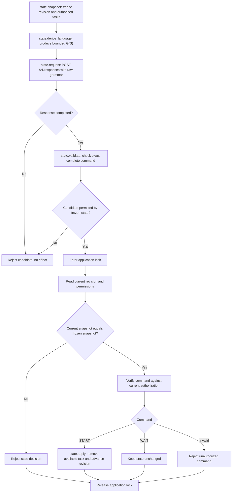
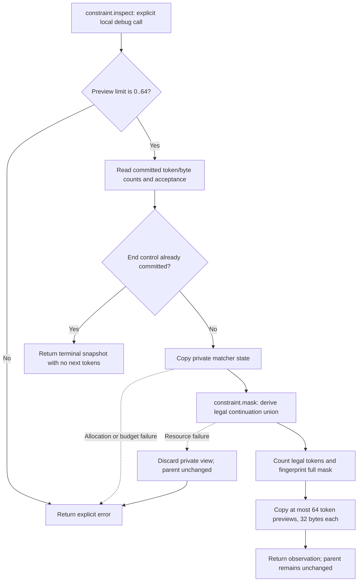
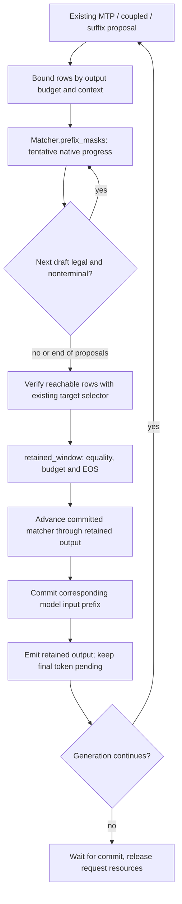

# Inspecting native grammar and application decisions

These Mermaid and plain-text views describe the checked-in source. They are not
executable ProgramModels or a second definition of the algorithms. The user
selected these formats in place of an actual Code Visualizer integration.
No cross-selection, regeneration or ProgramModel import is claimed.

## A state-dependent client contract

[grammar_state_contract.py](../tools/grammar_state_contract.py) is a bounded
client-side example. A frozen snapshot contains the revision, principal and
currently available tasks that principal may start. The client derives `G(S)`,
sends it through the existing grammar API, and independently checks the complete
candidate before applying it. Only an in-memory task set changes; no job, shell
command or arbitrary application callback runs.



The state and its lock belong to the application. They are never stored in a
Responses object or native grammar matcher. The application supplies the
authenticated principal independently of model text; the example's principal
table is a toy policy, not a production identity system. Permission changes
advance the same revision. Two concurrent candidates based on one revision can
perform at most one START transition.

Names use a deliberately narrow domain: at most 32 tasks, each with 1..32 ASCII
letters, digits, underscores or hyphens. Quotes, newlines, backslashes, path
syntax and arbitrary Unicode names are rejected before deriving grammar.
This is domain validation, not a general-purpose GBNF escaping function.
The application compares the full immutable snapshot. Its SHA-256 fingerprint
is useful for correlating observations and is not an authorization token.

Run the synthetic in-memory demonstration without a GPU:

```text
python tools/grammar_state_contract.py
python -m unittest tools.test_grammar_state_contract -v
```

Real native-model requests and their outcomes are recorded by
[grammar_state_probe.py](../tools/grammar_state_probe.py). The client refuses a
non-completed response even if its visible prefix happens to spell an allowed
command. The [G4 report](gbnf-evidence/G4/REPORT.md) links complete request `.txt`
files, derived `.gbnf` sources, actual native checks and a plain-text trace.

## Bounded private matcher inspection

`Matcher::inspect` in [grammar.cpp](../src/core/grammar.cpp) computes an
observation on a private copy of the same native matcher. It does not advance,
poison or spend the parent's remaining work budget. There is no inspector HTTP
route, pipe command or production grammar-file interface.



An observation contains the exact-source/backend/vocabulary definition
fingerprint, committed token/byte counts, acceptance/termination, work already
used, legal-token count, mask fingerprint and bounded token previews. Preview
bytes may split UTF-8; the test view renders them as hex and labels truncation.
`preview_complete=false` means the list is only a sample. The underlying mask
still accounts for the full vocabulary. Fingerprints are diagnostics, not
cryptographic authorization. Checkpoint restoration validates exact compiled
ownership and replays every token through the native matcher.

The local [inspection test](../src/core/grammar_inspection_test.cpp) has fixed
test grammars and an optional trusted tokenizer-directory argument. It exposes
no arbitrary grammar service. Build it with the enabled GBNF test targets:

```text
cmake --build <native-build> --target grammar_inspection_test
<native-build>/grammar_inspection_test <actual-tokenizer-directory>
```

The program prints real native observations. Occurrence labels such as
`left.shared-prefix-a` identify that test invocation; they are separate from
the `constraint.inspect` operation definition and the grammar definition
fingerprint. Definitions fingerprint exact source, not language equivalence.
An identical diagnostic fingerprint alone does not authorize restoring a
checkpoint into an independently compiled object.

Forking or restoring the matcher does not checkpoint model KV/recurrent state,
sampling counters or penalty history. At an accepting prefix, both end controls
and further text can still be legal. The inspector retains that distinction
instead of treating acceptance as mandatory termination.

## Ambiguity and probability

The native backend retains the viable continuation union, including overlapping
and recursive alternatives. It can merge equivalent parser states. Inspection
does not enumerate derivations or invent a unique parse tree. For example:

```text
root ::= left | right | alias
left ::= "a" "b"
right ::= "a" "c"
alias ::= "ab"
```

After token `a`, both `b` and `c` remain viable. A single `ab` token crosses the
rule boundary and completes the same bytes that can also be emitted as `a`, `b`.
The alternative `alias` adds another derivation of `ab`, not another disjoint
probability outcome. The native tests preserve both continuations and independent
forks. They report `hypotheses=backend_union_not_enumerated`.

Three measurements have different meanings:

| Measurement | Meaning |
|---|---|
| Raw-model token probability | Normalize the complete model logits at a stated positive temperature, before grammar or sampler filters. |
| Grammar-conditioned token probability | Renormalize that distribution over all legal tokens at this exact prefix. |
| Final sampler distribution | The actual eligible distribution after penalties, temperature, top-k/top-p/min-p and grammar legality; greedy selection is a point choice. |

**Synthetic mathematical illustration, not model evidence:** suppose the full
toy next-token distribution is `a:0.4, ab:0.2, ac:0.1, z:0.3`. Grammar legality
removes `z`, yielding `a:4/7, ab:2/7, ac:1/7`. A top-1 selector then chooses `a`.
That token is shared by both textual outcomes, so none of these numbers is the
complete probability of the `left` or `right` branch. Future conditional logits
and alternative tokenizations are needed to evaluate outcome mass; a top-N
preview is insufficient. Recursive languages may have infinitely many outcomes.

The G4 inspector does not collect logits or probabilities. Its plain-text output
labels raw-model, grammar-conditioned and final-sampler probabilities as
`not_collected`, and branch mass as `not_inferred`. It does not substitute legal
token counts, truncated previews or equal branch weights for those measurements.
Detailed numeric qualification belongs to G5's explicit native diagnostics.

## Speculative window view

This Mermaid view maps the source algorithms; it is not a second executable
state machine. The request's matcher is the only committed grammar owner.



Source: [prefix masks](../src/core/grammar.cpp),
[retained boundary](../include/strata/program/speculative_window.hpp),
[native composition](../src/program/generate.cpp). A grammar checkpoint does not
replace `Verifier::commit`, which restores/replays the retained recurrent and
attention state. An illegal proposal is an expected draft rejection; it is not
a generation failure or an acceleration-mode transition.
