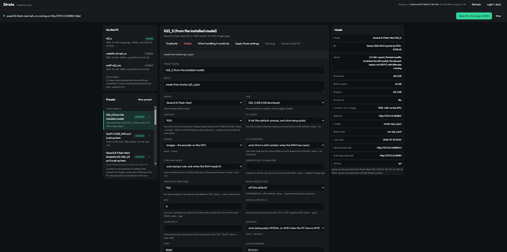

# Strata's launcher: pick a model and its settings in one window

`LAUNCHER.bat` (Windows) / `./launcher.sh` (Linux) opens a page on your own PC where you choose **which model to
run and with which settings**: the sizes setup offers and what each needs, the models this PC already has, presets
you save and reuse, and setup's calibration. It is a front-end, not a second engine: a download runs setup exactly as
`SETUP.bat` does, and a start runs the same `serve/server.py` as `run-<model>.bat`.

The launcher is for the case `START-HERE.bat` is not meant for - "run the Coder today with 32K and leave 2 GB of
VRAM free for the game" - without remembering flags. If you only ever run one model, you never need it.

<p align="center"></p>

- **On this page:** [Opening it](#opening-it) · [What is on the page](#what-is-on-the-page) ·
  [Presets](#presets) · [Downloading a model](#downloading-a-model) · [Measuring this PC](#measuring-this-pc) ·
  [Where things are stored](#where-things-are-stored) · [What it does not do](#what-it-does-not-do)

## Opening it

```
LAUNCHER.bat                    Windows
./launcher.sh                   Linux
python -m launcher              from the Strata folder, with any Python 3.10+ you like
python -m launcher --port 8091 --no-browser
```

It opens `http://127.0.0.1:8090/` in your browser (the next free port if that one is taken) and listens on this PC
only - the same rule the model server follows: nothing leaves the PC unless you set up a network address with an API
key. It uses only Python's standard library, so it starts before setup has made a `.venv`; when a `.venv` exists it
uses that, which is what the calibration needs. Closing the launcher's window leaves a model it started running -
stop a model on the page or close its own window.

## What is on the page

| | |
| --- | --- |
| **Top bar** | what runs now (model, port, idle or answering), a link to the chat page, Stop, and this PC: GPU, RAM, engine version. While a download or a measurement runs, its step and percentage are here. |
| **On this PC** | the models installed in this folder: their context, KV precision, images, port, when they were last used, and whether their files are all there. Clicking one shows its settings. The line under it says which Strata folder the page is reading - with two installs on the PC, that is the one you are changing. |
| **Presets** | your presets, each with a ✕ to remove it; "as it is set up here", one per model installed in this folder, read from its own `strata-<model>.json`; and the ones derived from this PC (setup's own recommendation, the fastest size, the biggest that fits, the Coder). |
| **The middle column** | the selected preset: its name, note and every setting, with the setup.py flag each one writes under it. Buttons: save, duplicate, delete, what installing it would do, apply these settings, download, start, measure this PC. |
| **Right column** | what the model needs (download, RAM, experts), its config and start script, what setup's calibration recorded for it, and - while a model runs - the base URLs for pointing your apps at it. |
| **Logs** (full width, under the three columns) | Download, Measuring, Server, Engine: the last 120 lines of that file, re-read every 3 seconds, so a running server writes itself onto the page while you watch. The pane stays at the end unless you scroll up to read something, the tab whose file is being written now is marked, and the line under the pane names the file and how many lines are shown. |

Nothing changes on this PC until you press a button that says so.

## Presets

A **preset** is one model plus its settings, with a name: the family and size, the context, the KV precision,
images, the low-RAM mode, the VRAM left free, the KV streaming, which GPU or GPUs, the port, the address and key,
whether the experimental speed projection is on, and whether to measure this PC first. Every field is a `setup.py`
flag - the page prints the flag under each field, and the plan shows the whole command - so a preset never hides a
setting that setup does not have. A field left empty is **not** passed: setup's own default for this PC decides,
which is what makes a preset portable to another machine. The form stops at what a person actually changes: the
context scaling and the draft token subset are not offered, because setup picks them for the context it is given.

The **context** field offers setup's own lengths (8K, 32K, 64K, 128K, 256K, 384K, 512K) plus **192K**, the one
between 128K and 256K, and an **own value** box for any token count from 1,024 to 1,048,576. setup takes any
`--context` - its list is only what its questions offer - so a length of your own is passed straight through and the
plan marks it as such. 192K is 196,608 tokens, still under the model's trained 262,144 positions, so no rope scaling
comes into it; past that setup adds yarn by itself, and the page marks those lengths as scaled.

Presets are plain JSON in `.strata-launcher/presets.json`: copy that file to another PC and the presets are there.
Selecting an installed model makes a preset out of its own `strata-<model>.json`, so "save what I have now" and
"change one thing and install it again" are the same path - and every installed model is listed under "as it is set
up here" with exactly what its config says it runs with, so the setup you already made is visible without clicking
around. None of these are stored: the installed ones are re-read from the configs and the ones derived from this PC
are recalculated from setup's tables, so a repository that adds a model adds it to the list. A folder with no
installed model shows no "as it is set up here" group - that is how you notice you started the launcher from a
different Strata copy.

A preset you made carries a **✕** in the list: one click removes it, after asking, and the model it downloaded stays
on the PC. The derived ones have no ✕ and their Delete button is greyed out: nothing is stored to remove, they are
recalculated from this PC and from the model's config.

Two presets can name the same model with different settings (a 32K one for work, a 128K one for long documents);
installing the second reuses the model files already downloaded and only re-applies the settings.

## Downloading a model

"Download" first shows the plan, and only runs setup once you agree to it: the size of the download (58-111 GB
depending on the size), the disk space needed and free, whether the RAM is enough, and how long it takes (20-90
minutes, mostly the download). Setup runs non-interactively in the background, exactly as the MCP server runs it, and
the page follows its steps and percentages. Stop it whenever you like: starting it again continues the download where
it stopped. When it finishes, setup has written `strata-<model>.json` and `run-<model>.bat` as usual, and the model
appears under "On this PC".

Installing a model that is already here **rewrites that model's config**: anything the preset does not carry is
chosen again by setup, so a preset made from an older config can quietly lower the context or drop KV streaming. The
plan says so before anything runs, one line per difference against the config that model runs with now - on a 16 GB
card, a 128K preset over a 256K model reads `Context: 262,144 becomes 131,072`. A preset that matches the installed
model lists nothing, and **matching is judged by what setup decides, not by the words**: `auto` is not a setting, it
is setup's RAM rule for this PC, so a preset saying `auto` - or saying what that rule decides (`off` for a size whose
experts fit the RAM, `on` for one that streams its cache) - is the model as it runs and lists nothing.  The two
settings setup decides by itself are compared as the engine runs them: KV streaming by its `--kv-resident`, the
low-RAM mode by its `--resident-experts`/`--mmap-experts`, each side with its own context and KV precision, with
setup's own rules (`kv_streaming_wanted`, `low_ram_wanted`).  What is listed is what really changes -
`KV streaming: on becomes off`, `Low-RAM mode: setup's own choice becomes on` - and a preset that changes nothing
never re-runs setup.  For a model that is already here the button in
the plan is **"Apply these settings"**, not "Download": setup re-checks the files and rewrites the config, it fetches
nothing again - a few seconds to a minute on this PC.

## Starting a model

"Start" runs the same command `run-<model>.bat` runs (`serve/server.py --engine strata --config strata-<model>.json
--port <port>`), in the background, and the page follows the server log while the model comes into memory - 1-3
minutes, and the PC is slow meanwhile. It also opens the model's chat page in a new browser tab: that tab says the
model is loading and becomes the chat page as soon as the server answers, which is what the start script does with
`--open`. If the browser blocks the new tab, the page says the model is ready and the top bar has an "Open the chat
page" button; if the start stops before the model is up, the tab it opened is closed. "Measure this PC first" opens
the same page when the measurement is done and the model starts. One model runs at a time: the top bar says which one
and on what port, and the model card shows the OpenAI and Anthropic base URLs for pointing your apps at it.

**A preset is applied when you start the model.** A model runs what its own `strata-<model>.json` says, so when the
preset differs from that config, Start runs setup first (`--yes --no-start`): the config is rewritten with the
preset's settings and the files already there are only checked again - a few seconds to a minute on this PC, nothing
fetched. The differences are listed above the buttons while they exist
(`Speed projection: the model runs with on, this preset says off`), and the start says what it did:
`applied the preset to iq3_s first (Speed projection off); Strata is running …`. "Apply these settings" does the same
without starting the model. A preset that already matches the config starts straight away, with no setup run, and a
server that is already running keeps the settings it started with until you stop it and start it again.

## Measuring this PC

"Measure this PC" is setup's `--calibrate`: it starts the model a few times with different settings (the share of
missing experts copied over PCIe, how sure the draft layer must be to guess further, how many CPU threads compute
experts), keeps a setting only when it beats the default by more than 3%, and writes the winners into that model's
config. It takes 5-10 minutes and keeps the PC busy, so the launcher asks first, refuses while a model is running
(the measurement needs the VRAM and RAM to itself), shows the measurement's own log, and can stop it. The result is
remembered per PC and model in setup's own settings file, so an update keeps it. NVIDIA cards for now, as before.

A preset says what to do about it: **ask** (the default) offers the measurement the first time you start that model
on this PC and starts it when the measurement is done, **always** runs it by itself after a download, **never**
leaves the shipped settings alone. You can also press "Measure this PC" at any time.

## Where things are stored

| | |
| --- | --- |
| `.strata-launcher/presets.json` | your presets |
| `.strata-launcher/calibrate.log`, `calibrate-result.json` | the last measurement's output and result |
| `.strata-mcp/` | unchanged: the install job, its log, and the model server the launcher starts |
| `strata-<model>.json`, `run-<model>.bat` | unchanged: setup writes these, the launcher only reads them |

## What it does not do

It adds no settings of its own: anything the page offers is a `setup.py` flag, and `setup.py --help` stays the
reference. It does not use the model server's own settings page, and it does not change a running model - a setting
is applied by running setup again, which is what "Update / re-apply" does. It does not listen outside this PC, and it
does not download anything without showing the plan first.

**Tests.** `python -m unittest launcher.test_presets launcher.test_api` checks the preset rules and the flags they
produce, and the launcher's own answers with a fixed description of a PC. They download nothing and use no GPU.
