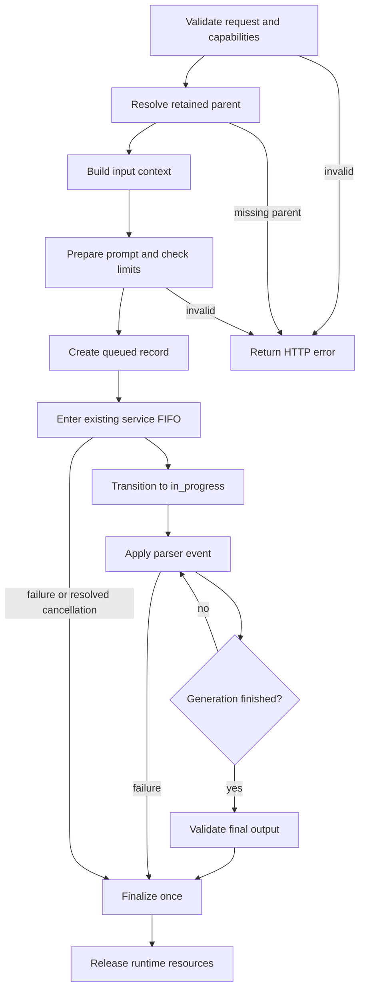

# Experimental Responses API

Enable once at server startup with `--experimental-responses` or
`"experimental_responses": true` in the run config. The default is `false`.
When disabled, the Responses routes return 404 and no Responses store is opened.
The flag enables the ordinary `/v1/responses` interface; requests have no
Strata-specific fields. Existing Chat Completions and Anthropic routes keep their
behavior. All Responses routes use the existing API key and CORS settings.
They also inherit the server's Host protection and browser-origin checks:
without an API key, an unapproved browser origin cannot create a response.
SDK and command-line requests without an Origin header keep their behavior.

## Enable and verify

Use the `feat/responses-api-451` branch of this fork and its Python server.
The fork's `main` and the separate hardware/performance branches do not contain
this adapter. From this checkout, using your installed Strata Python environment
and working model config:

```sh
python -m serve.server --engine strata --config strata-model.json --host 127.0.0.1 --port 8095 --experimental-responses
```

Replace `strata-model.json` with your run config. To make the setting persistent,
add `"experimental_responses": true` at the top level of that existing JSON
object, alongside `exe`, `args` and `tokenizer`, then restart your normal server
launcher. Keep the rest of the config. This key belongs outside `env` and
`sampling`; the CLI flag belongs to `serve.server`, not the native executable
or the setup command.

Startup prints `[strata] experimental Responses API on; retained responses: ...`.
A successful `POST /v1/responses` returns a `response` object, or typed SSE when
`stream:true`. The Python examples below exercise both views. Use the port your
server actually listens on: these examples explicitly use 8095, while generated
setup launchers commonly use 8080.

To disable, remove the CLI flag and set the config key to `false` (or remove it),
then restart. The CLI flag enables the adapter even if the config says `false`.
With both off, `/v1/responses` returns 404 and no Responses store is opened.
Disabling does not delete previously retained data. The API monitor is optional;
`--api-monitor` is not required to enable Responses.

For a text-only smoke test without a GPU:

```sh
python -m serve.server --engine mock --script "Hello from Strata." --experimental-responses
```

Use the model name returned by `/v1/models`. For example, with the default name:

```python
from openai import OpenAI

client = OpenAI(base_url="http://127.0.0.1:8095/v1", api_key="your-server-key")
response = client.responses.create(
    model="qwen3.8-flash-next",
    input="Say hello.",
    max_output_tokens=128,
)
print(response.output_text)

with client.responses.stream(
    model="qwen3.8-flash-next", input="Say hello.", max_output_tokens=128
) as stream:
    for text in stream.text_deltas:
        print(text, end="", flush=True)
    final = stream.get_final_response()
```

## Implemented boundary

| Operation | Behavior |
| --- | --- |
| `POST /v1/responses` | Text and client-owned functions, JSON or typed SSE |
| `GET /v1/responses/{id}` | Consistent retained snapshot, including active output |
| `GET /v1/responses/{id}/input_items` | Effective input history; `order=desc` by default, `after` cursor, `limit` 1–100 (default 20) |
| `DELETE /v1/responses/{id}` | Removes retained data; returns `response.deleted` |

Supported request fields are `model`, `input`, `instructions`,
`previous_response_id`, `stream`, `store`, `metadata`, `max_output_tokens`,
`temperature`, `top_p`, `text.format`, `tools`, `tool_choice` (`auto` or `none`),
and `parallel_tool_calls`. `background:false`, `truncation:"disabled"`,
`include:[]`, and `reasoning:{"effort":"none"}` are also accepted.
Unknown fields and unsupported values are errors, including inside items and tools.
The request body is limited to 8 MiB.

Input can be a string or typed messages, function calls, and string function
results. Messages support text parts and the `user`, `assistant`, `system`, and
`developer` roles. The model template requires system/developer messages at the
beginning of the context. Only completed supplied items can be replayed.
Images, audio, files, item references, reasoning representations and summaries,
hosted tools, MCP tools, compaction, conversations, WebSockets, stream replay,
and background execution are unsupported. There is no cancel endpoint.
Raw model thinking is never presented as a reasoning summary.

Reasoning is disabled for this adapter. Temperature and top-p default to the
server's sampling settings (otherwise 0 and 1); explicit request values win.
An omitted `max_output_tokens` uses the remaining context. An explicit positive
cap that exceeds the available context is rejected, including when Chat
Completions' optional `fit_max_tokens` setting is on. Input is never truncated.

## Functions and JSON

Functions use Responses' flat tool shape, for example:

```json
{
  "type": "function",
  "name": "lookup",
  "strict": true,
  "parameters": {
    "type": "object",
    "properties": {"q": {"type": "string"}},
    "required": ["q"],
    "additionalProperties": false
  }
}
```

The server returns a `function_call` item with distinct `id` and `call_id`.
The client executes the function and submits a `function_call_output` with that
`call_id`, using `previous_response_id` or replaying the earlier input/output.
Each pending call needs exactly one result. Result batches are mapped to the
native template in call order even if the client sends them in another order.
Strata does not execute client functions. Forced tool choices are rejected.
`parallel_tool_calls:false` limits a successful response to at most one call.

Structured output uses `text.format`, not Chat Completions' `response_format`.
For example, set the request's `text` field to:

```json
{
  "format": {
    "type": "json_schema",
    "name": "result",
    "strict": true,
    "schema": {
      "type": "object",
      "properties": {"value": {"type": "integer"}},
      "required": ["value"],
      "additionalProperties": false
    }
  }
}
```

`text`, `json_object`, and `json_schema` formats are supported. `json_object`
uses the standard library. JSON Schema output and function schemas require
`python -m pip install "jsonschema>=4.23,<5"`; without it, schema requests are
rejected before generation. The native engine has no grammar decoder: the
adapter prompts once and validates the result before marking it completed.
It does not retry, repair JSON, remove fences, or reserialize emitted text.
Streamed deltas are provisional until a terminal event; invalid output ends
with `response.failed`. Budget exhaustion ends with `response.incomplete`,
including partial JSON and unfinished function arguments.

Schemas use a bounded Draft 2020-12 subset: objects, arrays, primitive/nullable
types, properties, required, additionalProperties, items, enum, const, anyOf,
local JSON pointer references and $defs; numeric bounds/multipleOf,
string length/pattern and array length constraints; title and description.
Other keywords and external references are rejected. Strict schemas must make
every object property required and set additionalProperties to false. Omitted
function `strict` normalizes this supported subset to strict mode; explicit
`strict:false` preserves the supplied schema. All returned complete function
arguments are validated against the applied schema. Functions combined with
structured text output are currently rejected.

## Retention and lifecycle

`store` defaults to true. One server process owns its store directory:
`.responses/<config-name>/` beside the config, or `.responses/default/` in the
checkout when no config is supplied. Do not share a store between server
processes. Records expire after 30 days. Cleanup runs at startup and creation;
reads enforce expiry too. No database service or retention worker is started.
`store:false` keeps no response file and cannot be a continuation parent.
The separately enabled API monitor still has its documented bounded in-memory
request capture.

Continuations replay retained input plus the parent's output, then append the
new input. The parent's top-level `instructions` do not carry over. Parent
records are immutable, so children can branch independently. Only completed,
unexpired, retained parents can be continued. GPU caches are an optimization,
never the authority for conversation history.

Deleting active retained data does not cancel generation; completion cannot
recreate its file. A disconnected foreground request signals cancellation,
closes the existing service iterator and drains engine output before its state
becomes `cancelled`. Cleanup failures become `failed`. Interrupted creation
records become `failed` on restart. Output does not change after a terminal
state, and finalization is idempotent.



`serve/responses.py` owns the transition decision, response records, runtime
handles and wire events. `serve/response_store.py` only creates, reads, updates,
deletes and expires serializable records. It writes at creation and
finalization, not per token. The adapter calls `Service.prepare()` and
`Service.run()` directly; the existing engine, FIFO and draining stay in place.
SSE and JSON use one event generator. Item IDs and indexes stay stable, sequence
numbers increase, and done values are the concatenation of the emitted deltas.

With `--api-monitor`, the existing monitor shows controller transitions such
as `queued → in_progress → completed`. It is an observer and is not needed by
API clients. Lifecycle changes add one small transition record; token deltas
do not rebuild its history.

Run the GPU-free checks with `python -m unittest serve.test_responses -v`.
Install `jsonschema>=4.23,<5` to run the schema and function tests; those tests
skip when it is absent, while missing-validator rejection is always tested.
The optional OpenAI SDK check runs when `openai` is installed.

Validation on 2026-10-02: the seven serving test modules passed 178 tests,
including all 39 Responses tests; five model-tokenizer-dependent tests were
skipped. The modules ran in separate processes on Windows with Python 3.13.
Ten native CUDA integration checks also passed on an RTX 4090 with Coder IQ1_M,
4,096-token context, mapped experts, int8 KV and MTP window 4. Those checks used
OpenAI Python SDK 3.23.0 with strict response validation and covered JSON/SSE
consistency, CRUD/auth/CORS, independent continuations, structured output,
function arguments and client results, token limits, disconnect recovery, and
the existing chat endpoint and monitor. The test server shut down cleanly.
[Validation details and tested source hashes](benchmarks/2026-10-02-responses-cuda.json).

PR merge check on 2026-10-03: this branch merged cleanly with upstream 0.1.37
(`db4f91a`). All seven serving test modules passed: **204 passed, 5 skipped**,
including all 39 Responses tests and 114 server tests. This checks the combined
Python service with mock/scripted engines, including upstream's newer engine
recovery behavior. The native GPU measurements above retain their 0.1.34 source.
[Merge inputs, source hashes and module outcomes](benchmarks/2026-10-03-responses-merge-check.json).

Upstream sync on 2026-10-03: the branch now includes upstream 0.1.38 (`99f3dbd`).
Its browser-origin check runs before Responses dispatch, and its Host check
covers all Responses methods. Eight serving/security modules passed:
**231 passed, 5 skipped**, including 41 Responses, 118 server and 21 security
tests. Two new HTTP regressions cover these protections for Responses. This is
a mock/scripted-engine check; the earlier native GPU result remains on 0.1.34.
[Sync details, source hashes and module outcomes](benchmarks/2026-10-03-responses-upstream-0138.json).

Contract sources:
[Responses creation](https://developers.openai.com/api/reference/python/resources/responses/methods/create),
[streaming events](https://developers.openai.com/api/reference/resources/responses/streaming-events),
[input pagination](https://developers.openai.com/api/reference/python/resources/responses/subresources/input_items/methods/list),
[deletion](https://developers.openai.com/api/reference/python/resources/responses/methods/delete),
[function calling](https://developers.openai.com/api/docs/guides/function-calling).
