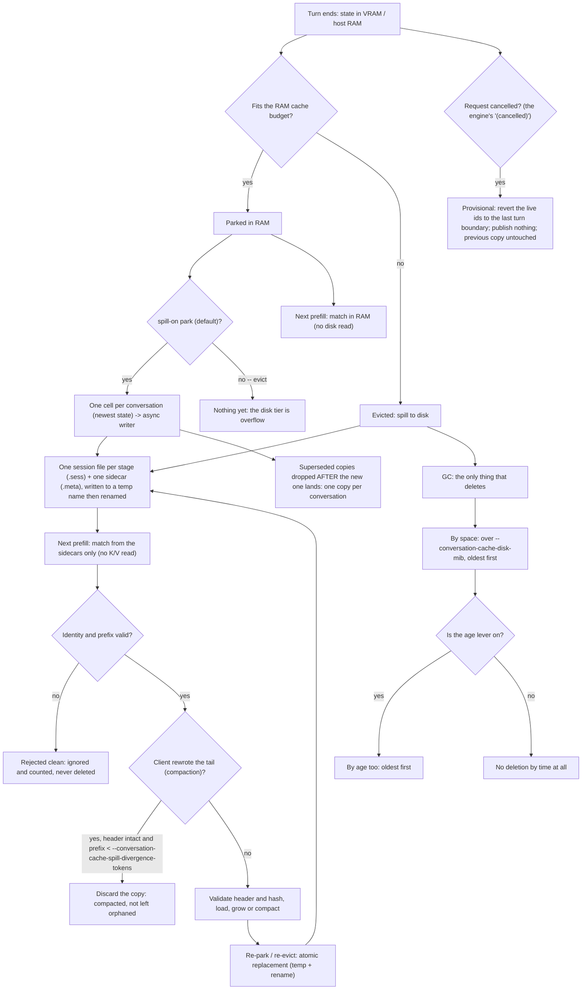
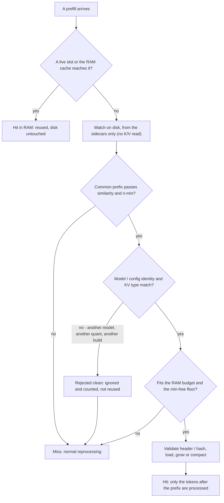
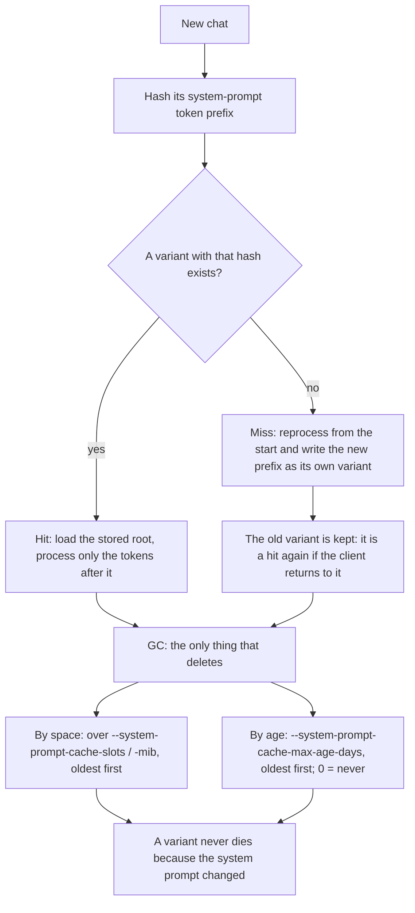

# Keeping conversations and the system prompt on disk

Two opt-in functions of `strata --serve` write a checkpoint to disk and read it back instead of reading a prompt
again: the **disk tier** keeps a conversation the RAM cache evicts, and the **system-prompt cache** keeps the
checkpoint that ends the system prompt. Both are off by default. With no flags, the engine behaves exactly like
upstream. Every flag is listed in [FLAGS.md](FLAGS.md).

## Why this helps

A long chat that comes back after a few turns is not free: the engine has to hold, or re-read, the history in
front of the new message. Upstream keeps that in host RAM (`--conversation-cache-mib`), but the RAM cache is
bounded and does not survive a restart. The disk tier closes that gap: a conversation is written to a folder as an
ordinary session file, and a later request — or a restart — reads it back instead of reading the whole prompt
again. The file is the same format the manual slot save/restore API writes, so a spilled conversation and a
hand-saved one are interchangeable.

The tier has two modes (`--conversation-cache-spill-on`). The default, **mirror** (`park`), writes the state the
moment a request ends and its session is parked, so an abrupt close loses at most the request in flight. The
opt-out, **overflow** (`evict`), is the delta-1 behaviour: only a conversation the RAM cache evicts reaches disk.
In both modes the folder holds **one copy per conversation**, and the copy is only replaced once its successor is
on disk.

The system prompt in front of every chat is (for one client) the same on every new chat, and it can be thousands
of tokens. Re-reading it costs time on the first request of each chat. The system-prompt cache persists the
checkpoint at the end of that prefix, so a new chat reads only what comes after it. It is a resume point for the
prefix, never a conversation tail.

## Slot lifecycle

A slot is one request's state. When its turn ends the state is parked; the RAM cache holds it, and the disk tier
mirrors it (default) or catches what the RAM cache drops (`evict`). The write happens when a request **ends**,
never mid-generation, and a burst of parks of one conversation collapses to its newest state: one cell per
conversation, drained by one background writer.

**Compaction.** The sidecar carries the conversation's own token ids, so the check needs no K/V. A stored copy
whose common prefix with the incoming prompt is shorter than `--conversation-cache-spill-divergence-tokens`
(4096 by default) **while its header still matches** describes a history the client has rewritten (a compaction or
an edited history): it can never be a hit, so it is discarded — index and file — and counted (`compacted`). A copy
the prompt extends is the normal turn and is kept; a copy whose header differs is another conversation and is left
alone.

**Cancellation.** A request the client aborts (Escape-Escape in a TUI) ends with the engine's own `(cancelled)`
line. That state is provisional: the live ids are reverted to the last turn boundary the read actually reached
(`--turn-token`), no durable copy is published of it, and the previous good copy is left exactly as it was — it is
the prefix the client resends on the retry. The harness does not matter: the decision uses only the turn token and
the engine's cancellation signal.

## Prefill decision tree

A new prompt is first offered to the live slots and the RAM cache; only then to the disk tier. A disk match is
loose (a common prefix), and the candidate is restored only if the exact prefix passes; otherwise the prompt is
read normally.

## System-prompt variants

The cache does not hold one system prompt but a small set of variants. A variant is keyed by the exact hash of
its system-prompt token prefix (plus `--system-prompt-cache-key` and the model/config identity), so only a prompt
that begins with exactly those tokens can attach it.

## Use and limits

**Turn it on.**

- Disk tier: `--conversation-cache-spill-dir DIR`, with `--conversation-cache-mib > 0`, `--prompt-cache > 0`,
  `--conversation-cache-slots > 0` and a nonzero `--conversation-cache-disk-mib` (default 8192 MiB).
  `--conversation-cache-spill-on` chooses `park` (default once the tier is on: a mirror, written at the park) or
  `evict` (the delta-1 overflow);
  `--conversation-cache-spill-when-full` chooses `evict-oldest` (default) or `reject`;
  `--conversation-cache-spill-max-age-days` adds optional age pruning (0 = off);
  `--conversation-cache-spill-divergence-tokens` (4096) and `--conversation-cache-spill-park-throttle-s` (0) tune
  the compaction check and the rewrite rate.
- System-prompt cache: `--system-prompt-cache` with `--system-prompt-cache-dir DIR`. It also needs
  `--prompt-cache > 0`, `--prompt-cache-root > 0`, a turn token and `--mtp` (without MTP the feature reports
  itself off rather than capturing a different artifact). Its folder is separate from the spill folder.

Both can be set in a config's `args` and edited from the Settings page (see `serve/runconfig.py`). The Monitor
shows their counters under `/metrics` in `conversation_cache` (`disk` and `system_prompt_cache`).

**Limits.**

- The disk tier works with `--layer-split`: one session file per stage plus one joint sidecar.
- The system-prompt cache works with `--layer-split` too, the same way: one session file per stage under the
  variant's key, and a joint sidecar holding the stage count (its sidecar is version 2; a version 1 file, the
  single-file form, is still read). It also loads a variant whose K/V was stored while the engine kept part of
  the context in host RAM.
- A disk hit is read into host RAM before it is restored: it must fit `--conversation-cache-mib` and leave the
  `--conversation-cache-min-free-mib` floor available, or the request reads the prompt normally.
- The scan never deletes. A file of another identity, a broken or missing sidecar, an orphan session file and a
  leftover temporary are ignored and counted (`foreign`, `stale`, `orphan`), never removed. Only the GC removes,
  by budget and (if enabled) by age, oldest first.
- **Known limitation: the divergence discard can name the wrong copy** when the chat template puts few-shot turns
  **inside the system prompt**. `discard_diverged_impl`
  ([`src/core/conversation_spill.cpp`](../src/core/conversation_spill.cpp)) decides which stored copy a rewritten
  tail belongs to from the end of the stored conversation's header - `conversation_header_length`, the start of its
  first assistant turn - and keeps a copy whose shared prefix reaches past that marker
  (`header == 0 || common < header` skips it). Few-shot turns inside the system prompt move that marker into the
  root the conversations share, so a **sibling** conversation (same system prompt, a different first exchange) also
  satisfies the guard, and its copy is the one removed - **discarded from disk, not archived**, in this version. The
  fix is a property guard: only the copy sharing the **longest prefix** with the prompt is a rewrite candidate, a tie
  between copies that disagree discards nothing, and a trace line names the `conversation_key` of the copy removed.
  It is written and tested on a sibling branch and arrives as the next stacked PR against this branch; this delta
  ships without it.
- Nothing is written with the flags absent: no folder is created and no byte is written. The mirror writes at the
  **end of a request** (the park), never mid-generation, and collapses a burst of parks of one conversation to its
  newest state; the disk cost is bounded by `--conversation-cache-disk-mib` either way.
- The **mirror** pays a host copy of the parked image per park (the writer owns its own copy, so the RAM cache's
  entry is never aliased). The copy is synchronous at the park; the disk write itself is asynchronous.

## Validation environment

- The session-file numbers below were measured on an **RTX 4070 Ti (12 GB), Ryzen 9 5900X, 64 GB RAM, NVMe ext4,
  IQ3_XXS**, on a 63,025-token conversation, with engine 0.1.38 carrying the session-file change (binary sha256
  `3bbe4fc3...`). They measure the **session-file SAVE/RESTORE path**, which the spill reuses; they are not a
  measurement of the automatic spill.
- The KV-streaming figure (~13.7 KB of RAM per context token) is measured on the setups in
  [DETAILS.md](DETAILS.md#speed-measured) (KV streaming, engine 0.1.5; ~1.7 GB at 128K).
- The layer's own host-only tests (conversation cache / memory / file / spill / prompt cache) build and pass with
  `-DSTRATA_BUILD_CONVERSATION_TESTS=ON`. That is a correctness check, not a speed measurement.
- Against this tree's base - upstream `v0.1.41` (`fb58e0d`) - what has been verified is: the CUDA build exits 0;
  the `strata.exe` the verification ran against is sha256
  `C1D54A4F5A405F076A0D5F1EB0384DECB5A5E422C3A109A7AD6CD7B86A26FB99`; its `--help` lists all 17 flags of this
  layer; an unknown flag is fatal (`unknown argument`, exit 2); the full host-only battery passes **12/12**
  (`ctest` exit 0); and the layer's own anchor/flag verifier (kept beside this series, not part of the diff)
  reports 39 anchors and 17 flags OK, exit 0.
- **A live run against this base exists now.** That same `strata.exe` (sha256
  `C1D54A4F5A405F076A0D5F1EB0384DECB5A5E422C3A109A7AD6CD7B86A26FB99`, the digest of the binary that was launched -
  the run log itself records `build_info`, not a digest) served `127.0.0.1:5012` on the verification machine on a
  clone of the production serve config, and reported `/props` `build_info='Strata 0.1.41'` with `n_ctx=196608`
  (`qwen3.8-flash-next-unsloth-ud-iq4_xs`), ready in **156.6 s** in both runs. A four-test battery (smoke, streamed
  throughput, repeated system prompt, two conversations that spill) ran against it **twice**, the second time after
  a server restart with the tier's folders left in place: `bench-20261009-051623.log` and
  `bench-20261009-061613.log` (`OVERALL: PASS`). The first run reported `OVERALL: FAIL` for one reason only: its
  harness (v1.0.0) could not compute a throughput figure at `max_tokens=256`; the second run (harness v1.1.0, no
  output cap) passed all four tests. The logs are kept with the harness, not in this repository. The numbers are
  under [Measured benefit](#measured-benefit) and what they do not show is under [Non-claims](#non-claims).

## Measured benefit

**Session files (what both functions write).** On the setup above, a 63,025-token conversation is a **1.20 GB**
file: **save 0.65 s**, **restore 1.05 s** in a new engine process, and the next 32-token turn then takes
**1.14 s** (1.00 s for the same turn without a restart). The cold first turn of that conversation takes 25.5 s.
The file reported `n_written = 1,198,691,396` bytes, that is **about 19,019 bytes per token** at this geometry.
Each extra checkpoint is about **118 MB**. These are single runs.

**KV streaming.** Holding the context's K/V in host RAM costs about **13.7 KB per context token** (1.7 GB at
128K). This is the dominant term when sizing a spill folder.

**This layer, end to end (live, the first two runs).** On the engine above, with the tier's folders left in place
between the runs:

- **Cold prefill against a restore after a process restart.** Two ~8k-token conversations (`prompt_tokens=8016`)
  took **29.76 s** and **30.10 s** in the first run (a fresh process, nothing on disk for them) and **1.98 s**
  each in the second one (a new process, both already on disk), with the engine counting `restores=4` in that
  second run against `restores=0` in the first. The 33,409-character system-prompt test has the same shape:
  **30.296 s** for the first call of the first run (nothing reused) against **2.298 s** for the first call of the
  second one.
- **The tier wrote, and its counters moved.** After the second run the engine reported
  `disk: enabled=True spills=2 bytes=2153775104 restores=4` over a folder of 19 files / 2,154,484,304 bytes, and
  `sysprompt: enabled=True variants=3 hits=1 misses=0 bytes=719323136`.
- **What the same binary serves** (a property of the build, not of the layer): with no output cap and a natural
  stop, three reps produced 472 / 480 / 458 tokens (`finish=stop`) at a median TTFT of **0.452 s**, at **28.11
  tok/s** decoding (27.39 tok/s end to end).

**What those numbers are not.** Both runs used the same binary with the layer **on**, so what is measured is
**cold prefill against a restore from disk after a restart** - nothing more. It is not a comparison against
upstream, not a speedup ratio for the layer, and not a throughput claim about it. `restores=4` and `hits=1` are
**one run each**: a working signal, not a rate. The `conversations=0` on that same counter line is what the engine
reports and is not interpreted here. The system-prompt test of the second run (TTFT 1.096 s then 1.52 s, with
`reused=7920/7925` already warm) is one sample of a warm prefix, not a regression - and the **-92.6 %** of the
first run is a cold-prefill KV-reuse figure (that run read `sysprompt hits=0`), so it is not a property of the
system-prompt cache either.

## Sizes by KV type

The KV cache is the part that scales with its type. `int8` is the type measured here; `f16` and `q4_0` are
**derived** from it by the nominal width (f16 = 2 bytes/value, int8 = 1, q4_0 = 18 bytes per 32 values = 0.5625),
so they are estimates, not measurements. The derivation ignores the per-block scale bytes and does not separate
the parts that do not scale with the KV (running state, checkpoints); treat them as a lower bound on the total
disk a folder will use.

Measured `int8` anchors: **~14,029 B (≈13.7 KB) per context token** for the KV in host RAM (streaming), and
**19,019 B per token** for the session file on disk (63,025 tokens → 1.20 GB).

| KV type | KV in host RAM (B/token) | 17k | 63k | 384k | Session file on disk (B/token) | 17k | 63k | 384k |
| --- | ---: | ---: | ---: | ---: | ---: | ---: | ---: | ---: |
| **f16** | ~28,058 *(derived)* | ~455 MiB | ~1.65 GiB | ~10.0 GiB | ~38,038 *(derived)* | ~617 MiB | ~2.23 GiB | ~13.6 GiB |
| **int8** | ~14,029 *(measured)* | ~227 MiB | ~0.82 GiB | ~5.0 GiB | 19,019 *(measured)* | ~308 MiB | 1.20 GB *(measured at 63,025)* | ~6.80 GiB |
| **q4_0** | ~7,891 *(derived)* | ~128 MiB | ~0.46 GiB | ~2.8 GiB | ~10,698 *(derived)* | ~173 MiB | ~0.63 GiB | ~3.83 GiB |

Sizes are powers of 1024 (MiB, GiB) except the measured 1.20 GB, which is the decimal figure upstream reports.

## Non-claims

- **The live run is a functional pass, not a benchmark.** The non-claim that used to sit here - that no instance of
  this tree was ever started on the `v0.1.41` base - is **withdrawn**: the two runs under [Validation
  environment](#validation-environment) started a real engine on this base and read real counters. What replaces it
  is narrower. They are **two runs of one harness on one machine**, with the layer **on** in both, so there is
  still no run with the layer off to compare against and **no speedup over upstream is claimed anywhere in this
  diff**. The battery covers four scenarios (a short completion, a streamed throughput set, a repeated system
  prompt, two conversations that spill and restore); it does **not** cover `--head-device` card order, a layer
  split, `--batch-mtp`, a cancelled request, the GC's age and budget levers, or the compaction path (when a rewrite
  happens is the harness's decision, and this delivery carries no archive tier) - those stay unverified at runtime.
  That the layer is **inert with the flags off under load** is likewise still unshown: both runs had it on.
- **Attention is causal.** A token's K/V was computed against the system prompt that was in front of it, so the
  tail of a conversation (its K/V) cannot be kept under a _different_ system prompt: everything after the
  divergence is **reprocessed**. If the change is at the **end** of the system prompt, only the tail is paid; if it
  is at the **beginning**, everything after it is paid.
- A file from **another model or another configuration** (including **another KV quant**) is **rejected**, not
  reused. The same identity check that guards the slot save/restore API guards the spill.
- The disk tier **does not speed up the path that already reuses**. It does not fix the per-turn cost and it does
  not change VRAM residency; those are `--kv-resident` and the slot count (`parallel`). The disk tier only avoids
  re-reading a prompt that would otherwise be read again.
- There is a real, documented case in the field in which a client that **mutates the head of the prompt** (a
  per-request attribution/version block) destroys reuse: the system-prompt prefix hash changes every request, so
  every request is a miss. The cache does not fix that; it makes it visible (a `hash_changes` counter).
- **The end-to-end numbers are two runs, not a profile.** The live figures under [Measured
  benefit](#measured-benefit) are one harness's four tests on one machine, read twice: one `restores=4`, one
  `hits=1`, one median TTFT, one conversation length. There is **no hit rate and no tokens-saved total** (both runs
  read `tokens_saved=0`), no distribution, no second machine and no second model.
- **The known limitation of the divergence discard is declared here, not tested on this base.** The defect is in this
  layer's own code - the guard quoted under [Use and limits](#use-and-limits) is what this branch ships - so it is
  present on `v0.1.41` as it was on `v0.1.40.1`. The test that reproduces it (red on the base, green under the fix)
  was written against the sibling base `v0.1.40.1`, **not** against `v0.1.41`, and has not been re-run here. The fix
  is deliberately not backported into this delta: it arrives as a separate stacked PR against this branch.

## Credits

This layer is authored and directed by Shahrokh Zargarpour. It was written and verified with the Grok TUI Build
coding agent - first on DeepSeek Flash, currently on Qwen3.8 flash-next UD iq4_xs, the local inference runtime the
layer was developed and verified against.
