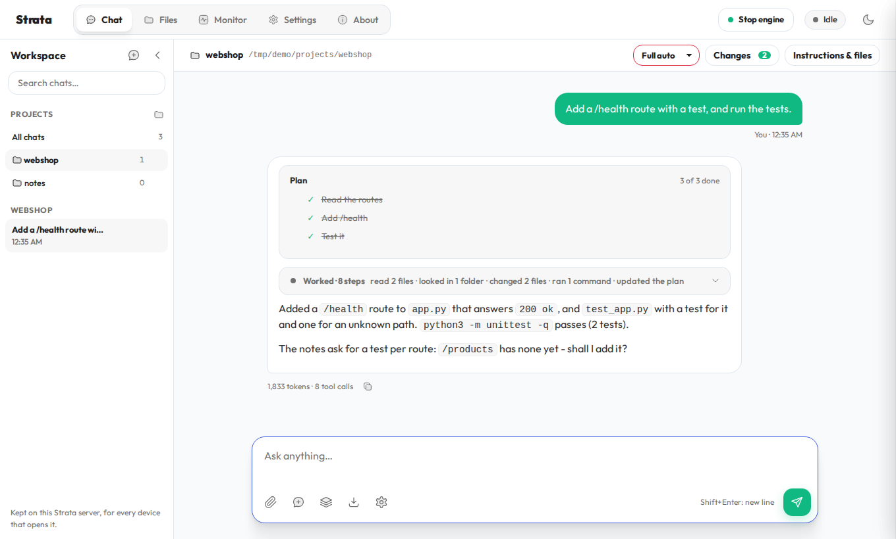
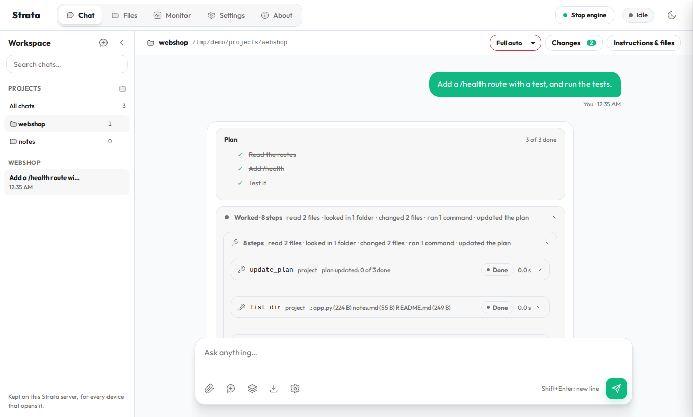
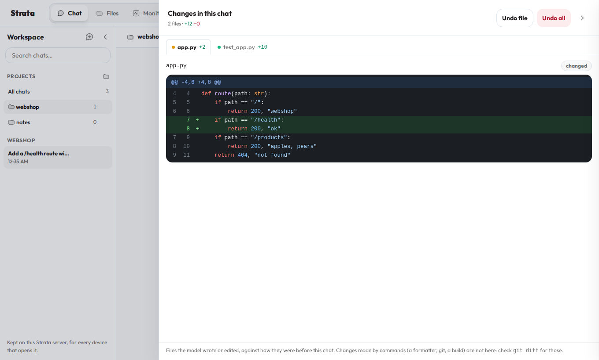
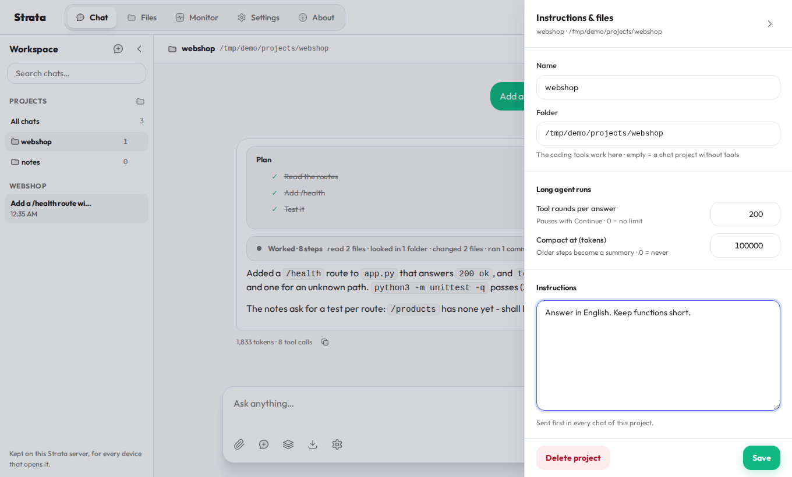
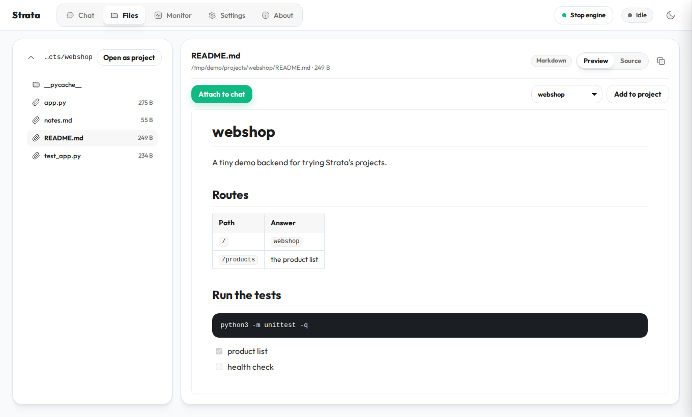
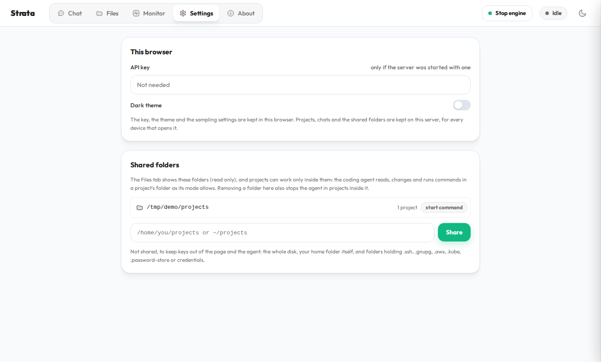
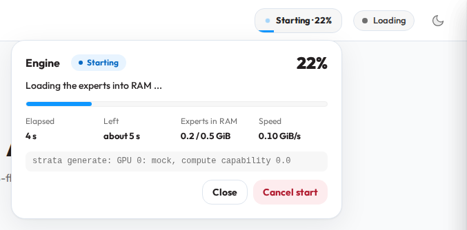

# The web app's workspace: projects, saved chats, files and a coding agent

The page at `http://127.0.0.1:8080/` keeps your chats on the Strata server, groups them into projects, shows the
folders you share with it, and can work in a project's folder as a coding agent. Every device that opens the page
sees the same chats. Requested in [#361](https://github.com/Niko1221/Strata/issues/361); the browser-only first
version was [#504](https://github.com/Niko1221/Strata/pull/504). Back to [the details](DETAILS.md#using-it).



## What it does

- **Saved chats in a sidebar**, kept on the server: new chat, rename, delete, move to a project, search across all
  chats. Chats a browser kept with the earlier sidebar move to the server once.
- **Projects**: a name, instructions sent first in every chat of the project, text files that go with every message,
  and optionally a folder. The bar above the chat shows the open project, its folder and its permission mode.
- **A coding agent** in a project with a folder. The model gets tools that work only inside that folder:
  `list_dir`, `read_file`, `search`, `find_files`, `write_file`, `edit_file`, `run_command` (live output, a timeout,
  background jobs with `job_output` / `job_stop`) and `update_plan` (a plan card in the answer). The folder's own
  `AGENTS.md` or `CLAUDE.md` is sent as the project's guide, and the skills in `.agents/skills/<name>/SKILL.md` (or
  `.claude/skills`) are listed so the model reads the one a task needs.
- **Permission modes** per project: *Read only* (enforced by the server), *Ask first* (every change and command
  waits for Allow / Allow all in this answer / Always allow / Deny), *Auto-edit* (edits run, commands ask) and
  *Full auto*. "Always allow" keeps a command prefix as a rule; a command that chains, pipes or redirects
  (`;` `&&` `|` `>` `<` `` ` `` `$(`) always asks.
- **Long runs**: up to 200 tool rounds per answer by default (then Continue; 0 = no limit), and compaction: when the
  context passes 100,000 tokens (per project; 0 = never) a summary replaces the older steps for the model, while the
  page keeps every step. A chat can also be compacted by hand.
- **Readable answers**: up to three steps show as they come; from the fourth, the work folds into one line
  ("Worked · 8 steps · read 2 files · changed 2 files · ran 1 command") that shows the last steps while it runs.
  Approvals and running commands always stay visible.



- **Changes and undo**: every file the agent wrote or edited, one tab per file, its diff with old and new line
  numbers, Undo file and Undo all (against the file as it was before the chat).



- **Instructions & files** of a project: name, folder, tool rounds, the compaction threshold, instructions, files and
  the commands that run without asking.



- **Files tab**: the shared folders, read only. Markdown is shown as a document (tables, task lists, local pictures,
  links between files), source code with colours and line numbers in about 60 languages. A file can be attached to
  the chat or added to a project, and a folder opened as a project.



- **Settings tab**: the API key and theme of this browser, and the shared folders of the server.



## Start and stop the engine from the page (opt-in)

`--engine-background` starts the web server at once and loads the model on a thread; a **Start engine / Stop
engine** button sits left of the status pill. Its card shows how far a start has got: the steps from the engine's
log, and while the experts are read into RAM (the long part) the engine's own memory against what the last start
loaded, then the locking for the GPU timed against the last start.



Stop unloads the model and keeps it unloaded: a request then gets a 503 that says so, instead of loading it again,
until Start. The choice survives a restart of the server. Images work as before (the encoder starts with the
engine). Without the flag nothing changes: the model loads before the server answers.

## Storage and settings

| What | Where |
| --- | --- |
| Projects, chats, project files, undo checkpoints, shared folders, engine choice | `Strata-data/workspace` next to the Strata folder (`--workspace-dir` or `"workspace_dir"` in the config) |
| Shared folders fixed at start | `--workspace-root <folder>` (repeatable), `"workspace_roots"` in the config, or `STRATA_WORKSPACE_ROOTS` |
| Shared folders set in the page | Settings tab (kept in the workspace folder) |
| This browser's API key, theme, sampling | the browser's `localStorage` |

The page talks to `POST /workspace/<op>` and `GET /engine`, `POST /engine/start` and `/engine/stop`.

## Safety

- The workspace routes need the API key when the server has one, a JSON body, and Strata's own page (the same
  checks as `/settings`); another web page cannot use them.
- Without an API key on a network address the file explorer and shared folders stay off.
- Files are read only inside the shared folders; links out of them are refused. The page cannot share the whole
  disk, the home folder itself, or a folder holding `.ssh`, `.gnupg`, `.aws`, `.kube`, `.password-store` or
  `credentials`. Removing a shared folder also stops the agent in projects inside it.
- The coding tools stay inside the project's folder. Commands run in their own process group with a timeout; Stop
  ends the whole group.
- Model text and file contents are escaped, or cleaned with DOMPurify for the Markdown view. The page loads nothing
  from the internet: marked, DOMPurify and highlight.js are served from `serve/web` (versions and licenses in
  [serve/web/VENDOR.md](../serve/web/VENDOR.md)), and pictures in a Markdown file come from the shared folders only.

## Tests

No GPU needed:

```
python -m unittest serve.test_workspace serve.test_engine_control -v
```

`serve/test_engine_control.py` uses a mock engine that starts like the real one (`STRATA_MOCK_START_S=<seconds>`
for `serve/server.py --engine mock` does the same for trying the page).
