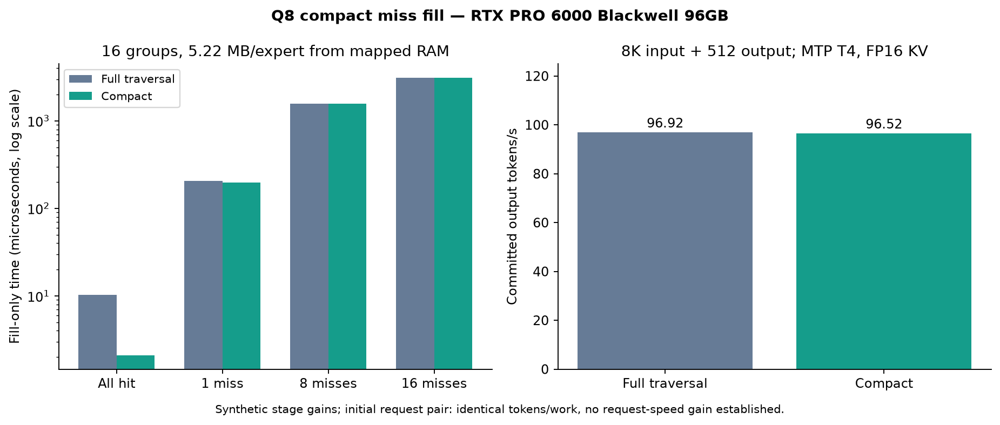

# Read-only Q8 secondary cache and compact fill

Based on [Niko1221/Strata](https://github.com/Niko1221/Strata) main `82f46a8c8f475f001ad76d92f58f4a4f8ffb0253`. Default off. One ordered CUDA stream owns each cache bank; original weights remain authoritative in RAM/files.

RTX PRO 6000 Blackwell Workstation Edition 96GB; Ryzen 9 7950X; 128GB RAM; Ubuntu 24.04.5; CUDA 13.2, driver 595.91.07.

## Change

`STRATA_Q8_MISS_CACHE_WAYS=1..16` enables immutable per-layer secondary copies for uniform Q8_0 experts. With 16 ways on this model it consumes 4,010,803,200 extra VRAM bytes (3.74 GiB). Cache hits avoid the mapped-RAM fill. Hits are reserved before miss admission; new tags become visible only after the complete copy. The feature refuses HIP, layer splits, batched slots, and nonuniform/non-Q8 experts. Use unsplit serving with mapped-RAM kernel copies (`--pcie-frac` above zero, resident RAM).

`STRATA_Q8_COMPACT_MISS_FILL=1` visits only miss payload ranges rather than traversing every group's logical range. It changes neither missed payload bytes nor expert arithmetic. Unset/0 retains the ordinary traversal. All-hit and empty fills do no payload work.

## Fresh branch qualification

Full engine build passed. Each arm passed 24 byte/guard/capture/cancellation component cases and 32 stage shapes. Compute Sanitizer reported zero errors and zero leaked allocations. Default-off 8K/512 output matched current main exactly. The enabled compact/control MTP pair matched all 512 output tokens and reported work.

| Misses / 16 groups | Control fill us | Compact fill us | Time reduction |
|---|---:|---:|---:|
| 0 | 10.261 | 2.097 | +79.56% |
| 1 | 207.597 | 198.592 | +4.34% |
| 8 | 1563.395 | 1563.281 | +0.01% |
| 16 | 3122.556 | 3122.505 | +0.00% |

These are warmed synthetic **fill-only** medians of three samples, 32 graph replays each; planning/publication is excluded. The full 32-shape table, including neutral/slower observations, is in [results.json](results.json).

The fresh 8K-input/512-output MTP T4 request pair measured **96.92 -> 96.52 output tok/s** (-0.41%). FP16 KV, 8,192-token prefill chunks, primary cache 15,472, secondary cache 16/layer, adaptive swaps disabled, mmap PLE. This is one observation per arm; no stable request-speed improvement is claimed. The pure-arithmetic function check passed in both arms; the long generated module was not executed or quality-scored.

No full-model sanitizer, internal state-digest equality, broad quality score or cross-hardware engine validation is claimed. Existing earlier P4 component results motivated this extraction; they do not establish a P4 model speedup for this branch.

## Reproduce

Build with CUDA/native experts and `STRATA_BUILD_TESTS=ON`. Run `readonly_miss_cache_fixture --quick` and `compact_miss_fill_bench` with the compact flag 0/1. Run Compute Sanitizer memcheck on the fixture. The accompanying recorded plan and case script reproduce the engine request after replacing local model/build/client paths. No network listener is opened.
