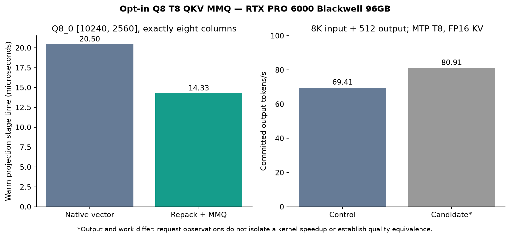

# Experimental SM120 eight-column Q8 QKV projection

Based on [Niko1221/Strata](https://github.com/Niko1221/Strata) main `82f46a8c8f475f001ad76d92f58f4a4f8ffb0253`. Default off: `STRATA_Q8_DENSE_T8_MMQ=1`. Only Q8_0 weights with 2,560 inputs, 10,240 outputs and exactly eight activation columns use the MMQ path. Other types/shapes/window lengths retain the native vector path. CUDA SM120 only; no other research changes included.

RTX PRO 6000 Blackwell Workstation Edition 96GB; Ryzen 9 7950X; 128GB RAM; Ubuntu 24.04.5; CUDA 13.2, driver 595.91.07.

## Representation and lifetime

The repacker preserves each original Q8_1 activation int8 code and exactly promotes its half scale to the MMQ float-scale layout. Weights are not converted or requantized. Each verifier owns one context/scratch/stream, with its exact shape prewarmed before capture. Graphs retire before scratch destruction. The arithmetic reduction order changes; exact model token streams are not promised.

## Component evidence

A fresh warmed synthetic graph benchmark, including input quantization, repack and multiplication, measured **20.495 -> 14.330 microseconds** (30.08% lower stage time), 256 replays per arm. These repeatedly reused 27.85 MB weights can remain in GPU cache; the result is not a cold-DRAM or full-request gain.

CUDA checks passed: unsupported shapes, unchanged zero row, independent scalar interpretation of original packed blocks, fixed-operation error bounds, graph input mutation, independent owners/streams and early close. The printed scalar case had relative RMS `2.30370893e-7`, maximum absolute difference `1.66893005e-6`. Compute Sanitizer reported zero errors and zero leaked allocations. Broader tensor distributions and full per-layer state/route divergence traces remain future work.

## Initial model observations

The same fresh branch binary at 8,192 input + 512 output, 16,384 allocated context, MTP T8, FP16 KV, 8,192-token prefill chunks, fixed primary cache 15,472, mmap PLE and adaptation disabled measured **69.41 -> 80.91 committed output tok/s**. Output tokens and reported work differed (first differing token index 16); this cannot be presented as an isolated request-speed gain or quality-equivalence result. Both pure-arithmetic function checks passed; the long module was not executed/scored. The timed candidate used 57 T8 verification launches after subtracting the preceding function's counter. Default-off output matched main in the separate fresh-build gate. The smaller-window timed fallback used no T8 launches.

This is suitable for a **draft experimental kernel contribution**, not promotion to a default or a claim of stable whole-request acceleration.

## Reproduce

Build CUDA/native experts with `STRATA_BUILD_TESTS=ON`. Run `dense_q8_t8_test`, `dense_q8_t8_bench` and Compute Sanitizer memcheck on the test. Use the recorded plan/case script with local paths changed, toggling only the T8 flag. No network listener is opened.
