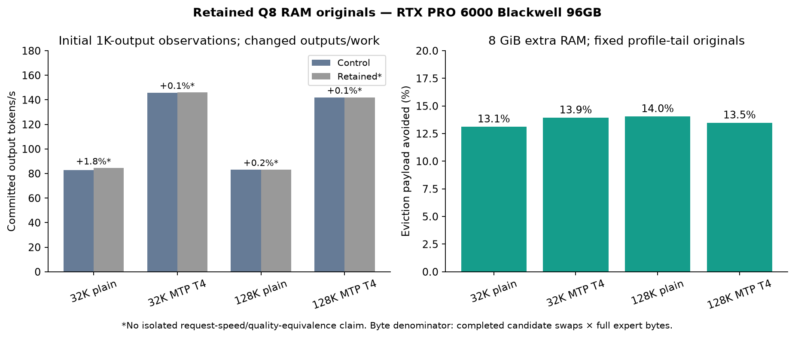

# Retain fixed RAM originals across native asynchronous exchanges

Independent contribution based on [Niko1221/Strata](https://github.com/Niko1221/Strata) main `82f46a8c8f475f001ad76d92f58f4a4f8ffb0253`. No secondary cache, duplex, per-layer admission, PDL or DeepGEMM dependency.

RTX PRO 6000 Blackwell Workstation Edition 96GB; Ryzen 9 7950X; 128GB RAM; Ubuntu 24.04.5; CUDA 13.2, driver 595.91.07.

## Ownership contract

Default off. `STRATA_EXCHANGE_RETAIN_GIB=8` with `STRATA_EXCHANGE_SEED_PROFILE_TAIL=1` reserves approximately eight extra GiB of mapped/pinned RAM. Startup retains and verifies the profile-tail GPU originals, then fixes those keys. If an evicted primary expert already has a canonical retained RAM copy, the native asynchronous adapter skips its D2H download. The batch commit keeps every outgoing expert authoritative in RAM before recycling an incoming buffer. GPU placement/rank selection is unchanged; admission completion timing can change.

Uniform fully mapped/pinned complement only, rotation enabled, no lent slots. This first contribution requires single-device/request native async serving, no peer/remote helpers, no pipelined windows, `--no-prefill-borrow`, and fixed profile-tail seeds. Additional RAM is bounded to eight GiB; a host/cgroup availability guard and failed pin allocation refuse unsupported requests. This is a tested manual resident-RAM configuration, not a new preset. It does not retain a duplicate of the entire model.

The native `commit_flip` must delegate active rotation to the shared batch commit, including retained ownership. A missing delegation caused an early refusal during extraction; the corrected branch was rebuilt and all model/cancellation cases below rerun successfully. The failed attempt is not performance evidence.

## Initial request observations

| Input / mode | Control tok/s | Retained tok/s | Output/work | D2H payload avoided | Counterfactual eviction reduction |
|---|---:|---:|---|---:|---:|
| 32K / plain | 82.90 | 84.40 | Changed | 1.911 GB | 13.12% |
| 32K / MTP T4 | 145.75 | 145.95 | Changed | 2.616 GB | 13.93% |
| 128K / plain | 83.06 | 83.19 | Changed | 2.058 GB | 14.05% |
| 128K / MTP T4 | 141.90 | 142.05 | Changed | 2.700 GB | 13.48% |

Unsloth Q8_0, FP16 KV, 8,192-token prefill chunks, primary cache 15,472 at 32K / 15,216 at 128K, no secondary cache, resident budget 56 GiB, mmap PLE, adaptation every four windows/up to 96 swaps, GPU miss fraction 0.55. One observation per arm. All enabled pairs changed output tokens and reported work, so these rates are not isolated acceleration estimates and do not establish quality equivalence. Both arithmetic checks passed in every pair; the long module was not executed/scored.

The reduction denominator is the candidate's completed primary swaps times 5,222,400 bytes/expert, the D2H payload that would be required without retained originals under the same candidate swaps. Warm-up is subtracted. It is not a paired-control traffic claim or sampled PCIe total. Startup transfers and approximately eight GiB of extra RAM are charged separately; startup timing and token/work hashes are in [results.json](results.json).

## Qualification

Full engine rebuild passed. Existing exchange-storage tests passed; the retained fixture completed 55,392 default/FIFO/fixed-key exchanges with byte guards, aliases, rejected-batch validation and immutable-data checks. ASan/UBSan passed. Default-off 8K/512 output exactly matched current main. Plain/MTP cancellation at 7, 19 and 65 streamed tokens drained and each following fresh arithmetic function passed. 32K/128K requests generated all 1,024 output tokens. No full internal state/route trace, GPU sanitizer on the entire model, cross-hardware validation or broad quality score is claimed. Keep the feature experimental/default off.

## Reproduce

Build CUDA/native experts with tests enabled. Run `exchange_storage_test` and `retained_exchange_storage_test`; the latter also runs under ASan/UBSan using a C++17 host compiler. Use the recorded plan/case script with your paths, comparing retained budget 0 versus 8 with fixed seeding. No network listener is opened.
