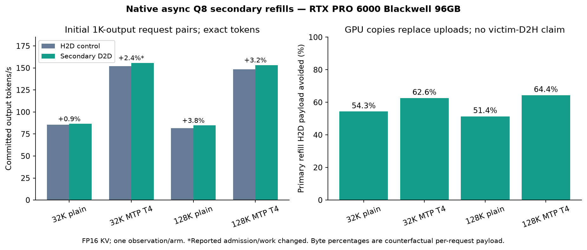

# Native async refills from immutable secondary copies

Based on current upstream main `82f46a8c8f475f001ad76d92f58f4a4f8ffb0253` and the accompanying read-only cache contribution. The feature-only source diff is 246 added / one removed line across six files before documentation. This branch shares the cache foundation commit with `perf/q8-compact-fill-main`; it does not import the former duplex, per-layer admission, PDL, DeepGEMM or other research changes.

RTX PRO 6000 Blackwell Workstation Edition 96GB; Ryzen 9 7950X; 128GB RAM; Ubuntu 24.04.5; CUDA 13.2, driver 595.91.07.

## Lifetime contract

Default off. `STRATA_Q8_ASYNC_REFILL=1` requires native `--adapt-async 1`, a Q8 secondary cache and `STRATA_Q8_CACHE_TAG_SNAPSHOT=1`. The snapshot is copied before the existing completed-window synchronization. Cache sources are queried on the owner thread at a completed boundary. D2D fills are queued on the refill stream, then an event fences **the next cache mutation** on compute. The helper continues uncached H2D fills on the same refill stream. The existing completion event still controls primary residency admission. Victim D2H remains unchanged. No source may be reused merely because its tag was sampled.

Single device/request, host planning and unsplit mapped-RAM copies only. The feature refuses peer/remote helpers, layer splits, batched slots, pipelined windows and device planning. The conservative whole-window read fence is intentional; finer layer overlap is a separate contribution.

## Fresh main-based measurements

| Input / mode | Control tok/s | D2D tok/s | Observed change | Exact 1K tokens | Reported work | Primary H2D avoided |
|---|---:|---:|---:|---|---|---:|
| 32K / plain | 85.71 | 86.52 | +0.94% | Yes | Same | 54.32% |
| 32K / MTP T4 | 152.16 | 155.80 | +2.39% | Yes | Changed | 62.62% |
| 128K / plain | 81.57 | 84.71 | +3.84% | Yes | Same | 51.40% |
| 128K / MTP T4 | 148.55 | 153.29 | +3.20% | Yes | Same | 64.36% |

Same binary and inputs, FP16 KV, 8,192-token prefill chunks, primary cache 15,472 at 32K / 15,216 at 128K, secondary 16/layer, resident budget 56 GiB, mmap PLE, adaptation every four windows with up to 96 swaps, GPU miss fraction 0.55. All four pairs produced identical 1,024-token streams. Admission timing and reported work differed in some pairs; those are not fixed-work transfer-isolation experiments. These are initial observations, one per arm, not confidence-bounded estimates. Effective rates and request timings are in [results.json](results.json).

The byte percentage is D2D/(D2D+H2D) from completed per-request logical refill payload, after subtracting function warm-up. It is the upload payload those D2D copies replace, not a sampled DRAM/PCIe counter or a reduction of all inference traffic. Secondary fills still incur their own costs. No victim-download reduction is claimed here.

## Checks

Full engine build, cache byte/capture/abandoned-fill fixture and dedicated source-lifetime fixture passed. Compute Sanitizer on the lifetime fixture reported zero errors/leaks. Default-off 8K/512 output exactly matched current main. Plain and MTP STOP tests at 7, 19 and 65 streamed tokens each drained and passed the following fresh arithmetic function check. The request module was not executed/scored. No full internal state-digest or cross-hardware claim is made.

## Reproduce

Build with CUDA/native experts and `STRATA_BUILD_TESTS=ON`. Run `readonly_miss_cache_fixture --quick`, `secondary_refill_lifetime_fixture` and its Compute Sanitizer memcheck. Use the accompanying recorded plan/case script after replacing local paths. Keep both arms' cache/snapshot settings equal and toggle only `STRATA_Q8_ASYNC_REFILL`. No network listener is opened.
