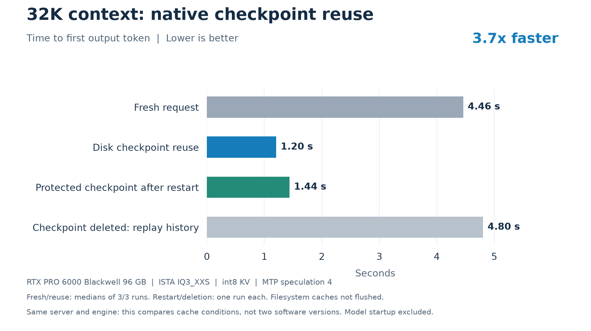

# Plain-server 32K checkpoint validation



The same server reaches the first output token in **4.46 s fresh versus 1.20 s
with a disk checkpoint**, a 3.7x difference. Complete-response medians are
5.99 s and 2.74 s, including checkpoint saving. These measurements compare cache
conditions, not this PR against unmodified main.

| Condition | First token | Complete response | Samples |
|---|---:|---:|---:|
| Fresh 32K request | 4.459 s | 5.989 s | 3, median |
| Disk reuse after another request | 1.204 s | 2.739 s | 3, median |
| Branch before the assistant answer | 1.027 s | 2.575 s | 1 |
| Protected checkpoint after restart | 1.436 s | 3.397 s | 1 |
| Checkpoint deleted; history replay | 4.804 s | 6.345 s | 1 |

## Setup and checks

- Frontend: this PR on main `fb58e0dbc8399662c0e47c76578c6e878b14f6cf`.
- Native executable: existing CUDA build `6346516f2e461836564c0ffe660282efc4894147`;
  native files are unchanged by this PR. These numbers are not a new 0.1.41
  native-engine performance claim.
- RTX PRO 6000 Blackwell 96 GB; ISTA IQ3_XXS; int8 KV; MTP speculation 4.
- Temperature 0, reasoning disabled, 128 output-token cap. Answers stop naturally.
- Exactly 32,768 input tokens in each fresh execution receipt; context limit 36,864.
- Native RAM conversation cache disabled. Managed disk budget 16 GiB, history
  free-space reserve 4 GiB, maximum staged snapshot bound 4 GiB.
- Serial requests; an unrelated request intervenes before each reuse.

Each prompt has a different verification code near its beginning, middle and
end. **9/9 answers** reproduced all three codes in order, allowing whitespace
differences. For example: `CEDAR-102 | MARBLE-202 | QUARTZ-302`. This checks
restored execution/retrieval behavior, not general model quality.

Every reuse, branch and protected restart registered a disk restore and reported
32,761 reused tokens. Branching left the original history unchanged. Shutdown
kept the available protected checkpoints and removed the ordinary checkpoint.
After deliberately deleting checkpoint blocks, replay returned the same codes
with zero reused tokens and no disk restore.

The Python regression run executed 98 tests: 97 passed and one was skipped.
The HTTP tests include adding two independent bookmarks, removing the first,
and verifying that only the second remains protected. CUDA was exercised in this
native probe; HIP and SYCL inference were not rerun for this frontend-only PR.

Startup/model loading is outside request timing. Filesystem caches were not
flushed. Three samples support a preliminary median, not tail-percentile claims.
Bookmarks select restart retention for available checkpoints; they do not reserve
runtime cache capacity or rebuild a checkpoint that was already evicted.

## Reproduce

Use an existing native engine/model configuration and a new scratch directory:

```sh
python tools/bench_branch_checkpoints.py \
  --config /path/to/config.json --mtp /path/to/mtp-runtime \
  --output /path/to/new-probe --tokens 32768 --repeats 3
python tools/plot_branch_checkpoints.py \
  /path/to/new-probe/results.json /path/to/new-probe/latency.png
```

The Linux harness starts isolated loopback processes, checks exact prepared token
counts, and deletes only its own checkpoint blocks during the recovery probe.
It does not alter production configuration or enable services. The plotter needs
matplotlib. Raw responses and audits are in [results.json](results.json),
[summary.json](summary.json), and [native-audit.txt](native-audit.txt).
