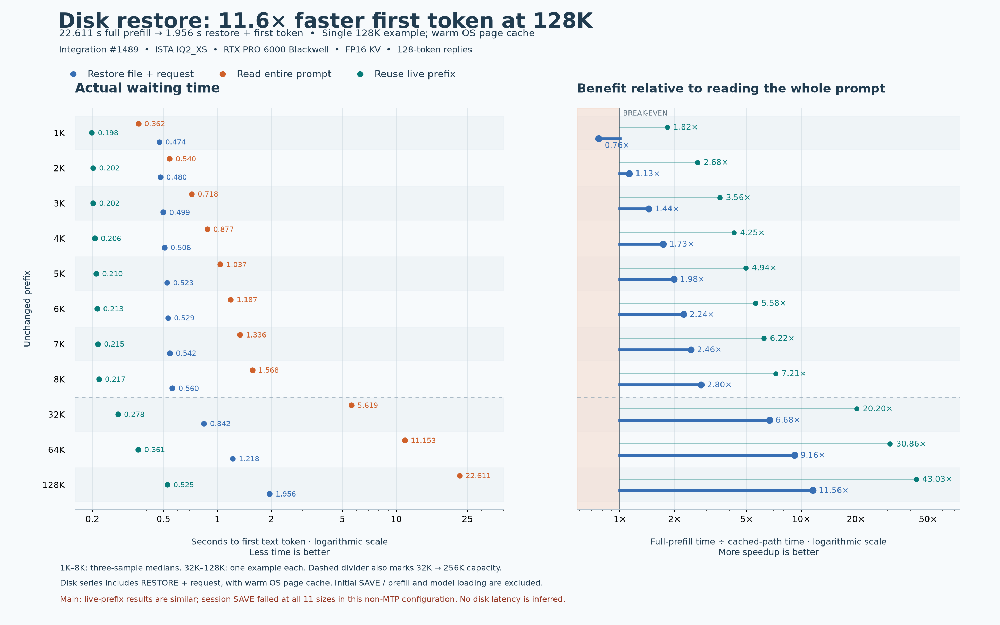
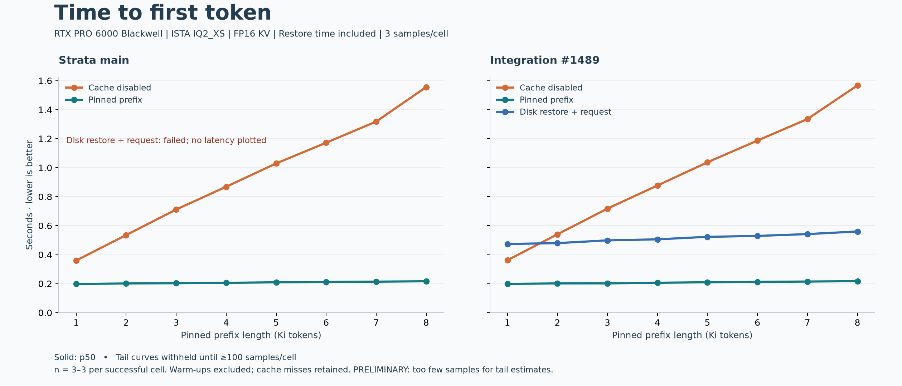
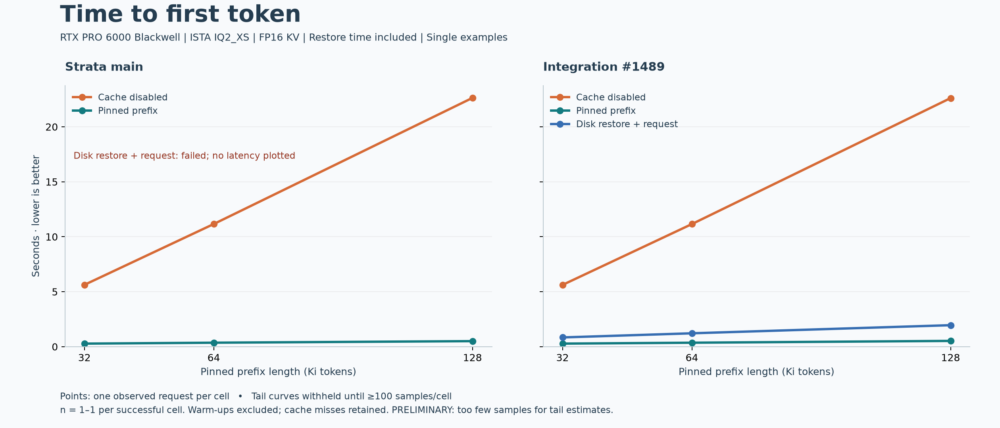

# Disk restore: 11.6x faster first token in the 128K example

With #1489, restoring a saved 128K prefix and generating the first text token took
**1.956 seconds**, versus **22.611 seconds** for full prefill: **11.6x faster**.
This is one measured example with warm OS page cache; it includes restore time
but excludes initial SAVE/prefill. Live prefix reuse is a secondary comparison.

The overview uses logarithmic axes so subsecond reuse and long full-prefill times
remain readable. Its 1x line marks break-even; disk restore falls below it at 1K.
The paired charts below retain the direct main-versus-integration comparison.

| Prefix | #1489 uncached | #1489 live prefix | #1489 disk restore + first token | Main disk path |
|---|---:|---:|---:|---|
| 1K | 0.362 s | 0.198 s | **0.474 s** | SAVE failed |
| 2K | 0.540 s | 0.202 s | **0.480 s** | SAVE failed |
| 3K | 0.718 s | 0.202 s | **0.499 s** | SAVE failed |
| 4K | 0.877 s | 0.206 s | **0.506 s** | SAVE failed |
| 5K | 1.037 s | 0.210 s | **0.523 s** | SAVE failed |
| 6K | 1.187 s | 0.213 s | **0.529 s** | SAVE failed |
| 7K | 1.336 s | 0.215 s | **0.542 s** | SAVE failed |
| 8K | 1.568 s | 0.217 s | **0.560 s** | SAVE failed |
| 32K | 5.619 s | 0.278 s | **0.842 s** | SAVE failed |
| 64K | 11.153 s | 0.361 s | **1.218 s** | SAVE failed |
| 128K | 22.611 s | 0.525 s | **1.956 s** | SAVE failed |

Short rows are medians of three observed requests; long rows are single examples.
All 27 successful disk-restored requests generated 128 tokens and reused the
entire requested prefix. Main failed its one SAVE attempt at each of the 11
sizes with HTTP 500, `conversation snapshot: invalid K/V extent`. Subsequent
restore/generation cases are **blocked**, not timed requests. This finding is
specific to the tested native IQ2_XS model with MTP off, single-GPU CUDA and FP16 KV;
it does not establish that all main configurations fail.

For these samples, the disk path is slower than fresh prefill at 1K and faster
from 2K upward. A live pinned prefix remains the fastest path. The integration
therefore preserves main's live reuse and makes this tested session-save/restore
path work; the native prefix speedup was already present in main.

## What is included

The disk series measures the whole `POST /slots/0?action=restore` HTTP call plus
the subsequent `/v1/responses` time to its first nonempty text delta. Completion
charts likewise include restore plus all 128 output tokens. Each session was
saved once after a warm-up request, then the live conversation was replaced with
an unrelated request before every restore. SAVE and initial prefill are outside
the plotted steady-state latency and are recorded separately in the raw rows.

The OS file cache was warm: this is the real filesystem restore API, including
validation and transfers, **not a measurement of cold physical SSD reads**. The
experiment does not restart the engine and does not measure automatic disk-tier
selection, profile switching or durable Responses history. Those are distinct
follow-ups. Model loading, queueing and concurrent load are excluded.

Both builds use identical settings within each size group. Capacity is 32K for
short requests and 256K for long examples; FP16 KV, prefill 8192, unchanged public
ISTA IQ2_XS, RTX PRO 6000 Blackwell, temperature 0, seed 42, reasoning none and MTP
off. See [the method and exact commits](../../../CACHE_LATENCY_BENCHMARK.md).

## Completion charts and raw evidence

- [1K–8K completion chart](short/completion.png) · [CSV](short/summary.csv) · [raw requests](short/raw/)
- [32K–128K completion chart](long/completion.png) · [CSV](long/summary.csv) · [raw requests](long/raw/)
- [Original short pilot](../pilot/) · [Original long examples](../long-examples/)

The 200-sample percentile campaign is paused. The harness can report p50, p80,
p90, p95 and p99; these small examples cannot establish tail behavior. Output
text can differ between cold and cached execution; no answer-quality equivalence
is claimed. Counts, errors and all raw replies remain visible.
