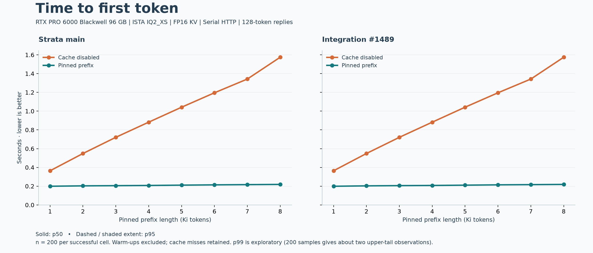
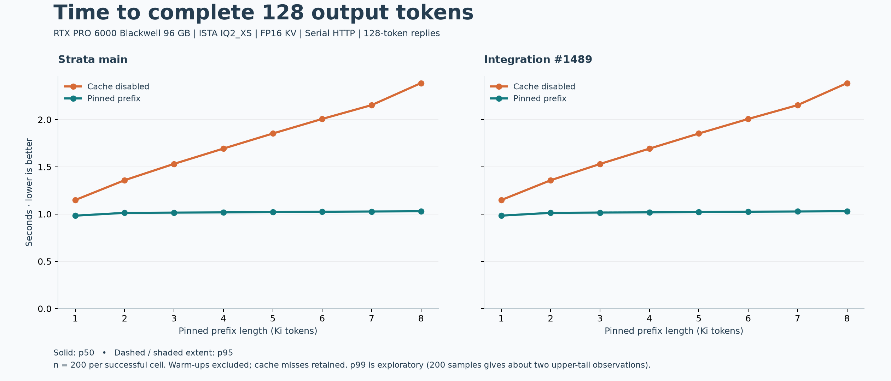
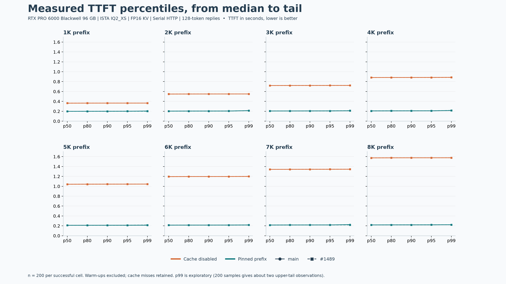

# Completed 1K–8K prefix-reuse campaign: 6,400 requests

At 8K, pinned live reuse reduced median time to first token from **1.574 s to
0.219 s (7.2x)**. Main and integration #1489 were effectively equal. This is
the benefit of existing prefix reuse, not an additional speedup from #1489.







Two builds × two modes × eight prefix lengths × 200 requests = **6,400 measured
requests**, all successful and all producing 128 output tokens. Ten blocks of
20 observations per cell reverse build/mode order on alternate blocks. Three
warmups per cell per block are recorded but excluded. Interrupted work is excluded
using the completed-job manifest; retry directories are not double-counted.

All 3,200 pinned requests reused their full prefix. All 3,200 cache-disabled
requests reported zero reused tokens. At 8K on #1489, cached TTFT was **p50
0.21870 s, p80 0.21959 s, p90 0.21993 s, p95 0.22025 s, p99 0.22266 s**.
The machine was otherwise idle. These are serial localhost measurements,
not loaded-server latency guarantees. With 200 observations per cell, p99 is
exploratory: approximately two observations occupy the upper one percent.

This campaign covers **live pinned reuse only**. The separate
[disk-restore study](../disk-restore/) still has three observations per successful
short cell and one example at each long length. Its 128K **11.6x disk-restore**
result includes RESTORE time with warm OS page cache; the **43x live-reuse**
example is a distinct comparison. Neither long-context number becomes a
200-sample estimate because this short-context campaign completed.

## Correctness and scope

All **3,200 cross-build matched outputs were identical**. Cache-disabled versus
pinned output text matched for **958/1,600 pairs in each build**, so this does not
establish numerical or answer-quality equivalence between cache modes. Exact
request and output hashes, output text, usage and native timings are retained.
This workload does not test automatic conversation parking, profile switching,
disk restore, process restart, durable history, concurrency or MTP.

Hardware: RTX PRO 6000 Blackwell Workstation Edition, 96 GB VRAM; 124 GiB usable
RAM; CUDA 13.2, architecture 120. Unchanged ISTA-DASLab IQ2_XS, FP16 KV, 32K
context, prefill 8192, temperature 0, seed 42, reasoning none, MTP off and suffix
drafting disabled. Responses SSE, `store: false`, 128 output tokens. Input length
is prefix + 83 tokens. Startup and warmups are excluded.

- [Method, commits and request example](../../../CACHE_LATENCY_BENCHMARK.md)
- [Summary JSON](summary.json), [CSV](summary.csv), [output comparison](comparisons.json)
- [Raw completed runs](raw/) and [completed-job manifest](raw/campaign.json)
- [TTFT SVG](ttft.svg), [completion SVG](completion.svg), [percentiles SVG](percentiles.svg)

Rebuild the report from this repository's root (Python with matplotlib):

```sh
python tools/cache_latency_report.py docs/measurements/cache-latency-20261008/full/raw \
  --output /tmp/cache-latency-report \
  --subtitle 'RTX PRO 6000 Blackwell 96 GB | ISTA IQ2_XS | FP16 KV | Serial HTTP | 128-token replies'
```
