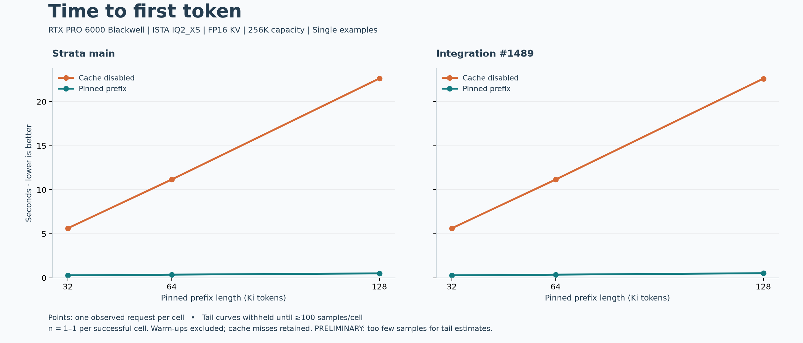
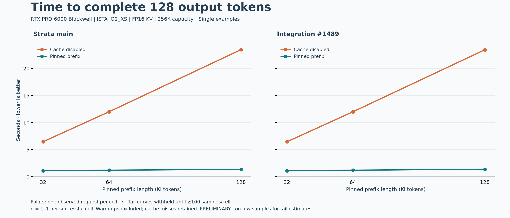

# Single examples: 32K, 64K and 128K pinned prefixes

One measured request per cell after one warm-up. These are individual observations, not percentiles or an SLA claim.

Time to first nonempty text delta:

| Prefix | Main: uncached → cached | #1489: uncached → cached |
|---|---:|---:|
| 32K | 5.626 → **0.277 s** | 5.619 → **0.278 s** |
| 64K | 11.158 → **0.362 s** | 11.153 → **0.361 s** |
| 128K | 22.631 → **0.504 s** | 22.611 → **0.525 s** |

Time to complete all 128 output tokens:

| Prefix | Main: uncached → cached | #1489: uncached → cached |
|---|---:|---:|
| 32K | 6.441 → **1.090 s** | 6.434 → **1.091 s** |
| 64K | 11.979 → **1.181 s** | 11.974 → **1.180 s** |
| 128K | 23.470 → **1.333 s** | 23.447 → **1.354 s** |

All 12 measured requests succeeded and generated exactly 128 output tokens. All six cached requests reused the full prefix; the six uncached requests reported zero reused tokens. Actual input length was prefix + 83 tokens.

Both builds use a 262,144-token context capacity for these examples, leaving room beyond the 131,072-token prefix. This differs from the 32,768-token capacity in the short pilot. Other settings match: unchanged public ISTA IQ2_XS, RTX PRO 6000 Blackwell, FP16 KV, prefill 8192, temperature 0, seed 42, reasoning none, MTP off, local serial Responses SSE and `store: false`.

This tests a live pinned prefix. It does not test disk restore, restart, conversation switching, durable API history, model accuracy or concurrent load. Initial model load and prefix creation are outside the measured cached request. Single observations cannot establish a meaningful speed difference between builds.

[Full method and exact commits](../../../CACHE_LATENCY_BENCHMARK.md) · [Short pilot](../pilot/) · [Summary CSV](summary.csv) · [Raw requests](raw/) · [Output comparison](comparisons.json)
