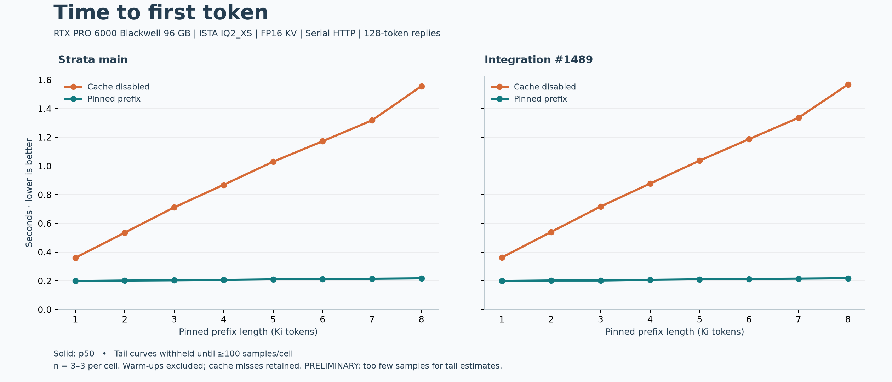
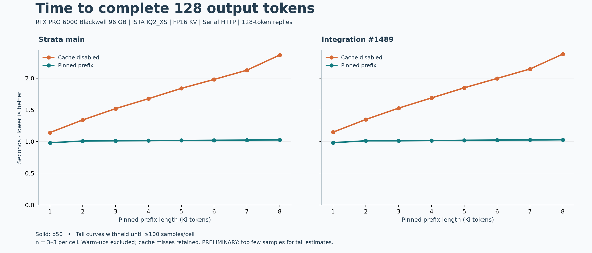

# Preliminary results: public Strata prefix caching

Follow-up: [6,400 measured requests with p50/p80/p90/p95/p99 charts](../full/).
The numbers below are retained as the original pilot, not the latest sample set.

On llm-60, pinned prefix reuse reduced first-token latency at 8K from about **1.56 seconds to 0.22 seconds** in both builds: roughly **7.2x faster**. Completing all 128 output tokens fell from about **2.37 seconds to 1.03 seconds**. Reuse helped at every tested size, starting at 1K.

These are three-sample medians after three warm-ups per cell, **not a tail-latency study**. The 200-sample follow-up is now complete and linked above. The benefit here comes from the existing pinned-prefix mechanism; this probe does not establish an additional speedup from #1489. It also does not exercise disk restores, durable Responses history, profile changes, concurrent requests or restarts.

| Prefix | Main, no reuse | Main, pinned | #1489, no reuse | #1489, pinned |
|---|---:|---:|---:|---:|
| 1K | 0.360 s | 0.198 s | 0.362 s | 0.198 s |
| 2K | 0.535 s | 0.201 s | 0.540 s | 0.202 s |
| 3K | 0.711 s | 0.203 s | 0.718 s | 0.202 s |
| 4K | 0.868 s | 0.206 s | 0.877 s | 0.206 s |
| 5K | 1.029 s | 0.210 s | 1.037 s | 0.210 s |
| 6K | 1.172 s | 0.212 s | 1.187 s | 0.213 s |
| 7K | 1.318 s | 0.214 s | 1.336 s | 0.215 s |
| 8K | 1.556 s | 0.217 s | 1.568 s | 0.217 s |

All 96 measured requests succeeded and generated exactly 128 tokens. All 48 cached requests reused the entire requested prefix; all 48 cache-disabled requests reported zero reused tokens. Input lengths were prefix + 83 tokens. All compared request bodies matched between modes.

Output check: main and #1489 produced identical output text for **48/48** matched requests. Cache-disabled versus pinned output matched for **16/24** requests in each build. Changed prefill/chunking can change floating-point results and generated text; this timing probe does not establish answer-quality equivalence. The raw replies are retained for inspection.

## Reproduce and inspect

- [Method, exact source commits and simple request example](../../../CACHE_LATENCY_BENCHMARK.md)
- [Summary JSON](summary.json) ? [CSV](summary.csv) ? [Output comparison](comparisons.json)
- [Raw requests and run metadata](raw/)
- [TTFT SVG](ttft.svg) ? [Completion SVG](completion.svg)

Hardware: RTX PRO 6000 Blackwell Workstation Edition, 96 GB VRAM; 124 GiB usable system RAM; WD_BLACK SN8100 NVMe. Model: unchanged ISTA-DASLab Qwen3.8-Flash-Next-GSQ-RCO IQ2_XS (39,225,954,592 + 28,800,138,432 bytes). CUDA 13.2, architecture 120; ggml `3cf03257f219afbe7334045ff7c6a06ac68c627d`. FP16 KV, 32K context, prefill 8192, temperature 0, seed 42, reasoning none, MTP off. Local serial Responses SSE, `store: false`. Model load and warm-ups excluded.
